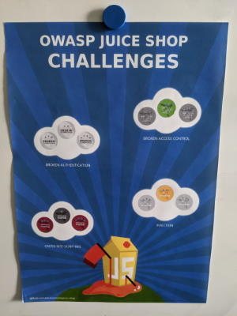

# Hands-on Hacking Workshop

Distilled slides from full lecture (on `master`) to set the stage for
four hands-on hacking lessons with
[OWASP Juice Shop](https://owasp-juice.shop):

* Cross-Site Scripting
* Injection
* Authentication Flaws
* Authorization Flaws

## Preparation (:man_teacher::woman_teacher:)

:bulb: _It is recommended to read the
[Trainer's Guide](https://pwning.owasp-juice.shop/appendix/trainers.html)
before your first workshop with the OWASP Juice Shop._

### Mandatory

1. Make sure each participant brings their own laptop
2. Make sure everyone has access to a Juice Shop instance **either**
   [self-hosted on their own laptop](https://github.com/bkimminich/juice-shop#setup)...
3. ...**or** provided centrally on a cluster or cloud infrastructure
   e.g. using the easy-to-deploy
   [JuicyCTF](https://github.com/iteratec/juicy-ctf) platform

### Optional

1. Print one
   [Juice Shop workshop poster](https://github.com/wurstbrot/security-pins/tree/master/juice-shop-challenge-pins)
   from the OWASP Security Pins project for each participant _(in DIN A3
   format)_
2. Print one
   [round sticker of each kind](https://github.com/wurstbrot/security-pins/tree/master/juice-shop-challenge-pins/Pins)
   shown on the poster per participant _(with 25mm diameter)_

:information_source: _Hand out the posters at at beginning of the workshop. After the
exercises of each lesson, hand out the corresponding stickers to be put
on the poster._

----

This work is licensed under a
[Creative Commons Attribution-ShareAlike 4.0 International License](https://creativecommons.org/licenses/by-sa/4.0/).
