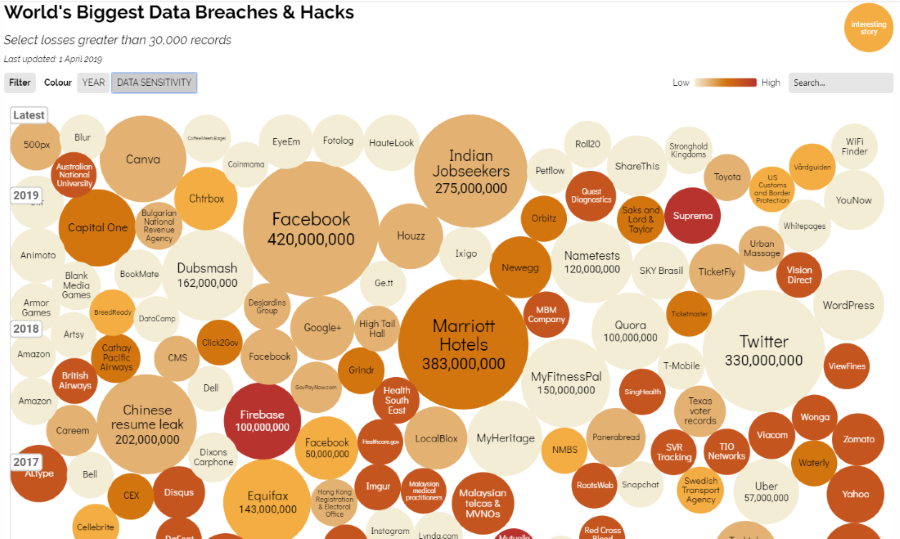
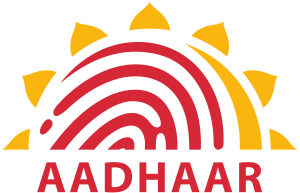

<!-- $theme: gaia -->

<!-- $size: 16:9 -->

<!-- page_number: true -->

<!-- footer: Copyright (c) by Bjoern Kimminich | Licensed under CC-BY 4.0 -->

# Motivation

---

# Vulnerability

> A **flaw or weakness in system** security procedures, design, implementation, or internal controls **that could […] result in a security breach** or a violation of the system's security policy [[^1]]

[^1]: http://csrc.nist.gov/publications/nistpubs/800-30/sp800-30.pdf

---

# Exploit

> A piece of software, a chunk of data, or a sequence of commands that **takes advantage of a bug or vulnerability to cause unintended or unanticipated behavior** to occur on computer software, hardware, or something electronic (usually computerized) [[^2]]

[^2]: https://en.wikipedia.org/wiki/Exploit_(computer_security)

---

# Zero-Day

> **A zero day vulnerability** refers to a hole in software that **is unknown to the vendor**.
>
> This security hole is then **exploited by hackers before the vendor becomes aware** and hurries to fix it—this exploit is called a zero day attack. [...]
>
> The term **“zero day” refers to the unknown nature** of the hole to those outside of the hackers, specifically, the developers. Once the vulnerability becomes known, a race begins for the developer, who must protect users. [[^3]]

[^3]: https://web.archive.org/web/20170704035927/http://www.pctools.com/security-news/zero-day-vulnerability/

---

# Exercise 1.1

## Brainstorming Attackers

1. Identify and :crayon: a mind map of possible **Attackers**
2. Rate the danger posed by each attacker type (:skull: to :skull::skull::skull:)
3. Estimate the risk of your own employer being targeted by each identified attacker type (in %)
4. Which attacker types are likely to work together and how does this impact their danger rating?

---

# Attacker Stereotypes

| Name                | Characteristics                        | Danger                |
|:--------------------|:---------------------------------------|:----------------------|
| **Script Kiddie**   | Bragging rights & wreaking havoc       | :skull:               |
| **Hacktivists**     | (Pseudo-)political / social motivation | :skull::skull:        |
| **Competitors**     | Industrial Espionage                   | :skull::skull:        |
| **Organized Crime** | Monetization, Cyber-Crime-as-a-Service | :skull::skull:        |
| **Evil Employees**  | Dangerous insider knowledge            | :skull::skull::skull: |
| **Nation States**   | Unlimited resources and budget         | :skull:x100           |

---

# Advantage of the Attacker

* Attacker must **succeed once**
  * Defender must get it right _all the time_
* Attacker can choose the **weakest spot**
  * Defender must defend _all places_
* Attacker can leverage **zero-days**
  * Defender can only defend against _known attacks_
* Attacker can **play dirty**
  * Defender needs to _play by the rules_

---

# Case Studies

---

<!-- *footer: -->

# Data Breaches (by no. of records)

---

<!-- *footer: -->

# Data Breaches (by data sensitivity)

---

# Aadhaar (January 2018)

> Today, The Tribune “purchased” a service being offered by anonymous sellers over WhatsApp that provided unrestricted access to details for any of the more than 1 billion Aadhaar numbers created in India thus far. [[^4]]

---

> It took just Rs 500, paid through Paytm, and 10 minutes in which an “agent” of the group running the racket created a “gateway” for this correspondent and gave a login ID and password [...] and instantly get all particulars that an individual may have submitted to the UIDAI (Unique Identification Authority of India), including name, address, postal code (PIN), photo, phone number and email.
>
> What is more, The Tribune team paid another Rs 300, for which the agent provided “software” that could facilitate the printing of the Aadhaar card after entering the Aadhaar number of any individual. [[^4]]

_**Sidenote:** 800 Indian Rupee equals 10.04 Euro (28.06.2018)_ :money_with_wings:

[^4]: http://www.tribuneindia.com/news/nation/rs-500-10-minutes-and-you-have-access-to-billion-aadhaar-details/523361.html

---