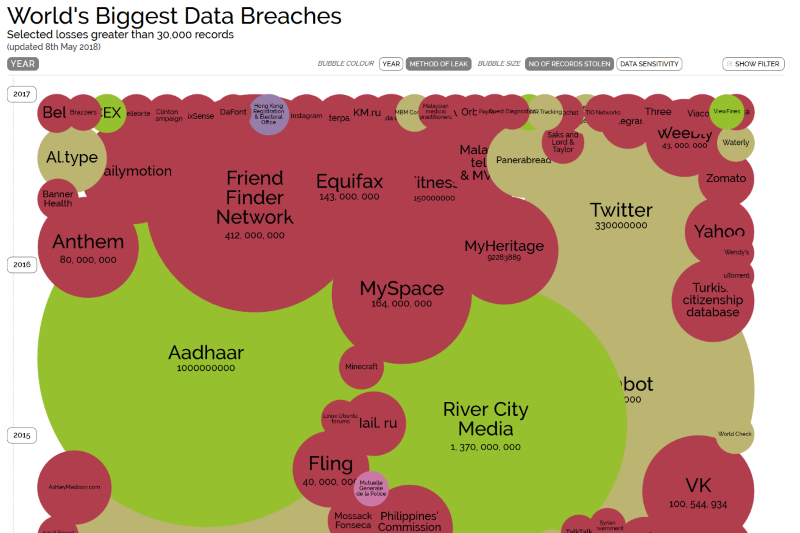
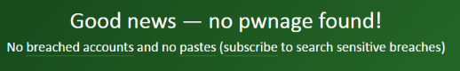
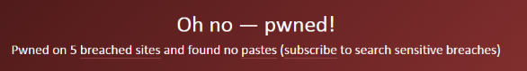

<!-- theme: default -->
<!-- paginate: true -->
<!-- footer: Copyright (c) by **Bjoern Kimminich** | Licensed under [CC-BY-SA 4.0](https://creativecommons.org/licenses/by-sa/4.0/) -->

# Motivation

---

# Security = :interrobang:

---

# Security

> The state of being free from danger or threat. \[[^1]\]

[^1]: https://en.oxforddictionaries.com/definition/security

---

# Vulnerability = :interrobang:

---

# Vulnerability

> A **flaw or weakness in system** security procedures, design,
> implementation, or internal controls **that could \[…\] result in a
> security breach** or a violation of the system's security policy
> \[[^2]\]

[^2]: http://csrc.nist.gov/publications/nistpubs/800-30/sp800-30.pdf

---

# Exploit = :interrobang:

---

# Exploit

> A piece of software, a chunk of data, or a sequence of commands that
> **takes advantage of a bug or vulnerability to cause unintended or
> unanticipated behavior** to occur on computer software, hardware, or
> something electronic (usually computerized) \[[^3]\]

[^3]: https://en.wikipedia.org/wiki/Exploit_(computer_security)

---

# Zero Day = :interrobang:

---

# Zero-Day

> **A zero day vulnerability** refers to a hole in software that **is
> unknown to the vendor**.
>
> This security hole is then **exploited by hackers before the vendor
> becomes aware** and hurries to fix it—this exploit is called a zero
> day attack. \[...\]
>
> The term **“zero day” refers to the unknown nature** of the hole to
> those outside of the hackers, specifically, the developers. Once the
> vulnerability becomes known, a race begins for the developer, who must
> protect users. \[[^4]\]

[^4]: https://web.archive.org/web/20170704035927/http://www.pctools.com/security-news/zero-day-vulnerability/

---

# Exercise 1.1 (:pushpin:)

## Brainstorming Attackers

1. Identify and describe possible **Attackers** and their motivation
2. Rate the danger posed by each attacker type (:skull: to
   :skull::skull::skull:)
3. Estimate the risk (high/medium/low) of your own organization being targeted by each
   identified attacker type 
4. Which attacker types are likely to work together and how does this
   impact their danger rating?

---

# Advantage of the Attacker

* Attacker must **succeed once**
  * Defender must get it right _all the time_
* Attacker can choose the **weakest spot**
  * Defender must defend _all places_
* Attacker can leverage **zero-days**
  * Defender can only defend against _known attacks_
* Attacker can **play dirty**
  * Defender needs to _play by the rules_

---

# Case Studies

---

# Data Breaches

---

# Peloton (May 2021)

> Peloton provides a line of network-connected stationary bikes and treadmills. The company also offers an online service that allows users to join classes, work with trainers, or do workouts with other users. In October \[2020\], Peloton told investors it had a community of 3 million members. Members can set accounts to be public so friends can view details such as classes attended and workout stats, or users can choose for profiles to be private. \[[^7]\]

---

> Researchers \[...\] reported that a flaw in Peloton’s online service was making data for all of its users available to anyone anywhere in the world, even when a profile was set to private. All that was required was a little knowledge of the faulty programming interfaces that Peloton uses to transmit data between devices and the company’s servers.
>
> Data exposed included:
> * User IDs
> * Instructor IDs
> * Group Membership
> * Workout stats
> * Gender and age
> * Weight
> * If they are in the studio or not
>
> \[[^7]\]

_The initial fix let anyone who subscribed to the online service still obtain the private details of any other subscriber._ :detective:

[^7]: https://arstechnica.com/gadgets/2021/05/peloton-takes-3-months-to-fix-flaw-that-exposed-users-private-information/#p3

---

# Marriot (November 2018)

> The hotel chain asked guests checking in for a treasure trove of
> personal information: credit cards, addresses and sometimes passport
> numbers. On Friday, consumers learned the risk. Marriott International
> revealed that hackers had breached its Starwood reservation system and
> had stolen the personal data of up to 500 million guests. \[[^5]\]

---

> \[...\] Starwood’s data has not popped up on the so-called dark web,
> according to Recorded Future, a cybersecurity firm, and Coalition, a
> cyber insurance provider, which suggested that the hotel attackers
> weren’t looking to sell what they took.
>
> “Usually when stolen data doesn’t appear, it’s a state actor
> collecting it for intelligence purposes,” \[...\] information could be
> fed, for example, into an analysis program run by a country’s state
> security apparatus \[...\]. Using “big data” technology similar to
> what marketers use in targeted advertising, the country could try to
> pinpoint the comings and going of intelligence agents from other
> nations. Did they stay, for example, in the same hotel as a potential
> source for that country? \[[^5]\]

_The intrusion went unnoticed for four years by Starwood._ :calendar:

[^5]: https://www.nytimes.com/2018/11/30/business/marriott-data-breach.html

---

# Equifax (September 2017)

> If you have a credit report, there’s a good chance that you’re one of
> the 143 million American consumers whose sensitive personal
> information was exposed in a data breach at Equifax, one of the
> nation’s three major credit reporting agencies. \[[^6]\]

---

> Here are the facts, according to Equifax. The breach lasted from
> mid-May through July. The hackers accessed people’s names, Social
> Security numbers, birth dates, addresses and, in some instances,
> driver’s license numbers. They also stole credit card numbers for
> about 209,000 people and dispute documents with personal identifying
> information for about 182,000 people. And they grabbed personal
> information of people in the UK and Canada too. \[[^6]\]

_Recommended steps for protection include "monitor your existing credit
card and bank accounts closely" but also "consider placing a credit
freeze" :icecream: or "placing a fraud alert on your files"._

[^6]: https://www.consumer.ftc.gov/blog/2017/09/equifax-data-breach-what-do

---

# CloudPets (February 2017)

> \[...\] There were a lot of news headlines about
> [how Germany had banned an internet-connected doll called "Cayla" over fears hackers could target children](http://www.telegraph.co.uk/news/2017/02/17/germany-bans-internet-connected-dolls-fears-hackers-could-target/).
>
> \[...\] Just before that, we had the
> [VTech data breach](#vtech-november-2015) which exposed a huge amount
> of very personal information.
>
> Which brings us to CloudPets \[...\] which is a toy that represents
> the nexus of both the problems discussed above. \[[^8]\]

---

> \[...\] Put yourself in the shoes of the average parent, that is one
> who's technically literate enough to know the wifi password but not
> savvy enough to understand how the "magic" of daddy talking to the
> kids through the bear (and vice versa) actually works. They don't
> necessarily realise that every one of those recordings – those
> intimate, heartfelt, extremely personal recordings – between a parent
> and their child is stored as an audio file on the web. They certainly
> wouldn't realise that in CloudPets' case, that data was stored in a
> MongoDB that was in a publicly facing network segment without any
> authentication required and had been indexed by Shodan (a popular
> search engine for finding connected things). \[[^8]\]

_Impacted parents were never notified by CloudPets. :scream:_

[^8]: https://www.troyhunt.com/data-from-connected-cloudpets-teddy-bears-leaked-and-ransomed-exposing-kids-voice-messages

---

# Exercise 1.2 (_optional_ :pushpin:)

## Have I been pwned?

1. Visit <https://haveibeenpwned.com/>
2. Type in your email address
3. Hit the `pwned?` button
4. How many pwnages do you get for your private and/or organization email?
   (:pushpin:)

---

# Exercise 1.3 (:pencil::house:)

1. Mark potentially malicious items in the Press Kit from the _Trump-Kim
   Summit_ (2018) in the image on the next slide (:arrow_right:)
2. Explain possible ways how these items might actually be malicious
3. Reason about potential attackers behind this and explain their most
   likely motivations
4. Come up with a least two more additions to the Press Kit and explain
   how they could be used maliciously

:information_source: _Speculation is allowed, but still be as specific
as possible!_

---

