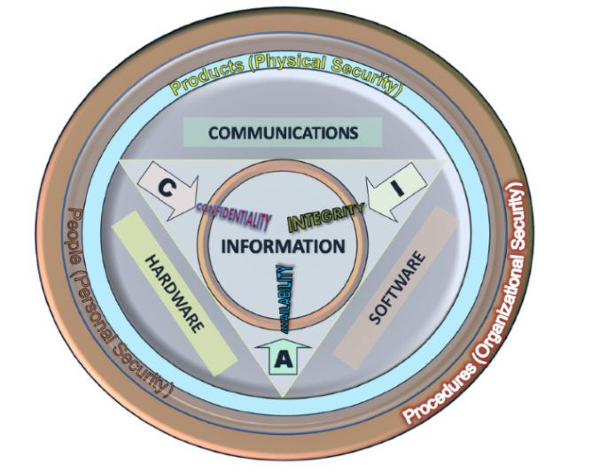
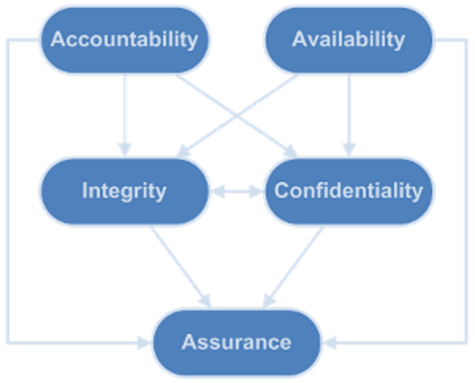

<!-- theme: gaia -->

<!-- size: 16:9 -->

<!-- page_number: true -->

<!-- footer: Copyright (c) by Bjoern Kimminich | Licensed under CC-BY-SA 4.0 -->

# Security Goals

---

<!-- *footer: -->

# Information Security <small>([44 U.S. Code § 3542](https://www.law.cornell.edu/uscode/text/44/3542))</small>

> <small>(1) The term “information security” means protecting information and information systems from unauthorized access, use, disclosure, disruption, modification, or destruction in order to provide—
>
> (A) integrity, which means guarding against improper information modification or destruction, and includes ensuring information nonrepudiation and authenticity;
>
> (B) confidentiality, which means preserving authorized restrictions on access and disclosure, including means for protecting personal privacy and proprietary information; and
>
> (C) availability, which means ensuring timely and reliable access to and use of information.</small>

---

<!-- *footer: The Information Security triad: CIA. Second version, 2009 John M. Kennedy T., used under CC-BY-SA 3.0 -->

# Information Security Triad: CIA

---

# :dart: Confidentiality

* **Protecting information from disclosure** to unauthorized parties
* Access to information should be granted only on a **need-to-know basis**
* **Data categorization** according to the amount and type of possible damage should it fall into wrong hands

#### Supporting Principles (:closed_lock_with_key:)

* Authentication, Authorization, Encryption, Anonymity, Secrecy

---

# :dart: Integrity

* **Protecting information from being modified** by unauthorized parties
* Being correct or **consistent with the intended state** of information
* Ensuring that the **information is not tampered** whenever it travels from source to destination or even stored at rest

#### Supporting Principles (:lock_with_ink_pen:)

* Hashing, Digital Signatures, Non-repudiation, Tamper-evident packaging

---

# :dart: Availability

* Ensuring that authorized parties are **able to access information** when needed
* Ensuring that the services of an organization are available

#### Supporting Principles (:atm:)

* Accessibility, Fault Tolerance, Redundancy, Backup, Testing

---

# Exercise 2.1 (:pushpin:)

1. Which security goals are at risk by the following threats?

| Threat                      | C | I | A |
|:----------------------------|:--|:--|:--|
| Network Sniffing            |   |   |   |
| DDoS Attack                 |   |   |   |
| Rogue WiFi Access Point     |   |   |   |
| Electromagnetic Pulse (EMP) |   |   |   |
| Whistleblower               |   |   |   |
| Social Engineering          |   |   |   |

---

# Attacker Behavior vs. Security Goals

|               |        Active        |      Passive       |        Threatened Security Goals         |
|:-------------:|:--------------------:|:------------------:|:----------------------------------------:|
| **Observing** | (:heavy_check_mark:) | :heavy_check_mark: |             Confidentiality              |
| **Altering**  |  :heavy_check_mark:  |        :x:         | Confidentiality, Integrity, Availability |

---

# Extended CIA Models

---

# [Parkerian Hexad](https://en.wikipedia.org/wiki/Parkerian_Hexad) (1998)

* Confidentiality
* Possession / Control (:new:)
* Integrity
* Authenticity (:new:)
* Availability
* Utility (:new:)

---

## :dart: Possession / Control

* Protecting against the idea that **confidential data can be possessed/controlled by an unauthorized individual or party**
* Loss of control or possession of information should not automatically lead to the breach of confidentiality

#### Supporting Principles (:left_luggage:)

* Encryption, Authentication

---

## :dart: Authenticity

* Assurance that **a message or transaction is from the source it claims to be from**

#### Supporting Principles (:memo:)

* Identification, Digital Certificates

---

## :dart: Utility

* **Usefulness** of data or information

#### Supporting Principles (:floppy_disk::pager:)

* Compatibility, Accessibility

> Information may be available and therefore usable but it doesn't necessarily have to be in a useful form to be defined as available. \[[^1]\]

[^1]: http://cs.lewisu.edu/mathcs/msisprojects/papers/georgiependerbey.pdf

---

# [CIA³](https://www.cia-cubed.org/) (2016)

* Confidentiality
* Integrity
* Availability
* Accountability (:new:)
* Assurance (:new:)

---

## :dart: Accountability

* Allowing to answer questions like _"Who did it?"_ or _"Who is accountable?"_
* Considering **legal consequences** and contractual obligations
* Encompassing **segregation of duties** and awareness training

#### Supporting Principles (:see_no_evil::hear_no_evil::speak_no_evil:)

* **Integrity**, Non-repudiation, Authenticity, Design, Governance, Policy

---

## :dart: Assurance

* Introduces **control activities** for the aforementioned security goals
* Periodic controls **assuring that all security measures** (both technical and operational) **work as intended**

#### Supporting Principles (:bar_chart::chart_with_upwards_trend:)

* Auditing, Measuring, Monitoring, Continuous Improvement

---

<!-- *footer: CIA3 model (anno 2016), http://www.cia-cubed.org, used under CC-BY-SA 4.0 -->

# Dependency Model of CIA³

---

# Exercise 2.2 (:pushpin:)

1. Define at least three supporting measures for each CIA³ security goal, distinguishing between technical and organizational measures

| Security Goal   | Technical Measures | Organizational Measures |
|:----------------|:-------------------|:------------------------|
| Confidentiality |                    |                         |
| Integrity       |                    |                         |
| Availability    |                    |                         |
| Accountability  |                    |                         |
| Assurance       |                    |                         |

---

# Exercise 2.3 (:house:)

1. Which of the "classic" CIA security goals could have been compromised in each of the [Motivation: Case Studies](01-01-motivation.md#case-studies)?
2. Explain each :heavy_check_mark: briefly

| Case Study                                               | C | I | A |
|:---------------------------------------------------------|:--|:--|:--|
| [Aadhaar](01-01-motivation.md#aadhaar-january-2018)      |   |   |   |
| [Equifax](01-01-motivation.md#equifax-september-2017)    |   |   |   |
| [VTech](01-01-motivation.md#vtech-november-2015)         |   |   |   |
| [CloudPets](01-01-motivation.md#cloudpets-february-2017) |   |   |   |
