<!-- theme: default -->

<!-- paginate: true -->

<!-- footer: Copyright (c) by **Bjoern Kimminich** | Licensed under [CC-BY-SA 4.0](https://creativecommons.org/licenses/by-sa/4.0/) -->

# Network Security

---

# OSI Network Layer Model

#### (repetition from [Technische Grundlagen der Informatik 2](https://www.nordakademie.de/bewerber/studienangebote/angewandte-informatik-bsc/studienplan/?tx_nacurriculum_nacurriculum%5Bid%5D=352&tx_nacurriculum_nacurriculum%5Bdate%5D=&tx_nacurriculum_nacurriculum%5Baction%5D=show&tx_nacurriculum_nacurriculum%5Bcontroller%5D=Studienplan&cHash=49faa9a950a1c7f9584e860140930247))

---

<!-- *footer: Shqip: Zbatimi i Niveleve OSI, 2010 Rexhep-bunjaku, used under CC-BY-SA 3.0 -->

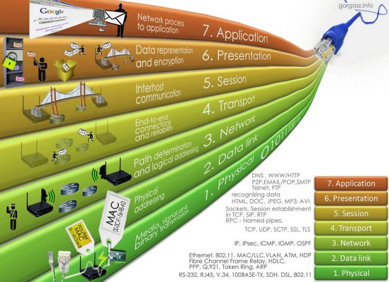

---

<!-- *footer: OSI User Layers, 2013 Gvseostud, used under CC-BY-SA 3.0 -->

# OSI User Layers

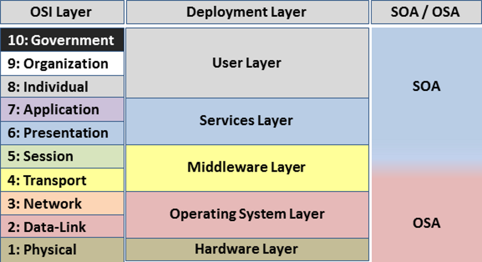

---

# [Wireshark](https://www.wireshark.org)

> Wireshark is the world's foremost and widely-used network protocol analyzer. It lets you see what's happening on your network at a microscopic level and is the de facto (and often de jure) standard across many commercial and non-profit enterprises, government agencies, and educational institutions. Wireshark development thrives thanks to the volunteer contributions of networking experts around the globe and is the continuation of a project started by Gerald Combs in 1998.

---

# Wireshark Features <small>(Excerpt)</small>

> * Deep inspection of hundreds of protocols
> * Live capture and offline analysis
> * Rich VoIP analysis
> * Live data can be read from Ethernet, IEEE 802.11, PPP/HDLC, ATM, Bluetooth, USB, Token Ring, Frame Relay, FDDI, and others (depending on your platform)
> * Decryption support for many protocols, including IPsec, ISAKMP, Kerberos, SNMPv3, SSL/TLS, WEP, and WPA/WPA2

---

# Exercise 4.1

1. Install Wireshark from <https://www.wireshark.org/#download>
2. Click _Start capturing packets_
3. Spend a few minutes surfing the Internet (the way you usually do)
4. Click _Stop capturing packets_
5. Use _File > Save as..._ to save your captured network traffic

_:information_source: You might be better off performing this exercise on a privately owned laptop, because campus computers might not allow installation of Wireshark._

---

# Exercise 4.2

1. Open your previously saved `.pcapng` file
2. Set `http` as a filter
3. Use _Find a packet_ to search for the _String_ `password` within the _Packet details_ (see screenshot below)

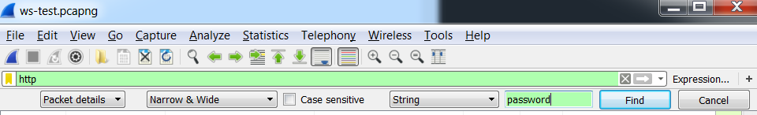

---

<!-- *footer:  -->

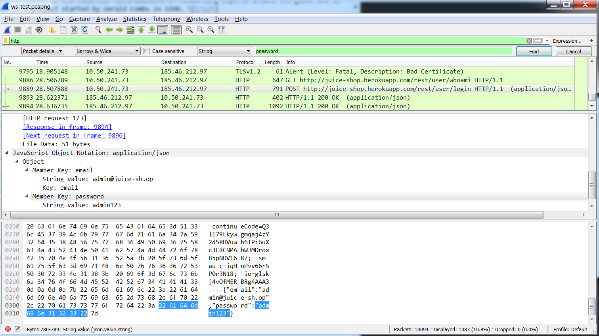

---

# VPN

## (Virtual Private Network)

---

# VPN Architecture

> Using VPNs, an organization can help **secure private network traffic over an unsecured network**, such as the Internet. VPN helps provide a secure mechanism for encrypting and encapsulating private network traffic and moving it through an intermediate network. **Data is encrypted for confidentiality**, and **packets** that might be intercepted on the shared or public network **are indecipherable** without the correct encryption keys. Data is also encapsulated, or wrapped, with an IP header containing routing information. \[[^1]\]

---

# VPN Scenarios

* **Remote Access VPN**: \[...\] Single computer user who connects to a private network from a remote location. The VPN server provides access to the resources of the network to which the VPN server is connected.
* **Site-to-Site VPN**: \[...\] Connects two portions of a private network or two private networks. \[...\] Allows an organization to have routed connections with separate offices, or with other organizations, over the Internet. \[...\] The VPN server provides a routed connection to the network to which the VPN server is attached. \[[^1]\]

---

<!-- *footer: How VPN Works, Windows Server 2003 Technical Reference, (c) 2009 Microsoft -->

# Remote Client to a Private Intranet

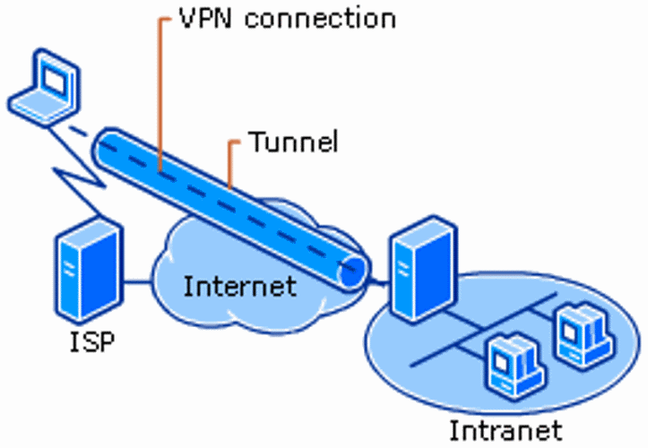

---

# Remote Client to a Private Intranet

> A remote access VPN connection over the Internet enables a remote access client to initiate a dial-up connection to a local ISP instead of connecting to a corporate or outsourced network access server (NAS). By using the established physical connection to the local ISP, the remote access client initiates a VPN connection across the Internet to the organization’s VPN server. When the VPN connection is created, the remote access client can access the resources of the private intranet. \[...\] \[[^1]\]

---

<!-- *footer: How VPN Works, Windows Server 2003 Technical Reference, (c) 2009 Microsoft -->

# Two Remote Sites Across the Internet

> <small>When networks are connected over the Internet, as shown in the following figure, a router forwards packets to another router across a VPN connection. To the routers, the VPN connection operates as a data-link layer link. \[[^1]\]</small>

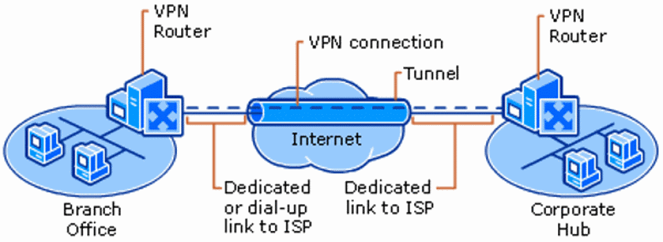

---

<!-- *footer: How VPN Works, Windows Server 2003 Technical Reference, (c) 2009 Microsoft -->

# Remote Access to a Secured Network over an Intranet

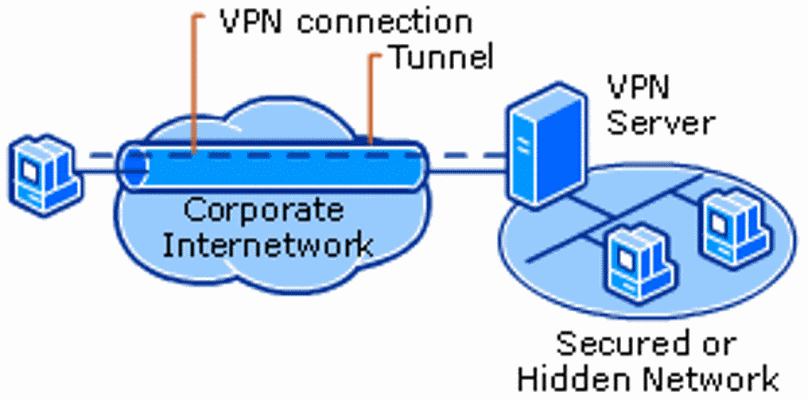

---

# Remote Access to a Secured Network over an Intranet

> In some organization intranets, the data of a department, such as human resources, is so sensitive that the network segment of the department is physically disconnected from the rest of the intranet. While this protects the data of the human resources department, it creates information accessibility problems for authorized users not physically connected to the separate network segment.
>
> VPN connections help provide the required security to enable the network segment of the human resources department to be physically connected to the intranet. \[...\] \[[^1]\]

---

<!-- *footer: How VPN Works, Windows Server 2003 Technical Reference, (c) 2009 Microsoft -->

# Connecting Two Networks over an Intranet

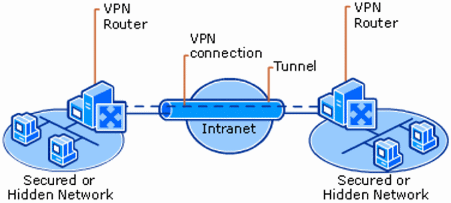

[^1]: https://docs.microsoft.com/en-us/previous-versions/windows/it-pro/windows-server-2003/cc779919(v=ws.10)

---

# Connecting Two Networks over an Intranet

> Two networks can be connected over an intranet using a site-to-site VPN connection. This type of VPN connection might be necessary, for example, for two departments in separate locations, whose data is highly sensitive, to communicate with each other. For instance, the finance department might need to communicate with the human resources department to exchange payroll information.
>
> The finance department and the human resources department are connected to the common intranet with computers that can act as VPN clients or VPN servers. \[...\] \[[^1]\]

---

# Exercise 4.3 (:house:)

1. Find out if your university (or company) is offering remote access via VPN and request access
2. Set up a VPN connection from your private computer (in your home network) and test the connection
3. Which protocols does your university (or company) VPN use for
   * Tunneling
   * Authentication
   * Encryption?
4. Elaborate how these protocols work together to provide a VPN (:pencil:)

---

# Wireless Security

---

# "I'm never gonna move"

<!-- *footer: "I'm never gonna move", 2012, http://weknowmemes.com/2012/09/im-never-gonna-move/ -->

:interrobang: Why would anyone not agree with _Success Baby_ on this?

---

# WLAN Security

> <small>\[...\] The original security standard was **Wired Equivalent Privacy (WEP)**. It was replaced by the original **Wi-Fi Protected Access (WPA)** in 2003 as an interim solution to the limited protection offered by WEP. The WPA program added support for **Temporal Key Integrity Protocol (TKIP)** encryption, an older form of security technology with some vulnerability to cryptographic attacks. WPA was replaced in 2004 with more advanced protocols of **WPA2**.</small>
>
> <small>Though the threat of a security compromise is small, users should not purchase new equipment which supports only WPA with TKIP. Only devices supporting WPA2 and **WPA3** security should be purchased and used. \[[^4]\]</small>

_:bookmark_tabs: Details on each protocol will be covered in the [Encryption](01-05-encryption.md) lecture!_

---

# Exercise 4.4 (:pushpin:)

1. Read the BSides Perth 2018 presentation [What Your RF Signature Says About You](https://obvi.us/presentation/rf-sig/)
2. Identify devices you own that could become a privacy risk
3. Consider changing some habits to reduce this risk, e.g. by following the [All Privacy Suggestions](#all-privacy-suggestions)

---

# Wardriving

> Wardriving is the act of searching for Wi-Fi networks from a moving vehicle. It involves **slowly driving around an area with the goal of locating Wi-Fi signals**. This may be accomplished by an individual or by two or more people, with one person driving and others searching for wireless networks.
>
> Wardriving may be as simple as searching for free Wi-Fi using a smartphone inside an automobile. However, the definition usually applies to a **hardware and software configuration specifically designed for locating and recording Wi-Fi networks**. \[...\]
>
> "Warbiking," "warwalking," and "warrailing" are variations of wardriving. \[[^2]\]

[^2]: https://techterms.com/definition/wardriving

---

#  WiGLE

> WiGLE, or (Wireless Geographic Logging Engine), is a website for collecting information about the different wireless hotspots around the world. Users can register on the website and upload hotspot data like GPS coordinates, SSID, MAC address and the encryption type used on the hotspots discovered. In addition, cell tower data is uploaded and displayed.
>
> By obtaining information about the encryption of the different hotspots, WiGLE tries to create an awareness of the need for security by running a wireless network. \[[^3]\]

[^3]: https://en.wikipedia.org/wiki/WiGLE

---

# WiGLE Map (World)

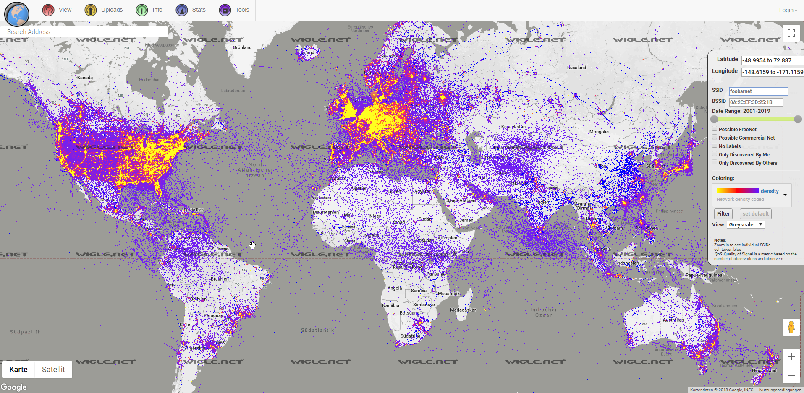

---

# WiGLE Map (Germany)

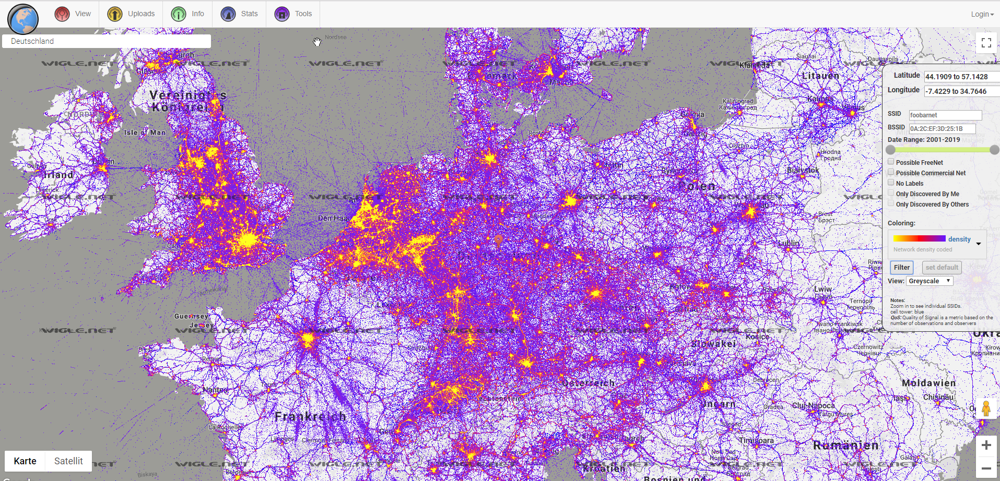

---

# WiGLE Map (Elmshorn, Germany)

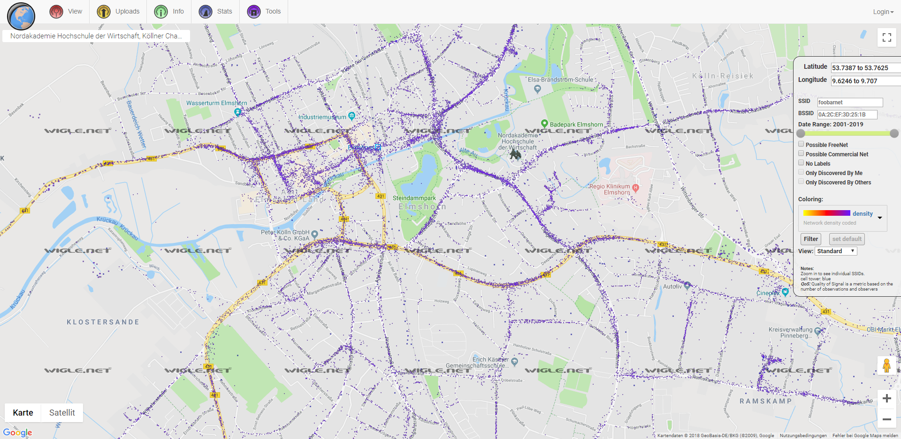

---

# WiGLE Statistics

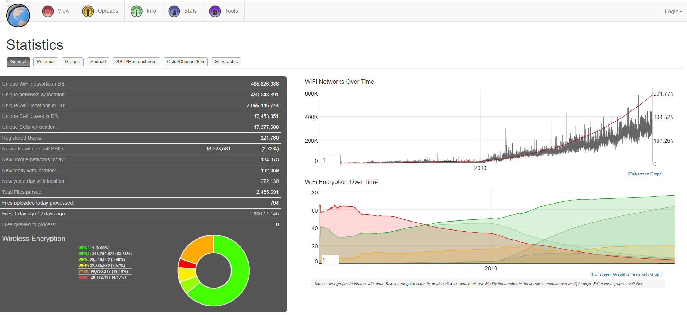

---

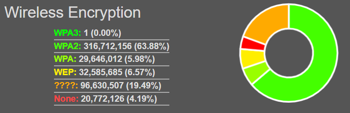
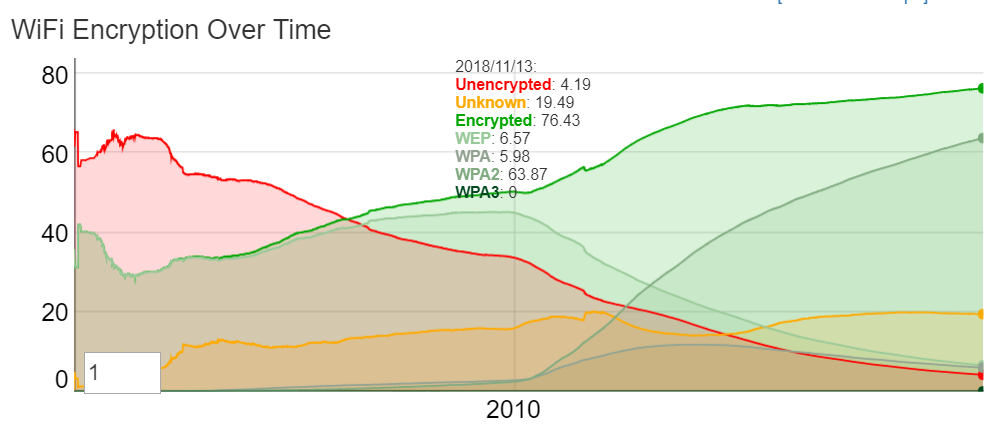

---

# Exercise 4.5 (:house:<small>_optional for iPhone users_</small>)

1. Install [Wigle WiFi Wardriving](https://play.google.com/store/apps/details?id=net.wigle.wigleandroid) app for Android
2. Let the app scan for networks on your way home
3. How many unencrypted networks did you encounter?
4. Did you encounter any WEP encrypted networks? How many?

<small>_:information_source: The Android app is Open Source: <https://github.com/wiglenet/wigle-wifi-wardriving>. Unfortunately, there are no war-driving tools for non-jailbroken iOS devices at this time, since Apple has disallowed them from their marketplace._</small>

---

## WiGLE Run from train station to university

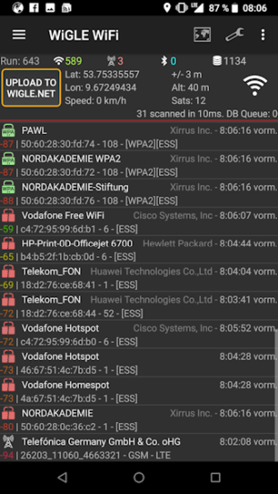 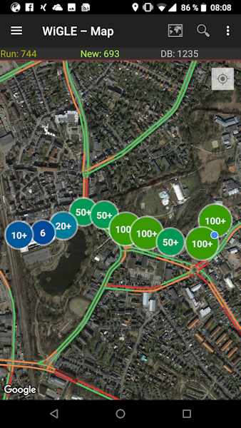 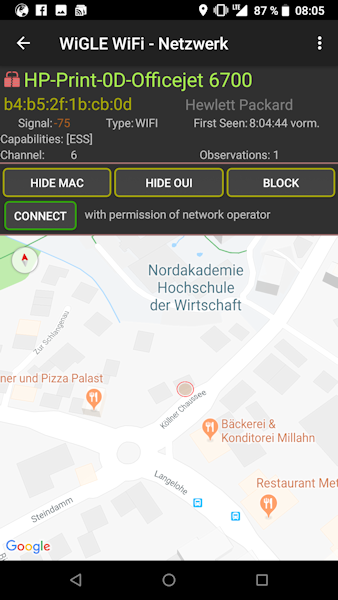

---

#### All Privacy Suggestions

> 1. Turn off phone WiFi when out
> 2. Forget old networks
> 3. Use a boring WiFi SSID (not your name)
> 4. Disable Wired to WiFi broadcasts
> 5. Migrate to 5GHz-only if possible
> 6. Wire your cameras
> 7. Pair Bluetooth devices at home
> 8. Put your cards in your wallet
> 9. Keep work logos and ID cards hidden \[[^4]\]

[^4]: https://obvi.us/presentation/rf-sig/

---

# Exercise 4.6 (:house:)

1. Install any popular NFC reader app on your smartphone
2. Scan a few of your credit cards, health insurance cards, ID cards etc. and document what personal information you can retrieve from each
3. Consider getting a Blocking Card or RFID-protected purse to prevent [RFID skimming](https://en.wikipedia.org/wiki/RFID_skimming)

---

# Data Center Security

---

# Network Firewall

> A firewall is a system that provides network security by **filtering incoming and outgoing network traffic based on a set of user-defined rules**. In general, the purpose of a firewall is to **reduce or eliminate the occurrence of unwanted network communications** while allowing all legitimate communication to flow freely. In most server infrastructures, firewalls provide an essential layer of security that, combined with other measures, prevent attackers from accessing your servers in malicious ways. \[[^5]\]

---

# Types of Firewalls

> * <small>**Packet filtering**, or stateless, **firewalls** work by inspecting individual packets in isolation. As such, they are unaware of connection state and can only allow or deny packets based on individual packet headers.</small>
>
> * <small>**Stateful firewalls** are able to determine the connection state of packets, which makes them much more flexible than stateless firewalls. They work by collecting related packets until the connection state can be determined before any firewall rules are applied to the traffic.</small>
>
> * <small>**Application firewalls** go one step further by analyzing the data being transmitted, which allows network traffic to be matched against firewall rules that are specific to individual services or applications. These are also known as proxy-based firewalls. \[[^5]\]</small> 

[^5]: https://www.digitalocean.com/community/tutorials/what-is-a-firewall-and-how-does-it-work

---

# Firewall Rules

A simple firewall could have rules defined like this:

* `FROM` _source_ `TO` _destination_ `ALLOW|BLOCK` _protocol_ `PORT` _port(s)_

Example policy for incoming traffic using above rule syntax:

1. `FROM` _external_ `TO` _internal_ `ALLOW` _tcp_ `PORT` _80|443_ 
2. `FROM` _194.94.98.42_ `TO` _internal_ `ALLOW` _tcp_ `PORT` _22_
3. `FROM` _194.94.98.\*_ `TO` _internal_ `BLOCK` _tcp_ `PORT` _22_
4. `FROM` _any_ `TO` _any_ `BLOCK` _any_ `PORT` _any_

---

# Default Policy

To keep configuration effort and complexity low, Firewalls fall back to a default policy when no explicitly defined rule matches the traffic.

* `FROM` _any_ `TO` _any_ `BLOCK` _any_ `PORT` _any_ 
= Block everything by default ("White List")

<!-- -->

* `FROM` _any_ `TO` _any_ `ALLOW` _any_ `PORT` _any_ 
= Allow everything by default ("Black List")

:information_source: For all incoming traffic a White List is recommended to maximize security. A Black List would suffice for outgoing traffic adding blocks only for some sites, e.g. <small>`FROM` _194.94.98.\*_ `TO` _youtube.\*_ `BLOCK` _tcp_ `PORT` _80|443_</small>

---

<!-- *footer: Traditional Single Layer DMZ with two flanking firewalls, 2014 Dgondim, used under CC-BY-SA 4.0 -->

#### DMZ with two Firewalls

---

<!-- *footer: Inner-Outer Two layer DMZ with three or more flanking firewalls, 2014 Dgondim, used under CC-BY-SA 4.0 -->

#### Two-Layer DMZ with three Firewalls

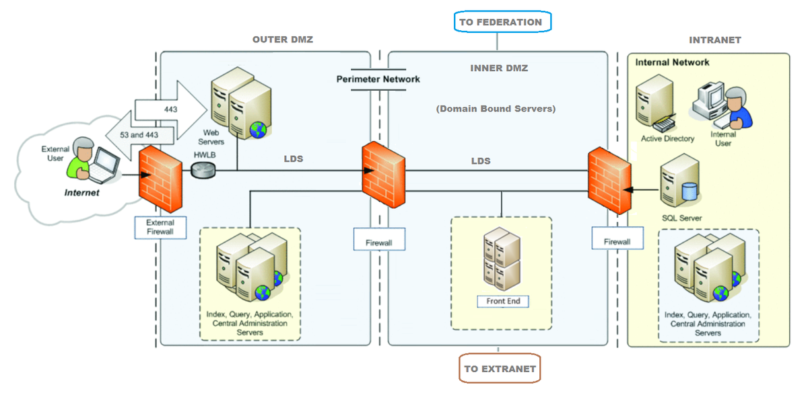

---

# IDS/IPS

## (Intrusion Detection / Prevention System)

---

# Definition

> An **intrusion detection system (IDS)** is a device or software application that **monitors a network or systems for malicious activity or policy violations**. Any malicious activity or violation is typically **reported either to an administrator or collected centrally**  \[...\]. 

> **Intrusion prevention systems** are considered extensions of intrusion detection systems because they both monitor network traffic and/or system activities for malicious activity. The main differences are, unlike intrusion detection systems, **intrusion prevention systems are placed in-line and are able to actively prevent or block intrusions** that are detected. \[[^6]\]

---

# Network-based IDS

> Network intrusion detection systems (NIDS) are placed at a strategic point or points within the network to monitor traffic to and from all devices on the network. It performs an analysis of passing traffic on the entire subnet, and matches the traffic that is passed on the subnets to the library of known attacks. Once an attack is identified, or abnormal behavior is sensed, the alert can be sent to the administrator. \[[^6]\]

---

<!-- *footer: DIFFERENCE BETWEEN IPS AND IDS IN NETWORK SECURITY, 2017, https://ipwithease.com/ -->

# IDS vs. IPS <small>(both Network-based)</small>

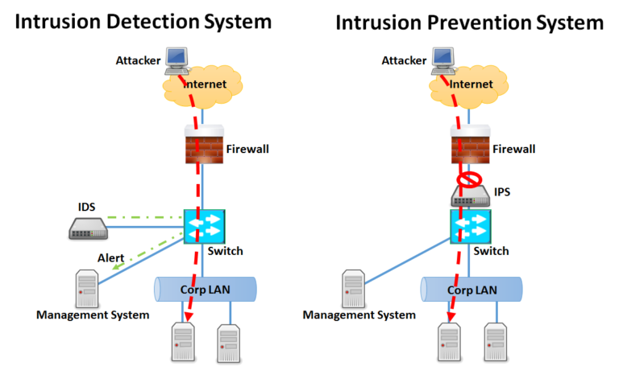

---

## Limitations

* Noise (e.g. from software bugs or corrupt DNS data) can severely limit an intrusion detection system's effectiveness
* Number of real attacks is often so far below the number of false-alarms that the real attacks are often missed and ignored
* Lag between a new threat discovery and its signature being applied to the IDS
* Cannot compensate for weak identification and authentication mechanisms or for weaknesses in network protocols
* Encrypted packets are not processed by most intrusion detection devices \[[^6]\]

[^6]: https://en.wikipedia.org/wiki/Intrusion_detection_system

---

# Host-based IDS

> Host intrusion detection systems (HIDS) run on individual hosts or devices on the network. A HIDS **monitors the inbound and outbound packets from the device only** and will alert the user or administrator if suspicious activity is detected. It **takes a snapshot of existing system files and matches it to the previous snapshot**. If the critical system files were modified or deleted, an alert is sent to the administrator to investigate. An example of HIDS usage can be seen on mission critical machines, which are not expected to change their configurations. \[[^6]\]

---

# WAF

## (Web Application Firewall)

---

# Web Application Firewall

> A web application firewall (WAF) is an application firewall for HTTP applications. It applies a set of rules to an HTTP conversation. Generally, these rules cover common attacks such as cross-site scripting (XSS) and SQL injection.
>
> While proxies generally protect clients, WAFs protect servers. A WAF is deployed to protect a specific web application or set of web applications. A WAF can be considered a reverse proxy.
>
> WAFs may come in the form of an appliance, server plugin, or filter, and may be customized to an application. The effort to perform this customization can be significant and needs to be maintained as the application is modified. \[[^7]\]

[^7]: https://www.owasp.org/index.php/Web_Application_Firewall

---

<!-- *footer: Simple Web Application Firewall Architecture, 2018 M2farah, used under CC-BY-SA 4.0 -->

# WAF Deployment in the Network

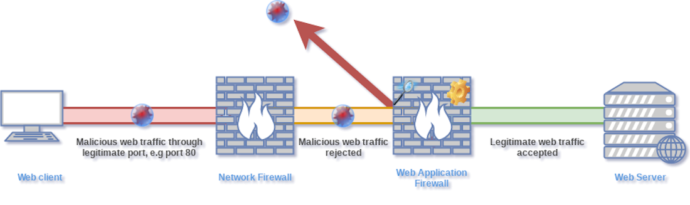

_:telescope: WAF benefits and limitations will be covered in detail at the end of [next semester](02-09-sdlc.md#web-application-firewall)!_
