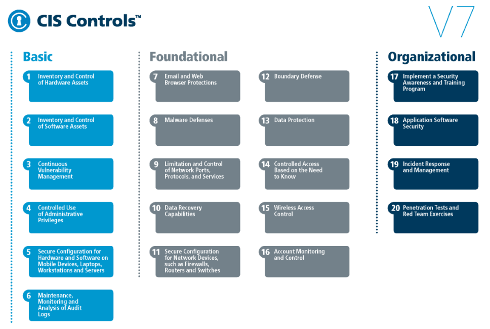

<!-- $theme: gaia -->

<!-- $size: 16:9 -->

<!-- page_number: true -->

<!-- footer: Copyright (c) by Bjoern Kimminich | Licensed under CC-BY-SA 4.0 -->

# Security Management & Organization

---

# Corporate Security Organization

---

# Exercise 6.1 (:pushpin:)

1. Brainstorm security roles and teams in the company you work for.
2. Associate tasks and responsibilities with these roles.
3. Where are these roles located within your company's org chart?

---

<!-- *footer: -->

## [Job Titles/Description Summaries](https://www.cs.seas.gwu.edu/cybersecurity-roles-and-job-titles)

* **Security Analyst**: <small>analyzes and assesses vulnerabilities in the infrastructure (software, hardware, networks), investigates available tools and countermeasures to remedy the detected vulnerabilities, and recommends solutions and best practices. Analyzes and assesses damage to the data/infrastructure as a result of security incidents, examines available recovery tools and processes, and recommends solutions. Tests for compliance with security policies and procedures. May assist in the creation, implementation, and/or management of security solutions.</small>
* **Security Engineer**: <small>Performs security monitoring, security and data/logs analysis, and forensic analysis, to detect security incidents, and mounts incident response. Investigates and utilizes new technologies and processes to enhance security capabilities and implement improvements.</small>

---

* **Security Architect**: <small>Designs a security system or major components of a security system, and may head a security design team building a new security system.</small>
* **Security Administrator**: <small>Installs and manages organization-wide security systems. May also take on some of the tasks of a security analyst in smaller organizations.</small>
* **Security Software Developer**: <small>Develops security software, including tools for monitoring, traffic analysis, intrusion detection, virus/spyware/malware detection, anti-virus software, and so on. Also integrates/implements security into applications software.</small>
* **Cryptographer/Cryptologist**: <small>Uses encryption to secure information or to build security software. Also works as researcher to develop stronger encryption algorithms.</small>

---

* **Cryptanalyst**: <small>Analyzes encrypted information to break the code/cipher or to determine the purpose of malicious software.</small>
* **Chief Information Security Officer**: <small>a high-level management position responsible for the entire information security division/staff. The position may include hands-on technical work.</small>
* **Security Consultant/Specialist**: <small>Broad titles that encompass any one or all of the other roles/titles, tasked with protecting computers, networks, software, data, and/or information systems against viruses, worms, spyware, malware, intrusion detection, unauthorized access, denial-of-service attacks, and an ever increasing list of attacks by hackers acting as individuals or as part of organized crime or foreign governments.</small>

---

## [Very Specialized Roles](https://www.cs.seas.gwu.edu/cybersecurity-roles-and-job-titles)

* **Intrusion Detection Specialist**: <small>Monitors networks, computers, and applications in large organizations, looking for events and traffic indicators that signal intrusion. Determines the damage caused by detected intrusions, identifies how an intrusion occurred, and recommends safeguards against similar intrusions. Also does penetration testing to identify vulnerabilities and recommend safeguards as preemptive measures.</small>
* **Computer Security Incident Responder**: <small>A member of team that prepares for and mounts rapid response to security threats and attacks such as viruses and denial-of-service attacks.</small>

---

* **Source Code Auditor**: <small>Reviews software source code to identify potential security issues and vulnerabilities that could be exploited by hackers to gain unauthorized access to data and system resources.</small>
* **Virus Technician**: <small>analyzes newly discovered computer viruses, and designs and develops software to defend against them.</small>
* **Penetration Tester** (also known as Ethical Hacker or Assurance Validator): <small>Not only scans for and identifies vulnerabilities, but exploits them to provide hard evidence that they are vulnerabilities. When penetration-testing, large infrastructures such as power grids, utility systems, and nuclear facilities, large teams of penetration testers, called Red Teams, are employed.</small>
* **Vulnerability Assessor**: <small>Scans for, identifies and assesses vulnerabilities in IT systems including computers, networks, software systems, information systems, and applications software.</small>

---

## Cyber Incident Response Team (CIRT)

> Also known as a “computer incident response team,” this group is responsible for responding to security breaches, viruses and other potentially catastrophic incidents in enterprises that face significant security risks. In addition to technical specialists capable of dealing with specific threats, it should include experts who can guide enterprise executives on appropriate communication in the wake of such incidents. The CIRT normally operates in conjunction with other enterprise groups, such as site security, public-relations and disaster recovery teams. \[[^2]\]

[^2]: https://www.gartner.com/it-glossary/cirt-cyber-incident-response-team

---

<!-- *footer: -->

### [Six steps for effective Incident Response](https://digitalguardian.com/blog/what-incident-response)

1. <small>**Preparation**: helps organizations determine how well their CIRT will be able to respond to an incident and should involve policy, response plan/strategy, communication, documentation, determining the CIRT members, access control, tools, and training</small>
2. <small>**Identification**: process through which incidents are detected, ideally promptly to enable rapid response and therefore reduce costs and damages</small>
3. <small>**Containment**: contain the damage and prevent further damage from occurring</small>
4. <small>**Eradication**: effective incident response that entails removing the threat and restoring affected systems to their previous state</small>
5. <small>**Recovery**: testing, monitoring, and validating systems while putting them back into production in order to verify that they are not re-infected or compromised</small>

---

# 6. Lessons Learned

> Lessons learned is a critical phase of incident response because it helps to educate and improve future incident response efforts. This is the step that gives organizations the opportunity to update their incident response plans with information that may have been missed during the incident, plus complete documentation to provide information for future incidents. Lessons learned reports give a clear review of the entire incident and may be used during recap meetings, training materials for new CIRT members, or as benchmarks for comparison.

---

## Security Operations Center (SOC)

> A security operations center (SOC) is a facility that houses an information security team responsible for monitoring and analyzing an organization’s security posture on an ongoing basis. The SOC team’s goal is to detect, analyze, and respond to cybersecurity incidents using a combination of technology solutions and a strong set of processes. Security operations centers are typically staffed with security analysts and engineers as well as managers who oversee security operations. SOC staff work close with [organizational incident response teams](#cyber-incident-response-team-cirt) to ensure security issues are addressed quickly upon discovery. \[[^3]\]

[^3]: https://digitalguardian.com/blog/what-security-operations-center-soc

---

## Blue Team

:wrench: **TODO**

---

## Red Team

:wrench: **TODO**

---

# Security Standards & Regulations

---

## ISO 27001

> ISO 27001 is an international standard published by the International Standardization Organization (ISO), and it describes how to manage information security in a company. The latest revision of this standard was published in 2013, and its full title is now ISO/IEC 27001:2013. The first revision of the standard was published in 2005, and it was developed based on the British standard BS 7799-2. \[[^3]\]

[^3]: https://advisera.com/27001academy/what-is-iso-27001/

---

### ISO 27001 Controls (Annex A)

> * A.5 **Information security policies** – controls on how the policies are written and reviewed
> * A.6 **Organization of information security** – controls on how the responsibilities are assigned; also includes the controls for mobile devices and teleworking
> * A.7 **Human resources security** – controls prior to employment, during, and after the employment
> * A.8 **Asset management** – controls related to inventory of assets and acceptable use, also for information classification and media handling \[[^4]\]

---

> * A.9 **Access control** – controls for Access control policy, user access management, system and application access control, and user responsibilities
> * A.10 **Cryptography** – controls related to encryption and key management
> * A.11 **Physical and environmental security** – controls defining secure areas, entry controls, protection against threats, equipment security, secure disposal, clear desk and clear screen policy, etc.
> * A.12 **Operational security** – lots of controls related to management of IT production: change management, capacity management, malware, backup, logging, monitoring, installation, vulnerabilities, etc. \[[^4]\]

---

> * A.13 **Communications security** – controls related to network security, segregation, network services, transfer of information, messaging, etc.
> * A.14 **System acquisition, development and maintenance** – controls defining security requirements and security in development and support processes
> * A.15 **Supplier relationships** – controls on what to include in agreements, and how to monitor the suppliers
> * A.16 **Information security incident management** – controls for reporting events and weaknesses, defining responsibilities, response procedures, and collection of evidence \[[^4]\]

---

> * A.17 **Information security aspects of business continuity management** – controls requiring the planning of business continuity, procedures, verification and reviewing, and IT redundancy
> * A.18 **Compliance** – controls requiring the identification of applicable laws and regulations, intellectual property protection, personal data protection, and reviews of information security \[[^4]\]

_:warning: \[...\] while IT is certainly important, IT alone cannot protect information. Physical security, legal protection, human resources management, organizational issues – all of them together are required to secure the information._ \[[^4]\]

[^4]: https://advisera.com/27001academy/knowledgebase/overview-of-iso-270012013-annex-a/

---

### ISO 27002

> ISO/IEC 27002 provides best practice recommendations on information security controls for use by those responsible for initiating, implementing or maintaining information security management systems (ISMS). Information security is defined within the standard in the context of the C-I-A triad. \[[^5]\]

[^5]: https://en.wikipedia.org/wiki/ISO/IEC_27002

---

## [CIS Controls](https://www.cisecurity.org/controls/)

* Maintained by the [Center for Internet Security](https://www.cisecurity.org)
* 20 prioritized actions to beat the vast majority of the most common attacks
* [Mappings to regulatory and compliance frameworks](https://www.cisecurity.org/cybersecurity-tools/mapping-compliance/) are available

_:information_source: An overview with regulatory framework mappings is available [as a poster](https://www.cisecurity.org/white-papers/cis-controls-2016-poster/) in its 41st edition (Winter 2016)._

---

<!-- *footer: Copyright © 2017 CIS® (Center for Internet Security) -->

---

## Other Standards (Examples)

* [NIST 800-53](https://csrc.nist.gov/publications/sp800) <small><small>([Security and Privacy Controls for Information Systems and Organizations](https://csrc.nist.gov/publications/detail/sp/800-53/rev-5/draft))</small></small>
* [DHS CDM Program](https://www.dhs.gov/cdm)
* [PCI DSS](https://www.pcisecuritystandards.org/)
* [BSI IT-Grundschutz-Standards](https://www.bsi.bund.de/EN/Publications/BSIStandards/BSIStandards_node.html)
* [BSI-Kritisverordnung](https://www.bmi.bund.de/SharedDocs/downloads/DE/publikationen/themen/bevoelkerungsschutz/kritis.html) (:de:)

---

# Exercise 6.2 (:house:)

1. Download the [Thresholds of the BSI-Kritis Ordinance](https://www.bmi.bund.de/SharedDocs/downloads/EN/themen/it-digital-policy/bsi-kritis-ordiance-poster.pdf?__blob=publicationFile&v=4)
2. Check if your employer's industry is affected by BSI-Kritis at all
3. Calculate (or estimate) if your employer is above or below the defined threshold for BSI-Kritis for your industry

---

# Security Communities & Associations

---

## [ISSA](https://www.issa.org)

> ISSA is the community of choice for international cybersecurity professionals dedicated to advancing individual growth, managing technology risk and protecting critical information and infrastructure.
>
> The **Information Systems Security Association (ISSA)®** is a not-for-profit, international organization of information security professionals and practitioners. It provides educational forums, publications, and peer interaction opportunities that enhance the knowledge, skill, and professional growth of its members.

---

## [ISACA](https://www.isaca.org)

> \[...\] **ISACA®** is a global association helping individuals and enterprises achieve the positive potential of technology. Today’s world is powered by technology, and ISACA equips professionals with the knowledge, credentials, education and community to advance their careers and transform their organizations.
>
> ISACA leverages the expertise of its 450,000 engaged professionals in information and cyber security, governance, assurance, risk and innovation, as well as its enterprise performance subsidiary, CMMI® Institute, to help advance innovation through technology

---

## (ISC)²

> **(ISC)²** is an international, nonprofit membership association for information security leaders like you. We’re committed to helping our members learn, grow and thrive. More than 138,000 certified members strong, we empower professionals who touch every aspect of information security.

---

<!-- *footer: -->

# [Computer Security Certifications](https://en.wikipedia.org/wiki/List_of_computer_security_certifications)

| Abbr. | Title                                                              | Issuer             |
|:-------------|:-------------------------------------------------------------------|:-------------------|
| CISSP        | <small>Certified Information Systems Security Professional</small> | (ISC)²             |
| SSCP         | <small>Systems Security Certified Practitioner</small>             | (ISC)²             |
| CSSLP        | <small>Certified Secure Software Lifecycle Professional</small>    | (ISC)²             |
| CISM         | <small>Certified Information Security Manager</small>              | ISACA              |
| OSCP         | <small>Offensive Security Certified Professional</small>           | Offensive Security |

_:moneybag: Security certifications typically come with an exam cost and an annual renewal fee._

---

<!-- *footer: -->

## [SANS Institute](https://www.sans.org)

> <small>The **SANS Institute** was established in 1989 as a cooperative research and education organization. Its programs now reach more than 165,000 security professionals around the world. A range of individuals \[...\] are sharing the lessons they learn and are jointly finding solutions to the challenges they face. At the heart of SANS are the many security practitioners in varied global organizations from corporations to universities working together to help the entire information security community.
>
> SANS is the most trusted and by far the largest source for information security training and security certification in the world. It also develops, maintains, and makes available at no cost, the largest collection of research documents about various aspects of information security, and it operates the Internet's early warning system - the Internet Storm Center.</small>

---

### Useful SANS Resources

* [Posters](https://www.sans.org/security-resources/posters), e.g.
  * [Security Leadership Poster](https://www.sans.org/security-resources/posters/leadership/security-leadership-poster-135)
  * [Security Awareness Roadmap](https://www.sans.org/security-resources/posters/securing-the-human/security-awareness-roadmap-95)
  * [Secure DevOps Toolchain and SWAT Checklist](https://www.sans.org/security-resources/posters/appsec/secure-devops-toolchain-swat-checklist-60) (:eyes:)
* [Information Security Policy Templates](https://www.sans.org/security-resources/policies/)
* [Incident Handler's Handbook](https://www.sans.org/reading-room/whitepapers/incident/paper/33901)

<!-- -->

* **[Internet Storm Center](https://isc.sans.edu/)**

---

## [OWASP](https://www.owasp.org)

> <small>The **Open Web Application Security Project (OWASP)** is a 501(c)(3) worldwide not-for-profit charitable organization focused on improving the security of software. Our mission is to make software security visible, so that individuals and organizations are able to make informed decisions. OWASP is in a unique position to provide impartial, practical information about AppSec to individuals, corporations, universities, government agencies and other organizations worldwide. Operating as a community of like-minded professionals, OWASP issues software tools and knowledge-based documentation on application security.</small>

_:eyes: OWASP will be covered in detail [next semester](02-01-owasp.md). The [AppSec lectures of this course](02-00-introduction.md#curriculum-2nd-semester) will be largely based on OWASP resources._
