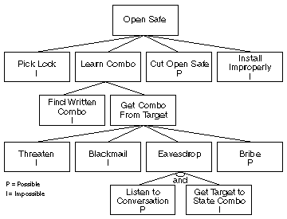
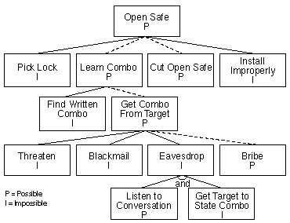
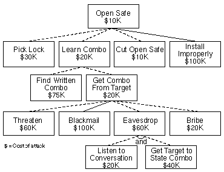
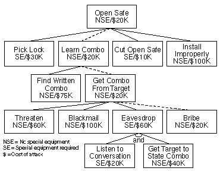
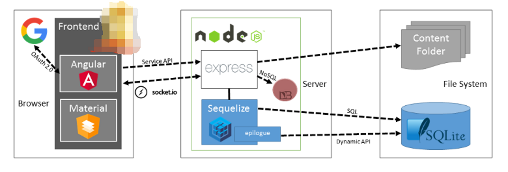

<!-- $theme: gaia -->

<!-- $size: 16:9 -->

<!-- page_number: true -->

<!-- footer: Copyright (c) by Bjoern Kimminich | Licensed under CC-BY-SA 4.0 -->

# Threat Modeling

---

# Threat Modeling

> Threat modeling is a **process by which potential threats**, such as structural vulnerabilities **can be identified, enumerated, and prioritized** – all from a hypothetical attacker’s point of view.
> 
> The purpose of threat modeling is to **provide defenders with a systematic analysis of the probable attacker’s profile, the most likely attack vectors, and the assets most desired by an attacker**.
> 
> Threat modeling answers questions like “Where are the high-value assets?”, “Where am I most vulnerable to attack?”, “What are the most relevant threats?”, and “Is there an attack vector that might go unnoticed?”. \[[^1]\]

[^1]: https://en.wikipedia.org/wiki/Threat_model

---

<!-- footer: Shostack, A. (2014) Threat Modeling: Designing for Security, Wiley -->

# Reasons to Threat Model

### Find Security Bugs Early

> * Help you find design issues even before you’ve written a line of code
> * Once you’ve chosen, changes will be expensive

---

### Understand Your Security Requirements

> * Good threat models can help you ask "Is that really a requirement?"
> * Interplay between requirements, threats, and mitigations
>   * Some threats don't line up with your business requirements, and as such may not be worth addressing
>   * Your requirements may not be complete
>   * Other threats might be too complex or expensive to address

---

### Engineer and Deliver Better Products

> * Considering your requirements and design early in the process
> * Dramatically lower the odds that you’ll be
>   * re-designing,
>   * re-factoring,
>   * or facing a constant stream of security bugs
> * Deliver a better product on a more predictable schedule

---

### Address Issues Other Techniques Won’t

> * Threat modeling will lead you to categories of issues that other tools won’t find
> * Models of what goes wrong, by abstracting away details, will help you see analogies and similarities to problems that have been discovered in other systems
> * Threat modeling should not focus on issues that your other safety and security engineering is likely to find

---

<!-- footer: "Attack Trees", Dr. Dobb's Journal, December 1999, (c) Bruce Schneier -->

# [Attack Trees](https://www.schneier.com/academic/archives/1999/12/attack_trees.html)

> Attack trees provide a formal, methodical way of describing the security of systems, based on varying attacks. Basically, you represent attacks against a system in a tree structure, with the goal as the root node and different ways of achieving that goal as leaf nodes.
 
---

## Attack Tree Example: Open Safe

* The goal: Opening the safe
* Each node becomes a subgoal, and children of that node are ways to achieve that subgoal. Parent nodes can be either `OR` or `AND` nodes
* **I** (impossible) or **P** (possible) have been assigned to each leaf node

---

## Possible vs. Impossible Attacks

* Dotted lines show possible attacks (=paths only over **P**-nodes)
  * Cutting open the safe
  * Learning the combination by bribing the owner of the safe

---

## Assigning Boolean values to nodes

* Any Boolean value can be assigned to the leaf nodes and then propagated up the tree structure
* Example: Which attacks require **Special Equipment** (which is probably expensive to retrieve for the attacker)?

---

## Assigning continuous values to nodes

* Costs were assigned to the leaf nodes and propagated up the tree
  * `OR` nodes have the value of their cheapest child
  * `AND` nodes have the value of the sum of their children
---

## Determine vulnerability of the system

* Dotted lines show attacks that cost less than $100,000
* Assumption: The contents of the safe are only worth $100,000
  * You should only concern yourself with attacks cheaper than that!

---

## Assigning different values to nodes

* Dotted line = The cheapest attack requiring no special equipment
* Querying the attack tree about a certain characteristic of attack lets you learn more about the system's security

---

<!-- footer: Copyright (c) by Bjoern Kimminich | Licensed under CC-BY-SA 4.0 -->

# Exercise 7.1 (:pushpin:)

1. Create an attack tree for the goal **"Access Building"** (obviously assuming that you are not authorized to do so in the first place)
2. Assign values **H** (human interaction needed) or **N** (no human interaction needed) to each leaf node
3. Assign costs to each leaf node (based on _realistic_ price research!)
4. Calculate cost and **H**/**N** values of each node and  the goal
5. Make some statements about the building's security based on querying the attack tree in different ways

---

<!-- *footer: Shostack, A. (2014) Threat Modeling: Designing for Security, Wiley -->

# Four-Step <small>Threat Modeling</small> Framework

> 1. What are you building?
> 2. What can go wrong with it once it’s built?
> 3. What should you do about those things that can go wrong?
> 4. Did you do a decent job of analysis?

---

# _What are you building?_

* _"We are going live with our facelifted next-gen online shop next month and we will gain market share like :stuck_out_tongue_winking_eye:!"_ <small>(SVP Sales & Marketing)</small>
* _"We will offer a dedicated next-gen B2B API to our customers using a RESTful endpoint supporting standard and custom data formats. We will :soon: migrate our legacy-XML-integrated customers to this new interface."_ <small>(Team Lead EDI Services)</small>
* _"Our new solution is no longer running natively on a classic VM but inside a single :whale: container on any :cloud: platform!"_ <small>(Datacenter Manager)</small>
* _"We added secure authentication via Google OAuth 2.0!"_ <small>(CISO)</small>
* _"In a future release we will of course add a Blockchain!"_ <small>(CIO)</small>

---

# Data Flows in the sample application

---

<!-- *footer: Shostack, A. (2014) Threat Modeling: Designing for Security, Wiley -->

# Trust Boundaries

> * Boundaries to show who controls what
> * Threats that cross those boundaries are likely important ones
> * Different people control different things
>
> _:information_source: Good examples include: Accounts, Network Interfaces, Different physical computers, virtual machines or organizational boundaries._

---

# Exercise 7.2 (:pencil:)

1. Mark all trust boundaries in the given [sample application's data flow diagram](#data-flows-in-the-sample-application)
2. Check the statements from [_What are you building?_](#what-are-you-building) and amend the diagram where necessary
3. If statements are unclear or sound ambiguous to you, ask your lecturer to impersonate the stakeholder and clarify! :performing_arts:
4. Are any new trust boundaries appearing? Do existing move or become obsolete?

---

<!-- *footer:  -->

## STRIDE _(What Can Go Wrong?)_

| Threat                     | Description                                                                                                                                                              |
|:---------------------------|:-------------------------------------------------------------------------------------------------------------------------------------------------------------------------|
| **S**poofing               | <small>Pretending to be something or someone you’re not</small>                                                                                                          |
| **T**ampering              | <small><small>Modifying something you’re not supposed to modify. It can include packets on the wire (or wireless), bits on disk, or the bits in memory</small></small>   |
| **R**epudiation            | <small><small>Claiming you didn’t do something (regardless of whether you did or not)</small></small>                                                                    |
| <small>**I**nformation&nbsp;Disclosure</small> | <small>Exposing information to people who are not authorized to see it</small>                                                                                           |
| <small>**D**enial&nbsp;of&nbsp;Service</small>      | <small><small>Attacks designed to prevent a system from providing service, including by crashing it, making it unusably slow, or filling all its storage</small></small> |
| <small>**E**levation&nbsp;of&nbsp;Privilege</small> | <small>When a program or user is technically able to do things that they’re not supposed to do</small>                                                                   |

---

<!-- *footer:  -->

## Threats vs. Security Goals/Principle

| Threat                     | Security Goal/Principle |
|:---------------------------|:------------------------|
| **S**poofing               | Authenticity            |
| **T**ampering              | Integrity               |
| **R**epudiation            | Non-repudiation         |
| **I**nformation Disclosure | Confidentiality         |
| **D**enial of Service      | Availability            |
| **E**levation of Privilege | Authorization           |

---

<!-- footer: Shostack, A. (2014) Threat Modeling: Designing for Security, Wiley -->

# [Elevation of Privilege (EoP)](../eop_card-game)
## Threat Modeling Card Game

---

# [Elevation of Privilege](../eop_card-game)

1. Deal the deck (Shuffling is optional)
2. The person with the 3 of Tampering leads the first round
3. [Play each round](#each-round-in-eop) (:next_track_button: slide)
4. When all the cards have been played, the game ends and the person with the most points wins
5. If you’re threat modeling a system you’re building, then you go file any bugs you find

---

# Each round in EoP...

1. Each player plays one card, starting with the person leading the round, and then moving clockwise
2. To play a card, read it aloud, and try to determine if it affects the system you have diagrammed. If you can link it, write it down, and score yourself a point. Play continues clockwise with the next player
3. When each player has played a card, the player who has played the highest card wins the round. That player leads the next round

:printer: [EoP cards and accessories for printing (CC BY 3.0 US)](../eop_card-game)

---

# Exercise 7.3 (:flower_playing_cards:)

1. Split into 3 groups of 3-6 students
2. If not provided to you, :printer: a [set of EoP cards](../eop_card-game/EoP_Card%20Game%20Images.pdf) and one [Score Card](../eop_card-game/EoP_Score%20Card.pdf)
3. :scissors: out the EoP playing cards
4. Play a complete game of EoP for the sample application
5. Keep your _Score Card_ in a safe place for Exercise 7.4 (:pencil:)

---

## _What should you do about those things?_

> * **Mitigate**: Doing things to make it harder to take advantage of a threat
> * **Eliminate**: Almost always achieved by eliminating features
> * **Transfer**: Letting someone or something else handle the risk
> * **Accept**: Once you've accepted the risk, you shouldn't worry over it. Sometimes worry is a sign that the risk hasn't been fully accepted, or that the risk acceptance was inappropriate

---

# _Did you do a decent job?_

## Diagramming

1. Can we tell a story without changing the diagram?
2. Can we tell that story without using words such as “sometimes” or “also”?
3. Can we look at the diagram and see exactly where the software will make a security decision?
4. Does the diagram show all the trust boundaries, such as where different accounts interact? Do you cover all UIDs, all application roles, and all network interfaces?

---

5. Does the diagram reflect the current or planned reality of the software?
6. Can we see where all the data goes and who uses it?
7. Do we see the processes that move data from one data store to another?

---

### Threats

1. <small>Have we looked for each of the STRIDE threats?</small>
2. <small>Have we looked at each element of the diagram?</small>
3. <small>Have we looked at each data flow in the diagram?</small>

### Validating Threats

1. <small>Have we written down or filed a bug for each threat?</small>
2. <small>Is there a proposed/planned/implemented way to address each threat?</small>
3. <small>Do we have a test case per threat?</small>
4. <small>Has the software passed the test?</small>

---

# Exercise 7.4 (:pencil::house:)

1. Meet with your original EoP-group and have the _Score Card_ ready
2. Address each threat identified from Exercise 7.2 and outline your choice of _Mitigate_, _Eliminate_, _Transfer_, or _Accept_ with some corresponding measures
3. Go through the [_Did you do a decent job?_](#did-you-do-a-decent-job) list to verify your result is sufficiently detailed and up-to-date
4. Scan or take a photo of your Score Card and send it to bjoern.kimminich@nordakademie.de
5. _(Optional)_ Use a PGP encrypted (:closed_lock_with_key:) and signed (:lock_with_ink_pen:) email in step 4!
