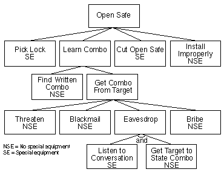
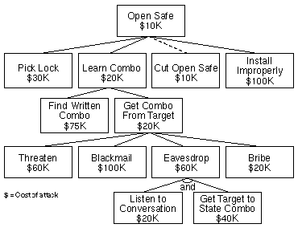

<!-- $theme: gaia -->

<!-- $size: 16:9 -->

<!-- page_number: true -->

<!-- footer: Copyright (c) by Bjoern Kimminich | Licensed under CC-BY-SA 4.0 -->

# Threat Modelling

---

<!-- footer: "Attack Trees", Dr. Dobb's Journal, December 1999, (c) Bruce Schneier -->

# [Attack Trees](https://www.schneier.com/academic/archives/1999/12/attack_trees.html)

> Attack trees provide a formal, methodical way of describing the security of systems, based on varying attacks. Basically, you represent attacks against a system in a tree structure, with the goal as the root node and different ways of achieving that goal as leaf nodes.
 
---

## Attack Tree Example: Open Safe

* The goal: Opening the safe
* Each node becomes a subgoal, and children of that node are ways to achieve that subgoal. Parent nodes can be either `OR` or `AND` nodes
* **I** (impossible) or **P** (possible) have been assigned to each leaf node

---

## Possible vs. Impossible Attacks

* Dotted lines show possible attacks (=paths only over **P**-nodes)
  * Cutting open the safe
  * Learning the combination by bribing the owner of the safe

---

## Assigning Boolean values to nodes

* Any Boolean value can be assigned to the leaf nodes and then propagated up the tree structure
* Example: Which attacks require **Special Equipment** (which is probably expensive to retrieve for the attacker)?

---

## Assigning continuous values to nodes

* Costs were assigned to the leaf nodes and propagated up the tree
  * `OR` nodes have the value of their cheapest child
  * `AND` nodes have the value of the sum of their children
---

## Determine vulnerability of the system

* Dotted lines show attacks that cost less than $100,000
* Assumption: The contents of the safe are only worth $100,000
  * You should only concern yourself with attacks cheaper than that!

---

## Assigning different values to nodes

* Dotted line = The cheapest attack requiring no special equipment
* Querying the attack tree about a certain characteristic of attack lets you learn more about the system's security

---

<!-- footer: Copyright (c) by Bjoern Kimminich | Licensed under CC-BY-SA 4.0 -->

# Exercise 7.1 (:pushpin:)

1. Create an attack tree for the goal **"Access Building"** (obviously assuming that you are not authorized to do so in the first place)
2. Assign values **H** (human interaction needed) or **N** (no human interaction needed) to each leaf node
3. Assign costs to each leaf node (based on _realistic_ price research!)
4. Calculate cost and **H**/**N** values of each node and  the goal
5. Make some statements about the building's security based on querying the attack tree in different ways

---

# STRIDE

---

# PASTA

---

# Elevation of Privilege