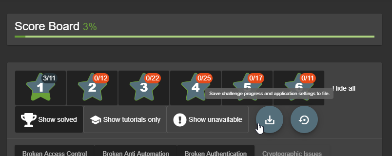

<!-- theme: default -->
<!-- paginate: true -->
<!-- footer: Copyright (c) by **Bjoern Kimminich** | Licensed under [CC-BY-SA 4.0](https://creativecommons.org/licenses/by-sa/4.0/) -->

# 

# OWASP

---

# [OWASP](https://owasp.org)

> The Open Web Application Security Project (OWASP) is a nonprofit
> foundation that works to improve the security of software. Through
> community-led open source software projects, hundreds of local
> chapters worldwide, tens of thousands of members, and leading
> educational and training conferences, the OWASP Foundation is the
> source for developers and technologists to secure the web.

---

# [Core Values](https://owasp.org/about/#core-values)

> * **Open**: Everything at OWASP is radically transparent from our
>   finances to our code.
> * **Innovative**: We encourage and support innovation and experiments
>   for solutions to software security challenges.
> * **Global**: Anyone around the world is encouraged to participate in
>   the OWASP community.
> * **Integrity**: Our community is respectful, supportive, truthful,
>   and vendor neutral

---

# OWASP Projects

---

# [OWASP Projects](https://owasp.org/projects/)

An OWASP project is a collection of related tasks that have a defined
roadmap and team members.

| Project Type  | Examples                                                                                                                                                                                                                                        |
|:--------------|:------------------------------------------------------------------------------------------------------------------------------------------------------------------------------------------------------------------------------------------------|
| Tool          | [ZAP](https://owasp.org/www-project-zap/), [Dependency Check](https://owasp.org/www-project-dependency-check/), [DefectDojo](https://owasp.org/www-project-defectdojo/), [Juice Shop](https://owasp.org/www-project-juice-shop/)                |
| Code          | [ModSecurity Core Rule Set](https://owasp.org/www-project-modsecurity-core-rule-set/)                                                                                                                                                           |
| Documentation | [OWASP Top 10](https://owasp.org/www-project-top-ten/), [Application Security Verification Standard (ASVS)](https://owasp.org/www-project-application-security-verification-standard/), [Cornucopia](https://owasp.org/www-project-cornucopia/) |

---

# [Project Lifecycle](https://wiki.owasp.org/index.php/Category:OWASP_Project#tab=Project_Assessments)

| Level     | Icon                                                          | Description                                                                                                                                                                 |
|:----------|:--------------------------------------------------------------|:----------------------------------------------------------------------------------------------------------------------------------------------------------------------------|
| Incubator |  | OWASP Incubator projects represent the experimental playground where projects are still being fleshed out, ideas are still being proven, and development is still underway. |
| Labs      |            | OWASP Labs projects represent projects that have produced an OWASP reviewed deliverable of value.                                                                           |
| Flagship  |    | The OWASP Flagship designation is given to projects that have demonstrated strategic value to OWASP and application security as a whole.                                    |

---

# OWASP Chapters

---

# [OWASP Chapters](https://owasp.org/chapters/)

> OWASP Local Chapters build community for application security
> professionals around the world. Our Local Chapter Meetings are free
> and open to anyone to attend so both members and non-members are
> always welcomed. Local meetings include:
>
> * Training to improve your skills
> * Talks relevant to your work
> * Networking opportunities

---

# [OWASP German Chapter](https://owasp.org/www-chapter-germany/)

There is one Chapter for Germany in total which is complemented by a
so-called
[OWASP Stammtisch](https://owasp.org/www-chapter-germany/#div-treffen)
each in several metropolitan areas such as München, Frankfurt,
[Hamburg](https://owasp.org/www-chapter-germany/stammtische/hamburg/),
Stuttgart, Köln, Hannover, Karlsruhe, Dresden, Ruhrpott,
Heilbronn-Franken.

---

# [Mandatory Chapter Rules](https://owasp.org/www-policy/operational/chapter-handbook-existing)

* Organize free and open meetings
* Hold a minimum of 4 chapter meetings or events each year
* Give official notice on the website and chapter mailing list
* Abide by OWASP principles and the code of ethics
* Protect the privacy of the chapter's local contacts
* Maintain vendor neutrality (act independently)
* Spend any chapter funds in accordance with the OWASP goals, code of
  ethics, and principles

---

# OWASP Top 10

---

#  [OWASP Top 10](https://owasp.org/www-project-top-ten/)

|    |                         |    |                                             |
|:---|:------------------------|:---|:--------------------------------------------|
| 1  | Injection               | 6  | Security Misconfiguration                   |
| 2  | Broken Authentication   | 7  | Cross-Site-Scripting (XSS)                  |
| 3  | Sensitive Data Exposure | 8  | Insecure Deserialization                    |
| 4  | XML External Entities   | 9  | Using Components with Known Vulnerabilities |
| 5  | Broken Access Control   | 10 | Insufficient Logging & Monitoring           |

---

# Application Security Risks

---

## Risk Rating Table

_:information_source: Based on the
[OWASP Risk Rating Methodology](https://owasp.org/www-community/OWASP_Risk_Rating_Methodology)_

---

# Risk Calculation Example

---

# Top 10 Risk Factor Summary

---

# Some(!) Additional Risks to Consider

|                                                                                   |                                                                              |
|:----------------------------------------------------------------------------------|:-----------------------------------------------------------------------------|
| Cross-Site Request Forgery (CSRF)                                                 | Unvalidated Forward and Redirects                                            |
| Uncontrolled Resource Consumption ('Resource Exhaustion', 'AppDoS')               | Improper Control of Interaction Frequency (Anti-Automation)                  |
| Unrestricted Upload of File with Dangerous Type                                   | Inclusion of Functionality from Untrusted Control Sphere (3rd Party Content) |
| User Interface (UI) Misrepresentation of Critical Information (Clickjacking etc.) | Server-Side Request Forgery (SSRF)                                           |

---

# Other Resources on AppSec

* [**SANS** Software Security Community](https://software-security.sans.org/)
  * [CWE/SANS TOP 25 Most Dangerous Software Errors](http://www.sans.org/top25-software-errors)
  * [Securing Web Application Technologies \[SWAT\] Checklist](https://software-security.sans.org/resources/swat)

* [**CWE** Common Weakness Enumeration](http://cwe.mitre.org)
  * Community-developed list of common software security weaknesses

---

# 

# OWASP Juice Shop

---

#  [OWASP Juice Shop](https://owasp-juice.shop)

> OWASP Juice Shop is probably the most modern and sophisticated
> insecure web application! It can be used in security trainings,
> awareness demos, CTFs and as a guinea pig for security tools! Juice
> Shop encompasses vulnerabilities from the entire OWASP Top Ten along
> with many other security flaws found in real-world applications!

---

## Main Selling Points

* **Free and Open source**: Licensed under the
  [MIT license](https://github.com/bkimminich/juice-shop/blob/master/LICENSE)
  with no hidden costs or caveats
* **Easy-to-install**: Choose between [node.js](http://nodejs.org),
  [Docker](https://www.docker.com) and
  [Vagrant](https://www.vagrantup.com/downloads.html) to run on
  Windows/Mac/Linux
* **Self-contained**: Additional dependencies are pre-packaged or will
  be resolved and downloaded automatically
* **Beginner-friendly**: Hacking Instructor tutorial scripts guide users
  through several of the easier challenges while explaining the
  underlying vulnerabilities
* **Gamification**: The application notifies you on solved challenges
  and keeps track of successfully exploited vulnerabilities on a Score
  Board

---

* **Self-healing**: The simple SQLite and MarsDB databases are wiped and
  repopulated from scratch on every server startup
* **Re-branding**: Fully customizable in business context and look &
  feel to your own corporate or customer requirements
* **CTF-support**: Challenge notifications optionally contain a flag
  code for your own
  [Capture-The-Flag events](https://github.com/bkimminich/juice-shop-ctf)

---

# Installation

* Individual local instance per student
* Runs on node.js, Docker, Vagrant and in the :cloud:

## :warning: Hacking Rules

* Do **not** look at the source code on GitHub
* Do **not** look at GitHub issues, PRs etc.
* Do **not** cheat (with online tutorials or walkthroughs) before trying
* Report problems during exercises immediately

---

# Official Companion Guide

> [Pwning OWASP Juice Shop](https://leanpub.com/juice-shop) \[...\] will
> give you a complete overview of the vulnerabilities found in the
> application including hints how to spot and exploit them. In the
> appendix you will even find complete step-by-step solutions to every
> challenge. The ebook is published under
> [CC BY-NC-ND 4.0](https://creativecommons.org/licenses/by-nc-nd/4.0/)
> and is available **for free**
> [online-readable](https://pwning.owasp-juice.shop). The latest
> officially released edition is
> [available **for free** on LeanPub in PDF, Kindle and ePub format](https://leanpub.com/juice-shop).

---

&nbsp;&nbsp;&nbsp;&nbsp;&nbsp;&nbsp;&nbsp;&nbsp;&nbsp;&nbsp;&nbsp;&nbsp;

&nbsp;&nbsp;&nbsp;&nbsp;&nbsp;&nbsp;&nbsp;&nbsp;&nbsp;&nbsp;&nbsp;&nbsp;&nbsp;&nbsp;&nbsp;

---

# Exercise 1.1

## Install the OWASP Juice Shop `v11.x`

1. Install the latest
   [Node.js 12.x (or 14.x) release](https://nodejs.org/) on your
   computer
2. On <https://github.com/bkimminich/juice-shop#setup> follow the
   instructions for either
   * [From Sources](https://github.com/bkimminich/juice-shop#from-sources)
     or
   * [Packaged Distributions](https://github.com/bkimminich/juice-shop#packaged-distributions--)

:whale: _If you want to use
[Docker](https://github.com/bkimminich/juice-shop#docker-container-----)
you need to run the container with `docker run -d -e "NODE_ENV=unsafe"
-p 3000:3000 bkimminich/juice-shop` or you won't be able to solve
several of the exercises._

---

# Exercise 1.2

## Happy path shopping tour

1. Register a user account at your local Juice Shop
2. Browse the inventory and purchase some products
3. Try out all other functionality you find in the application

---

# Exercise 1.3

## Score Board

1. Find the hidden Score Board in the Juice Shop (:star:)

:information_source: _You can let the application's friendly Hacking
Instructor guide you through this exercise by clicking "Help getting
started" on the welcome banner or in the side bar._

---

# Exercise 1.4 _(optional with `v12.0.0-SNAPSHOT`)_

## Transfer your hacking progress

1. If you keep using the same computer _and_ do not delete your cookies your browser will persist and restore your hacking progress.
2. It is still recommended to make a backup of your progress regularly.
3. You can also use this `JSON` backup to restore your progress and settings on any other computer.

