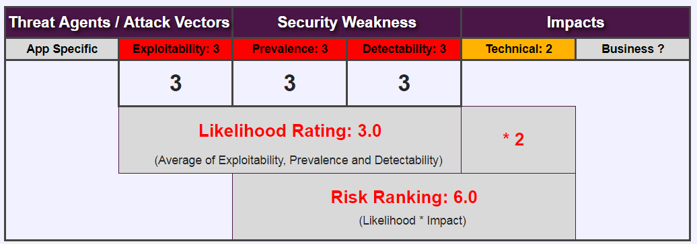
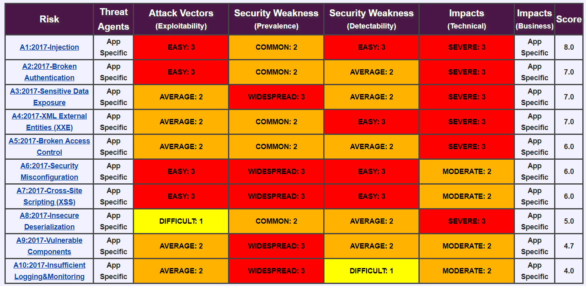

<!-- $theme: gaia -->

<!-- $size: 16:9 -->

<!-- page_number: true -->

<!-- footer: Copyright (c) by Bjoern Kimminich | Licensed under CC-BY 4.0 -->

# OWASP

---

# OWASP

* [**O**pen **W**eb **A**pplication **S**ecurity **P**roject](https://www.owasp.org)
  * Free and open software security community
  * 501(c)(3) Nonprofit organization

* Core purpose
  * Be the thriving global community that drives visibility and evolution in the safety and security of the world's software

---

# Core Values

* **OPEN** Everything at OWASP is radically transparent from our finances to our code.
* **INNOVATION** OWASP encourages and supports innovation and experiments for solutions to software security challenges.
* **GLOBAL** Anyone around the world is encouraged to participate in the OWASP community.
* **INTEGRITY** OWASP is an honest and truthful, vendor neutral, global community.

---

# Principles

* Free & Open
* Governed by rough consensus & running code
* Abide by a [code of ethics](https://www.owasp.org/index.php/About_The_Open_Web_Application_Security_Project#Code_of_Ethics)
* Not-for-profit
* Not driven by commercial interests
* **Risk based approach**

---

# Application Security Risks (1/2)

---

# Application Security Risks (2/2)

* Based on the [OWASP Risk Rating Methodology](https://www.owasp.org/index.php/OWASP_Risk_Rating_Methodology)

---

# OWASP Top 10

|   |                         |    |                                             |
|:--|:------------------------|:---|:--------------------------------------------|
| 1 | Injection               | 6  | Security Misconfiguration                   |
| 2 | Broken Authorization    | 7  | Cross-Site-Scripting (XSS)                  |
| 3 | Sensitive Data Exposure | 8  | Insecure Deserialization                    |
| 4 | XML External Entities   | 9  | Using Components with Known Vulnerabilities |
| 5 | Broken Access Control   | 10 | Insufficient Logging & Monitoring           |

---

# Risk Calculation Example

---

# Top 10 Risk Factor Summary

