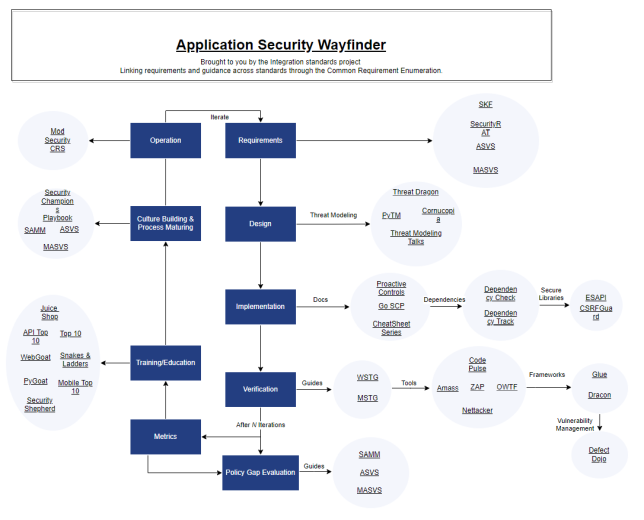

<!-- theme: default -->
<!-- paginate: true -->
<!-- footer: Copyright (c) by **Bjoern Kimminich** | Licensed under [CC-BY-SA 4.0](https://creativecommons.org/licenses/by-sa/4.0/) -->

# 

# OWASP

---

# [OWASP](https://owasp.org)

> The Open Web Application Security Project® (OWASP) is a nonprofit
> foundation that works to improve the security of software. Through
> community-led open source software projects, hundreds of local
> chapters worldwide, tens of thousands of members, and leading
> educational and training conferences, the OWASP Foundation is the
> source for developers and technologists to secure the web.

---

# [Core Values](https://owasp.org/about/#core-values)

> * **Open**: Everything at OWASP is radically transparent from our
>   finances to our code.
> * **Innovative**: We encourage and support innovation and experiments
>   for solutions to software security challenges.
> * **Global**: Anyone around the world is encouraged to participate in
>   the OWASP community.
> * **Integrity**: Our community is respectful, supportive, truthful,
>   and vendor neutral

---

# OWASP Projects

---

# [OWASP Projects](https://owasp.org/projects/)

> OWASP Projects are a collection of related tasks that have a defined roadmap and team members. Our projects are open source and are built by our community of volunteers - people just like you! OWASP project leaders are responsible for defining the vision, roadmap, and tasks for the project. The project leader also promotes the project and builds the team. OWASP currently has over 100 active projects, and new project applications are submitted every week.

---

# [Application Security Wayfinder]()

---

# [Project Lifecycle](https://owasp.org/projects/)

| Level     | Icon                                                          | Description                                                                                                                                                                 |
|:----------|:--------------------------------------------------------------|:----------------------------------------------------------------------------------------------------------------------------------------------------------------------------|
| Incubator |  | OWASP Incubator projects represent the experimental playground where projects are still being fleshed out, ideas are still being proven, and development is still underway. |
| Labs      |            | OWASP Labs projects represent projects that have produced an OWASP reviewed deliverable of value.                                                                           |
| Flagship  |    | The OWASP Flagship designation is given to projects that have demonstrated strategic value to OWASP and application security as a whole.                                    |

---

# OWASP Chapters

---

# [OWASP Chapters](https://owasp.org/chapters/)

> OWASP Local Chapters build community for application security
> professionals around the world. Our Local Chapter Meetings are free
> and open to anyone to attend so both members and non-members are
> always welcomed. Local meetings include:
>
> * Training to improve your skills
> * Talks relevant to your work
> * Networking opportunities

---

# [OWASP German Chapter](https://owasp.org/www-chapter-germany/)

There is one Chapter for Germany in total which is complemented by a
so-called
[OWASP Stammtisch](https://owasp.org/www-chapter-germany/#div-treffen)
each in several metropolitan areas such as München, Frankfurt,
[Hamburg](https://owasp.org/www-chapter-germany/stammtische/hamburg/),
Stuttgart, Köln, Hannover, Karlsruhe, Dresden, Berlin, Leipzig, Heilbronn-Franken.

---

# [Mandatory Chapter Rules](https://owasp.org/www-policy/operational/chapter-handbook-existing)

* Organize free and open meetings
* Hold a minimum of 4 chapter meetings or events each year
* Give official notice on the website and chapter mailing list
* Abide by OWASP principles and the code of ethics
* Protect the privacy of the chapter's local contacts
* Maintain vendor neutrality (act independently)
* Spend any chapter funds in accordance with the OWASP goals, code of
  ethics, and principles

---

# OWASP Top 10

---

#  [OWASP Top 10](https://owasp.org/Top10/)

|     |                           |     |                                            |
|:----|:--------------------------|:----|:-------------------------------------------|
| 1   | Broken Access Control     | 6   | Vulnerable and Outdated Components         |
| 2   | Cryptographic Failures    | 7   | Identification and Authentication Failures |
| 3   | Injection                 | 8   | Software and Data Integrity Failures       |
| 4   | Insecure Design           | 9   | Security Logging and Monitoring Failures   |
| 5   | Security Misconfiguration | 10  | Server-Side Request Forgery                |

---

# [Methodology](https://owasp.org/Top10/#methodology)

> This installment of the Top 10 is more data-driven than ever but not blindly data-driven. We selected eight of the ten categories from contributed data and two categories from the Top 10 community survey at a high level. We do this for a fundamental reason, looking at the contributed data is looking into the past. AppSec researchers take time to find new vulnerabilities and new ways to test for them. It takes time to integrate these tests into tools and processes. By the time we can reliably test a weakness at scale, years have likely passed. To balance that view, we use an community survey to ask application security and development experts on the front lines what they see as essential weaknesses that the data may not show yet.

---

# [CWE](https://cwe.mitre.org/) vs. [CVE](https://cve.mitre.org/)

**CWE** = **C**ommon **W**eakness **E**numeration

> **CWE™** is a community-developed list of software and hardware weakness types. It serves as a common language, a measuring stick for security tools, and as a baseline for weakness identification, mitigation, and prevention efforts.

**CVE** = **C**ommon **V**ulnerabilities and **E**xposures

> The mission of the **CVE®** Program is to identify, define, and catalog publicly disclosed cybersecurity vulnerabilities.

---

# [Data Factors](https://owasp.org/Top10/A00_2021_Introduction/#data-factors)

> * CWEs Mapped: The number of CWEs mapped to a category by the Top 10 team.
> * Incidence Rate: Incidence rate is the percentage of applications vulnerable to that CWE from the population tested by that org for that year.
> * Weighted Exploit: The Exploit sub-score from CVSSv2 and CVSSv3 scores assigned to CVEs mapped to CWEs, normalized, and placed on a 10pt scale.
> * Weighted Impact: The Impact sub-score from CVSSv2 and CVSSv3 scores assigned to CVEs mapped to CWEs, normalized, and placed on a 10pt scale.

---
 
> * (Testing) Coverage: The percentage of applications tested by all organizations for a given CWE.
> * Total Occurrences: Total number of applications found to have the CWEs mapped to a category.
> * Total CVEs: Total number of CVEs in the NVD DB that were mapped to the CWEs mapped to a category.

---

# [Awareness Document vs. Standard](https://owasp.org/Top10/A00_2021_How_to_use_the_OWASP_Top_10_as_a_standard/)

> The OWASP Top 10 is primarily an awareness document. However, this has not stopped organizations using it as a de facto industry AppSec standard since its inception in 2003. If you want to use the OWASP Top 10 as a coding or testing standard, know that it is the bare minimum and just a starting point.
>
> One of the difficulties of using the OWASP Top 10 as a standard is that we document appsec risks, and not necessarily easily testable issues.

> Tools cannot comprehensively detect, test, or protect against the OWASP Top 10 due to the nature of several of the OWASP Top 10 risks, with reference to A04:2021-Insecure Design. OWASP discourages any claims of full coverage of the OWASP Top 10, because it’s simply untrue. 

---

# 

# OWASP Juice Shop

---

#  [OWASP Juice Shop](https://owasp-juice.shop)

> OWASP Juice Shop is probably the most modern and sophisticated
> insecure web application! It can be used in security trainings,
> awareness demos, CTFs and as a guinea pig for security tools! Juice
> Shop encompasses vulnerabilities from the entire OWASP Top Ten along
> with many other security flaws found in real-world applications!

---

## Main Selling Points

* **Free and Open source**: Licensed under the
  [MIT license](https://github.com/juice-shop/juice-shop/blob/master/LICENSE)
  with no hidden costs or caveats
* **Easy-to-install**: Choose between
  [node.js](http://nodejs.org),
  [Docker](https://www.docker.com) and
  [Vagrant](https://www.vagrantup.com/downloads.html) to run on
  Windows/Mac/Linux as well as all major cloud providers
* **Self-contained**: Additional dependencies are
  [pre-packaged](https://github.com/juice-shop/juice-shop/releases/latest)
  or will be resolved and downloaded automatically
* **Beginner-friendly**:
  [Hacking Instructor](https://pwning.owasp-juice.shop/part1/challenges.html#hacking-instructor)
  scripts with optional
  [tutorial mode](https://pwning.owasp-juice.shop/part1/challenges.html#tutorial-mode)
  guide newcomers through several challenges while explaining the
  underlying vulnerabilities
* **Gamification**: The application
  [notifies you on solved challenges](https://pwning.owasp-juice.shop/part1/challenges.html#success-notifications)
  and keeps track of successfully exploited vulnerabilities on a
  [Score
  Board](https://pwning.owasp-juice.shop/part1/challenges.html#the-score-board)

---

* **Self-healing**:
  [Wiped clean and
  repopulated from scratch](https://pwning.owasp-juice.shop/part1/running.html#self-healing-feature)
  on every server startup while
  [automatically persisting progress in your browser](https://pwning.owasp-juice.shop/part1/challenges.html#automatic-saving-and-restoring-hacking-progress)
  or via
  [manual local backup](https://pwning.owasp-juice.shop/part1/challenges.html#manual-progress-and-settings-backup)
* **Re-branding**:
  [Fully customizable](https://pwning.owasp-juice.shop/part1/customization.html)
  in business context and look & feel to your own corporate or customer
  requirements
* **CTF-support**: Challenge notifications optionally contain a flag
  code for your own
  [Capture-The-Flag events](https://pwning.owasp-juice.shop/part1/ctf.html)
* **Coding Challenges**: Over 20 hacking challenges come with an additional [Coding Challenge](https://pwning.owasp-juice.shop/part1/challenges.html#coding-challenges) where finding and fixing the responsible code flaw can be trained
* **Interoperability**: Integrate with your own training systems via
  [WebHook](https://pwning.owasp-juice.shop/appendix/integration.html#challenge-solution-webhook),
  monitor the
  [extensive metrics](https://pwning.owasp-juice.shop/appendix/monitoring.html)
  or consume challenge information directly via
  [API](https://pwning.owasp-juice.shop/appendix/integration.html#challenges-api)
  or
  [file import](https://pwning.owasp-juice.shop/appendix/integration.html#challenge-declaration-file)

---

# Installation

* Individual local instance per student
* Runs on node.js, Docker, Vagrant and in the :cloud:

## :warning: Hacking Rules

* Do **not** look at the source code on GitHub
* Do **not** look at GitHub issues, PRs etc.
* Do **not** cheat (with online tutorials or walkthroughs) before trying
* Report problems during exercises immediately

---

# Official Companion Guide

> [Pwning OWASP Juice Shop](https://leanpub.com/juice-shop) \[...\] will
> give you a complete overview of the vulnerabilities found in the
> application including hints how to spot and exploit them. In the
> appendix you will even find complete step-by-step solutions to every
> challenge. The ebook is published under
> [CC BY-NC-ND 4.0](https://creativecommons.org/licenses/by-nc-nd/4.0/)
> and is available **for free**
> [online-readable](https://pwning.owasp-juice.shop). The latest
> officially released edition is
> [available **for free** on LeanPub in PDF, Kindle and ePub format](https://leanpub.com/juice-shop).

---

&nbsp;&nbsp;&nbsp;&nbsp;&nbsp;&nbsp;&nbsp;&nbsp;&nbsp;&nbsp;&nbsp;&nbsp;

&nbsp;&nbsp;&nbsp;&nbsp;&nbsp;&nbsp;&nbsp;&nbsp;&nbsp;&nbsp;&nbsp;&nbsp;&nbsp;&nbsp;&nbsp;

---

# Exercise 1.1

## Install the OWASP Juice Shop `v14.x`

1. Install the latest
   [Node.js 14.x, 16.x or 18.x release](https://nodejs.org/) on your
   computer
2. On <https://github.com/juice-shop/juice-shop#setup> follow the
   instructions for either
   * [From Sources](https://github.com/juice-shop/juice-shop#from-sources)
     or
   * [Packaged Distributions](https://github.com/juice-shop/juice-shop#packaged-distributions--)

:whale: _If you want to use
[Docker](https://github.com/juice-shop/juice-shop#docker-container-----)
you need to run the container with `docker run -d -e "NODE_ENV=unsafe"
-p 3000:3000 bkimminich/juice-shop` or you won't be able to solve
several of the exercises._

---

# Exercise 1.2

## Happy path shopping tour

1. Register a user account at your local Juice Shop
2. Browse the inventory and purchase some products
3. Try out all other functionality you find in the application

---

# Exercise 1.3

## Score Board

1. Find the hidden Score Board in the Juice Shop (:star:)

:information_source: _You can let the application's friendly Hacking
Instructor guide you through this exercise by clicking "Help getting
started" on the welcome banner or in the sidebar._

---

# Exercise 1.4

## Coding Challenges

1. On the Score Board, scroll to the challenge named "Score Board"
2. Click the button with the graduation cap and the `<>` symbol (or the `<>` button) to perform the _Score Board_-Coding Challenge with (or without) assistance

_:information_source: In all future exercises, consider doing the associated
Coding Challenge (where available) after solving the hacking part. The `<>`-button will indicate if a Coding Challenge is available._

---

# Exercise 1.5 (_optional_)

## Transfer your hacking progress

1. If you keep using the same computer _and_ do not delete your cookies
   your browser will persist and restore your hacking progress.
2. It is still recommended making a backup of your progress regularly.
3. You can also use this `JSON` backup to restore your progress and
   settings on any other computer.

---

# Exercise feedback

:pray: Please consider providing feedback on individual exercises either in person or via the :thumbs_up:/:thumbs_down: buttons displayed for each solved hacking & coding challenge in the Juice Shop 
