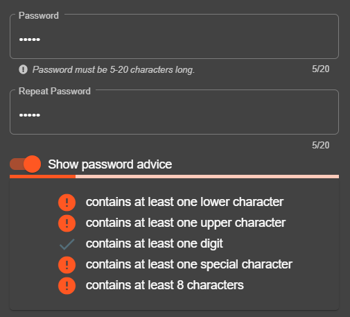

<!-- theme: default -->
<!-- paginate: true -->
<!-- footer: Copyright (c) by **Bjoern Kimminich** | Licensed under [CC-BY-SA 4.0](https://creativecommons.org/licenses/by-sa/4.0/) -->

# Authentication Flaws

---

# :x: [Typical Flaws in Authentication](https://owasp.org/Top10/A07_2021-Identification_and_Authentication_Failures/)

* Permits brute force or other automated attacks
* Permits default, weak, or well-known passwords
* Uses weak or ineffective credential recovery and forgot-password
  processes (e.g. "knowledge-based answers")
* Uses plain text, encrypted, or weakly hashed passwords
* Has missing or ineffective multi-factor authentication
* Exposes Session IDs in the URL
* Does not rotate Session IDs after successful login
* Does not properly invalidate Session IDs

---

# Data Factors

## A07:2021 – Identification and Authentication Failures

<small><small>

| <small>CWEs Mapped</small> | <small>Max Incidence Rate</small> | <small>Avg Incidence Rate</small> | <small>Avg Weighted Exploit</small> | <small>Avg Weighted Impact</small> | <small>Max Coverage</small> | <small>Avg Coverage</small> | <small>Total Occurrences</small> | <small>Total CVEs</small> |
|:--------------------------:|:---------------------------------:|:---------------------------------:|:-----------------------------------:|:----------------------------------:|:---------------------------:|:---------------------------:|:--------------------------------:|:-------------------------:|
|             22             |              14.84%               |               2.55%               |                7.40                 |                6.50                |           79.51%            |           45.72%            |             132,195              |           3,897           |

</small></small>

---

# Exercise 4.1 (:pushpin:)

1. Watch
   [How To Keep Your Passwords Safe](https://www.facebook.com/CollegeHumor/videos/10155483807197807/)
   :tv:
2. Log in with MC SafeSearch's user account (:star::star:)

_:warning: Do **not** use SQL Injection for authentication bypass!_

---

# Exercise 4.2 (:pushpin:)

1. What benefits and downsides (if any) would enforcing user passwords
   with the advice below have?
2. What password might the user currently have typed in?

---

# Exercise 4.3 (:pushpin:)

1. Pick one Security Question and explain how :muscle: it is against
   attacks.
2. What would you recommend to pick as an answer? Assume that the risk
   of compromise is full takeover of your user account.

---

# [Prevention](https://cheatsheetseries.owasp.org/cheatsheets/Authentication_Cheat_Sheet.html)

#### [Password Strength Controls](https://pages.nist.gov/800-63-3/sp800-63-3.html)

* **Enforce minimum password length** of at least 10 characters
* Maximum length should allow 64 characters or more
* **No periodic password resets** as users rely on predictable patterns
* Avoid password complexity rules as _all of them_ are predictable
* Ban bad passwords or ones which have appeared in data breaches
  * e.g. [Troy Hunt's 10GB+ list](https://haveibeenpwned.com/Passwords)
    or
    [Daniel Miesler's various lists](https://github.com/danielmiessler/SecLists/tree/master/Passwords)
* Allow convenience features on password fields
  * Offer _Show Password while typing_ option
  * Allow pasting from clipboard into password fields

---

#### [Secure "Forgot Password" Mechanism](https://cheatsheetseries.owasp.org/cheatsheets/Forgot_Password_Cheat_Sheet.html)

* Return a consistent message for both existent and non-existent
  accounts
* Ensure that the time taken for the user response message is uniform
* Use a side-channel to communicate the method to reset their password
* Use URL tokens for the simplest and fastest implementation
* Ensure that generated tokens or codes are:
  * Randomly generated using a cryptographically safe algorithm
  * Sufficiently long to protect against brute-force attacks
  * Stored securely
  * Single use and expire after an appropriate period

---

#### [Secure Password Storage](https://cheatsheetseries.owasp.org/cheatsheets/Password_Storage_Cheat_Sheet.html)

* Use
  [Argon2id](https://cheatsheetseries.owasp.org/cheatsheets/Password_Storage_Cheat_Sheet.html#argon2id)
  unless you have a good reason not to
* Set a reasonable
  [work factor](https://cheatsheetseries.owasp.org/cheatsheets/Password_Storage_Cheat_Sheet.html#work-factors)
  for your system
* Use a
  [salt](https://cheatsheetseries.owasp.org/cheatsheets/Password_Storage_Cheat_Sheet.html#salting)
  (modern algorithms like Argon2id, bcrypt and PBKDF2 do this for you automatically)
* Consider using a
  [pepper](https://cheatsheetseries.owasp.org/cheatsheets/Password_Storage_Cheat_Sheet.html#peppering)
  to provide an additional layer of security

---

#### Other Authentication Controls

* **Transmit passwords only over TLS**
  * The "login landing page" must be served over TLS as well
* **Prevent Brute-Force Attacks** (e.g. throttling or periodic lockout)
* Require re-authentication for sensitive features
* **Offer optional 2FA / MFA**
  * Consider strong transaction authentication

#### Enterprise Controls

* Use centralized corporate authentication system (if in place) :100:

---

# Two-Factor Authentication

> Two-factor authentication adds a second level of authentication to an
> account log-in. When you have to enter only your username and one
> password, that's considered a single-factor authentication. 2FA
> requires the user to have two out of three types of credentials before
> being able to access an account. The three types are:
>
> * **Something you know**, such as a personal identification number
>   (PIN), password or a pattern
> * **Something you have**, such as an ATM card, phone, or fob
> * **Something you are**, such as a biometric like a fingerprint or
>   voice print \[[^1]\]

[^1]: https://www.cnet.com/news/two-factor-authentication-what-you-need-to-know-faq/

---

# [2FA Method Comparison](https://www.expressvpn.com/blog/best-two-factor-authentication)

| Method            | Security        | Privacy                              | Access             | Prevalence                                             |
|:------------------|:----------------|:-------------------------------------|:-------------------|:-------------------------------------------------------|
| SMS               | :key:           | :sunglasses:                         | :door::door::door: | :department_store::department_store::department_store: |
| Authenticator App | :key::key:      | :sunglasses::sunglasses::sunglasses: | :door:             | :department_store::department_store:                   |
| Hardware Key      | :key::key::key: | :sunglasses::sunglasses::sunglasses: | :door::door:       | :department_store:                                     |

> <small>Hardware keys win from a security perspective, they are private
> and unaffected by a dying or out of range phone. However, only a few
> services (Google, Dropbox, Facebook, Github and a few others) support
> the standard so far. Unless you trust your phone provider (and few
> providers are trustworthy), **an authenticator app is the best
> option**.</small>

---

# Password Managers

> Password managers are programs, browser plugins or web services that
> automate management of large number of different credentials. Most
> password managers have functionality to allow users to easily use them
> on websites, either by pasting the passwords into the login form, or
> by simulating the user typing them in. \[[^2]\]

|  |  |  |
|:------------------------------------------------------------------------------------------------|:--------------------------------------------------------------------------------------------------------|:---------------------------------------------------------------------------------------------------------------|
| Open Source (GPLv2)                                                                             | Proprietary / Freemium                                                                                  | Proprietary                                                                                                    |
| Local installation, optional file or cloud sync                                                 | Cloud-based                                                                                             | Local installation with Cloud sync                                                                             |

---

> Web applications should at least not make password managers job more
> difficult than necessary by observing the following recommendations:
> * use standard HTML forms for username and password input with
>   appropriate `type` attributes,
> * do not artificially limit user passwords to a length "reasonable for
>   humans" and allow passwords lengths up to 128 characters,
> * do not artificially prevent copy and paste on username and password
>   fields,
> * avoid plugin-based login pages (Flash, Silverlight etc) \[[^1]\]

[^2]: https://cheatsheetseries.owasp.org/cheatsheets/Authentication_Cheat_Sheet.html#password-managers

---

# Exercise 4.4 (:house:)

1. Log in with the admin's user account (:star::star:)
2. Reset Jim's password by answering his secret question
   (:star::star::star:)
3. Log in with Bjoern's Google account (:star::star::star::star:)

_:warning: Do **not** use SQL Injection for authentication bypass! Also,
do **not** hack Bjoern's actual Google account!_

---

# Exercise 4.5 (_optional_)

1. Install a 2FA app on your phone (e.g.
   [Google Authenticator](https://play.google.com/store/apps/details?id=com.google.android.apps.authenticator)
   or [Authy](https://authy.com/))
2. Visit <https://2fa.directory/> and find out what services you use
   offer 2FA
3. Turn 2FA on wherever possible
4. Do not forget to print (=:printer:!) the backup codes and keep them
   safe

:bulb: _Pro tip: Print hard copies of the originally displayed QR codes
for easy setup on any new phone! Just store them very securely!_
