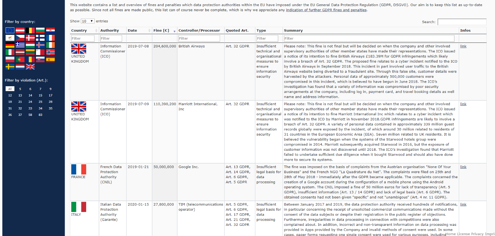

<!-- theme: default -->
<!-- paginate: true -->
<!-- footer: Copyright (c) by **Bjoern Kimminich** | Licensed under [CC-BY-SA 4.0](https://creativecommons.org/licenses/by-sa/4.0/) -->

# Sensitive Data

---

# Sensitive Data

> Sensitive data such as **passwords, credit card numbers, health
> records, personal information and business secrets** require extra
> protection, particularly if that data falls under privacy laws (EU's
> General Data Protection Regulation GDPR), financial data protection
> rules such as PCI Data Security Standard (PCI DSS) or other
> regulations. \[[^1]\]

[^1]: https://wiki.owasp.org/images/b/bc/OWASP_Top_10_Proactive_Controls_V3.pdf

---

## [GDPR](https://publications.europa.eu/en/publication-detail/-/publication/3e485e15-11bd-11e6-ba9a-01aa75ed71a1/language-en)

> Regulation (EU) 2016/679 of the European Parliament and of the Council
> of 27 April 2016 on the protection of natural persons with regard to
> the processing of personal data and on the free movement of such data,
> and repealing Directive 95/46/EC (General Data Protection Regulation)

---

## [Personal Data](https://ec.europa.eu/info/law/law-topic/data-protection/reform/what-personal-data_en) as defined in GDPR

* Name and surname
* Home address
* Email address
* Identification card number
* Location data (for example on a mobile phone)
* Internet Protocol (IP) address
* ...

_**§** Articles 2, 4(1) and(5) and Recitals (14), (15), (26), (27), (29)
and (30)_

---

## [Sensitive Personal Data](https://ec.europa.eu/info/law/law-topic/data-protection/reform/rules-business-and-organisations/legal-grounds-processing-data/sensitive-data/what-personal-data-considered-sensitive_en) as defined in GDPR

* Personal data revealing racial or ethnic origin, political opinions,
  religious or philosophical beliefs
* Trade-union membership
* Genetic data, biometric data processed solely to identify a human
  being
* Health-related data
* Data concerning a person's sex life or sexual orientation

_**§** Article 4(13), (14) and (15) and Article 9 and Recitals (51) to
(56)_

---

## [GDPR Enforcement Tracker](https://enforcementtracker.com)



---

## [PCI DSS](https://www.pcisecuritystandards.org/documents/PCIDSS_QRGv3_2.pdf)

> PCI DSS is the global data security standard adopted by the payment
> card brands for all entities that process, store or transmit
> cardholder data and/or sensitive authentication data.

---

## [PCI DSS Requirements](https://www.pcisecuritystandards.org/documents/PCIDSS_QRGv3_2.pdf)

| <small>Goals</small>                      | <small>Requirements</small>                                                  |
|:------------------------------------------|:-----------------------------------------------------------------------------|
| <small>Secure Network and Systems</small> | <small>Firewall; No default credentials</small>                              |
| <small>Protect Cardholder Data</small>    | <small>Protect stored data; encrypt transmissions</small>                    |
| <small>Vulnerability Management</small>   | <small>Anti-Malware/-Virus; Secure Development</small>                       |
| <small>Strong Access Controls</small>     | <small>Need-to-know access; Authentication; Restrict physical access</small> |
| <small>Monitoring & Testing</small>       | <small>Monitor network and data access; Test systems/processes</small>       |
| <small>Security Policy</small>            | <small>Maintain Information Security policy for all personnel</small>        |

---

# [Sensitive Data Exposure](https://owasp.org/www-project-top-ten/OWASP_Top_Ten_2017/Top_10-2017_A3-Sensitive_Data_Exposure)

* **Failure to determine the protection needs of data**
* Transmitting data in clear text (e.g. HTTP, SMTP, FTP)
* Employing old or weak cryptographic algorithms
* Using default or weak generated crypto keys
* Lack of proper key management/rotation
* Not enforcing encryption through browser directives/HTTP headers
* Lack of certificate verification

_:warning: External Internet traffic is especially dangerous!_

---

# Risk Rating

## Sensitive Data Exposure

| Exploitability                 | Prevalence              | Detecability                   | Impact              | Risk                                                                                                  |
|:-------------------------------|:------------------------|:-------------------------------|:--------------------|:------------------------------------------------------------------------------------------------------|
| :large_orange_diamond: Average | :red_circle: Widespread | :large_orange_diamond: Average | :red_circle: Severe | [A3](https://owasp.org/www-project-top-ten/OWASP_Top_Ten_2017/Top_10-2017_A3-Sensitive_Data_Exposure) |
| ( **2**                        | + **3**                 | + **2** ) / 3                  | * **3**             | = **7.0**                                                                                             |

---

# [Prevention](https://owasp.org/www-project-top-ten/OWASP_Top_Ten_2017/Top_10-2017_A3-Sensitive_Data_Exposure)

* **Classify data in system** and determine sensitivity level
* **Don't store sensitive data unnecessarily**
* Encrypt data at rest
* Ensure up-to-date and strong
  * Standard algorithms
  * Protocols
  * Keys
* Encrypt data in transit (e.g. [TLS](01-05-encryption.md)) and enforce
  encryption (e.g. HSTS)

---

## Information Classification

| Class            | Description                                                                                                              | Examples                                                                                              |
|:-----------------|:-------------------------------------------------------------------------------------------------------------------------|:------------------------------------------------------------------------------------------------------|
| **Public**       | <small><small>Information without any confidentiality requirements.</small></small>                                      | <small><small>User documentation, news, press releases, lunch menus</small></small>                   |
| **Internal**     | <small><small>Common information inside an organization.</small></small>                                                 | <small><small>Memos, system documentation or meeting minutes</small></small>                          |
| **Confidential** | <small><small>Information or compartmental data with restricted access. Disclosure might induce damage.</small></small>  | <small><small>Customer, HR, financial or PII data; source code, credentials, logfiles</small></small> |
| **Secret**       | <small><small>Highest confidentiality and integrity requirements. Damaging to organization if disclosed.</small></small> | <small><small>Business secrets, secret formulae, planned mergers/acquisitions</small></small>         |

---

# Exercise 6.1

For each classification level decide if the listed practices should be
allowed (:heavy_check_mark:) or strictly forbidden (:x:). Use footnotes
to describe preconditions (if necessary).

| Practice                 | Public | Internal | Confidential | Secret |
|:-------------------------|:-------|:---------|:-------------|:-------|
| Publish on Internet      |        |          |              |        |
| Publish on Intranet      |        |          |              |        |
| Print on :printer:       |        |          |              |        |
| Share with third parties |        |          |              |        |
| Copy to USB key          |        |          |              |        |

---

# Exercise 6.2

For each classification level define restrictions (:red_circle:) and/or
recommendations (:o:) for the listed lifecycle phases.

| Phase                           | Public | Internal | Confidential | Secret |
|:--------------------------------|:-------|:---------|:-------------|:-------|
| Permanent storage<br>           |        |          |              |        |
| Transfer (internal network)<br> |        |          |              |        |
| Transfer (public network)<br>   |        |          |              |        |
| Disposal<br>                    |        |          |              |        |

---

## [HTTP Strict Transport Security (HSTS)](https://cheatsheetseries.owasp.org/cheatsheets/HTTP_Strict_Transport_Security_Cheat_Sheet.html)

> HTTP Strict Transport Security (HSTS) is an opt-in security
> enhancement that is specified by a web application through the use of
> a special response header. Once a supported browser receives this
> header that browser will prevent any communications from being sent
> over HTTP to the specified domain and will instead send all
> communications over HTTPS. It also prevents HTTPS click through
> prompts on browsers.

##### Example

```http
Strict-Transport-Security: max-age=16070400; includeSubDomains
```

---

## [Secure Cryptographic Storage Design](https://cheatsheetseries.owasp.org/cheatsheets/Cryptographic_Storage_Cheat_Sheet.html)

* Only store sensitive data that you need
* Use strong approved Authenticated Encryption
* Store a one-way and salted value of passwords
* Ensure that the cryptographic protection remains secure even if access
  controls fail
* Ensure that any secret key is protected from unauthorized access
* Follow applicable regulations on use of cryptography

---

## [Perfect Forward Secrecy (PFS)](https://www.wired.com/2016/11/what-is-perfect-forward-secrecy/)

> Perfect forward secrecy means that a piece of an encryption system
> automatically and frequently changes the keys it uses to encrypt and
> decrypt information, such that if the latest key is compromised, it
> exposes only a small portion of the user’s sensitive data. Encryption
> tools with perfect forward secrecy switch their keys as frequently as
> every message in text-based conversation, every phone call in the case
> of encrypted calling apps, or every time a user loads or reloads an
> encrypted web page in his or her browser.

:information_source: Examples of crypto protocols (used for instant
messaging conversations) providing PFS are
[OTR (Off-the-record) Messaging](https://otr.cypherpunks.ca/index.php)
and
[Double Ratchet](https://signal.org/docs/specifications/doubleratchet/)
(used within [Signal](https://signal.org/)).

---

### [Best Practices](https://wiki.owasp.org/index.php/Cryptographic_Storage_Cheat_Sheet#Architectural_Decision)

| Scenario                                                                                                         | Practice                                  | :key: Length     |
|:-----------------------------------------------------------------------------------------------------------------|:------------------------------------------|:-----------------|
| Key exchange                                                                                                     | Diffie-Hellman                            | 2048+ bits       |
| Message Integrity                                                                                                | HMAC-SHA2                                 | -                |
| Message Hash                                                                                                     | SHA2                                      | 256 bits         |
| [Asymetric encryption](https://cheatsheetseries.owasp.org/cheatsheets/Cryptographic_Storage_Cheat_Sheet.html)    | **ECC** (Curve25519), RSA                 | 2048 bits (RSA)  |
| [Symmetric-key algorithm](https://cheatsheetseries.owasp.org/cheatsheets/Cryptographic_Storage_Cheat_Sheet.html) | AES                                       | 128-**256** bits |
| [Password Hashing](https://cheatsheetseries.owasp.org/cheatsheets/Password_Storage_Cheat_Sheet.html)             | <small>**Bcrypt**, Argon2, PBKDF2</small> | -                |

---

# Exercise 6.3 (:house:)

1. Access a confidential document (:star:)
2. Retrieve as many clear text user passwords as you can
   (:star::star::star::star:)
3. Visit the Token Sale page before it officially goes live
   (:star::star::star::star::star:)

##### Bonus exercises on cryptography (_optional_)

4. Retrieve both the :rabbit2: easter eggs (:star::star::star::star:)
5. Solve the steganography challenge (:star::star::star::star:)
6. Solve the non-existent challenge \#999
   (:star::star::star::star::star::star:)

