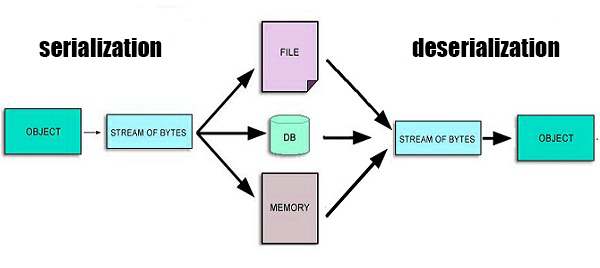

<!-- theme: default -->
<!-- paginate: true -->
<!-- footer: Copyright (c) by **Bjoern Kimminich** | Licensed under [CC-BY-SA 4.0](https://creativecommons.org/licenses/by-sa/4.0/) -->

# Software & Data Integrity Failures

---

# Software & Data Integrity Failures

* Code and infrastructure not protected against integrity violations, e.g.
  * application relies upon plugins, libraries, or modules from untrusted sources, repositories, and content
  delivery networks (CDNs)
  * insecure CI/CD pipeline introduces the potential for unauthorized access, malicious code, or system compromise
  * auto-update functionality downloading and applying updates without sufficient integrity verification
* Objects or data encoded or serialized into a structure that an attacker can see and modify is vulnerable to insecure deserialization, e.g.
  * XML parsers allowing XML External Entities (XXE)
  * insecure native serialization formats and libraries being used

---

# Data Factors

## A08:2021 – Software and Data Integrity Failures

| <small>CWEs Mapped</small> | <small>Max Incidence Rate</small> | <small>Avg Incidence Rate</small> | <small>Avg Weighted Exploit</small> | <small>Avg Weighted Impact</small> | <small>Max Coverage</small> | <small>Avg Coverage</small> | <small>Total Occurrences</small> | <small>Total CVEs</small> |
|:--------------------------:|:---------------------------------:|:---------------------------------:|:-----------------------------------:|:----------------------------------:|:---------------------------:|:---------------------------:|:--------------------------------:|:-------------------------:|
|             10             |              16.67%               |               2.05%               |                6.94                 |                7.94                |           75.04%            |           45.35%            |              47,972              |           1,152           |

---

# [Prevention](https://owasp.org/Top10/A08_2021-Software_and_Data_Integrity_Failures/#how-to-prevent)

- Using digital signatures to verify the software or data is unaltered and from the expected source
- Ensuring libraries and dependencies (e.g. `npm` or Maven) consume trusted repositories
- Hosting an internal known-good and vetted repository as a proxy
- Using a software supply chain security tool (e.g. [OWASP Dependency Check](02-07-insecure_dependencies_and_configuration.md#owaspdependency-checkhttpsjeremylonggithubiodependencycheck) or OWASP CycloneDX) to verify that components do not contain known vulnerabilities
- Establishing a review process for code and configuration changes to minimize the chance that malicious code or configuration could be introduced into the software pipeline
- Establishing a CI/CD pipeline with proper segregation, configuration, and access control to ensure the integrity of the code flowing through the build and deploy processes

---

# XXE

## (XML External Entities)

---

# XML Entities

* In the Document Type Definition (DTD) you specify shortcuts as
  `ENTITY`...
  * `<!ENTITY author "Bjoern Kimminich">`
  * `<!ENTITY copyright "(C) 2018">`

* ...to later dereference them in the XML
  * `<author>&author; &copyright;</author>`

---

# External Entities

* DTD changed to use External Entities...
  * `<!ENTITY author SYSTEM
    "https://raw.githubusercontent.com/juice-shop/juice-shop/gh-pages/entities.dtd">`
  * `<!ENTITY copyright	SYSTEM
    "https://raw.githubusercontent.com/juice-shop/juice-shop/gh-pages/entities.dtd">`

* ...whereas the XML stays the same
  * `<author>&author; &copyright;</author>`

---

# [Attack Vector XXE](https://wiki.owasp.org/index.php/XML_External_Entity_(XXE)_Processing)

* Many older or poorly configured XML processors evaluate external
  entity references within XML documents

* External entities can be abused for
  * disclosure of internal files
  * internal port scanning
  * remote code execution
  * denial of service attacks

---

# XML with Attack Payloads

## Extracting Data

```xml
<?xml version="1.0" encoding="ISO-8859-1"?>
    <!DOCTYPE foo [
    <!ELEMENT foo ANY >
    <!ENTITY xxe SYSTEM "file:///etc/passwd" >]>
    <foo>&xxe;</foo>
```

---

## Network Probing

```xml
<?xml version="1.0" encoding="ISO-8859-1"?>
    <!DOCTYPE foo [
    <!ELEMENT foo ANY >
    <!ENTITY xxe SYSTEM "https://192.168.1.1/private" >]>
    <foo>&xxe;</foo>
```

## DoS Attack (against Linux-based Systems)

```xml
<?xml version="1.0" encoding="ISO-8859-1"?>
    <!DOCTYPE foo [
    <!ELEMENT foo ANY >
    <!ENTITY xxe SYSTEM "file:///dev/random" >]>
    <foo>&xxe;</foo>
```

---

# Exercise 8.1

1. Identify the weak point of the application that accepts arbitrary XML
   data as input (:star::star:)
2. Retrieve the content of your local system‘s `C:\Windows\system.ini`
   (or `/etc/passwd` if you are using Linux) via an XXE attack
   (:star::star::star:)

---

# [Prevention](https://cheatsheetseries.owasp.org/cheatsheets/XML_External_Entity_Prevention_Cheat_Sheet.html)

* **Configure XML parser to**
  * **disable DTDs completely** (by disallowing `DOCTYPE` declarations)
    :100:
  * disable External Entities (only if allowing DTDs cannot be avoided)

:x: Selective validation or escaping of tainted data is **not**
sufficient, as the whole XML document is crafted by the attacker!

---

# [XML Parser Hardening Examples](https://cheatsheetseries.owasp.org/cheatsheets/XML_External_Entity_Prevention_Cheat_Sheet.html)

#### `libxml2` (C/C++)

* `XML_PARSE_NOENT` and `XML_PARSE_DTDLOAD` must **not be defined** in
  the Enum `xmlParserOption`.

_:information_source: Starting with release `2.9` entity expansion is
disabled by default. Using any older version makes it more likely to
have XXE problems if the configuration was not explicitly hardened._


---

#### `org.dom4j.io.SAXReader` (Java)

```java
saxReader.setFeature(
  "http://apache.org/xml/features/disallow-doctype-decl", true);
saxReader.setFeature(
  "http://xml.org/sax/features/external-general-entities", false);
saxReader.setFeature(
  "http://xml.org/sax/features/external-parameter-entities", false);
```

#### `java.beans.XMLDecoder` (Java)

* The `readObject()` method in this class is fundamentally unsafe
* It is vulnerable against XXE as well as arbitrary code execution
* There is no way to make use of this class safe

_:warning: Most Java XML parsers have insecure parser settings by
default!_

---

# Deserialization

---

<!-- _footer: Български: Схема на сериализация и десериализация, 2016 WnbKrumov, used under CC-BY-SA 4.0 -->

# Serialization

> Object serialization transforms an object's data to a bytestream that
> represents the state of the data. The serialized form of the data
> contains enough information to recreate the object with its data in a
> similar state to what it was when saved. \[[^1]\]



[^1]: http://www.oracle.com/technetwork/java/serial-137074.html

---

# Deserialization

```java
InputStream is = request.getInputStream();
ObjectInputStream ois = new ObjectInputStream(is);
AcmeObject acme = (AcmeObject)ois.readObject();
```

* The casting operation to `AcmeObject` occurs **after** the
  deserialization process ends
* It is not useful in preventing any attacks that happen during
  deserialization from occurring

---

# [Insecure Deserialization](https://owasp.org/www-community/vulnerabilities/Deserialization_of_untrusted_data)

* Insecure deserialization often leads to **remote code execution**
  (RCE), one of the most serious attacks possible
* Other possible attacks include
  * replay attacks
  * injection attacks
  * privilege escalation
  * DoS

---

# Exercise 8.2

1. What happens when the `root` object would be deserialized?

```java
ArrayList<Object> root = new ArrayList<>(Integer.MAX_VALUE);
```

---

# Exercise 8.3

1. What happens when the `root` object would be deserialized?

```java
Set root = new HashSet();
Set s1 = root;
Set s2 = new HashSet();
for (int i = 0; i < 100; i++) {
  Set t1 = new HashSet();
  Set t2 = new HashSet();
  t1.add("foo");
  s1.add(t1);
  s1.add(t2);
  s2.add(t1);
  s2.add(t2);
  s1 = t1;
  s2 = t2;
}
```

---

# [Prevention](https://cheatsheetseries.owasp.org/cheatsheets/Deserialization_Cheat_Sheet.html)

* **Avoid native deserialization formats** :100:
  * JSON/XML lessens (but not removes) the chance of custom
    deserialization logic being maliciously repurposed
* Use the Data Transfer Object (DTO) pattern
  * Exclusive purpose is data transfer between application layers

---

##### If serialization cannot be avoided

* Sign any serialized objects & only deserialize signed data
* Enforce strict type constraints during deserialization before object
  creation (Not sufficient on its own!)
* Isolate deserialization in low privilege environments
* Log deserialization exceptions and failures
* Restrict or monitor incoming and outgoing network connectivity from
  containers or servers that deserialize
* Monitor & alert if a user deserializes constantly

---

# :heavy_check_mark: [SerialKiller (Java)](https://github.com/ikkisoft/SerialKiller)

Replacing every `java.io.ObjectInputStream` instanciation

```
ObjectInputStream ois = new ObjectInputStream(is);
String msg = (String) ois.readObject();
```

with `SerialKiller` from a look-ahead Java deserialization library

```
ObjectInputStream ois = new SerialKiller(is, "/etc/serialkiller.conf");
String msg = (String) ois.readObject();
```

secures the application from untrusted input. Via `serialkiller.conf`
classes can be block- or allowlisted.

---

# :x: [node-serialize (JavaScript)](https://www.npmjs.com/package/node-serialize)

The `node-serialize` module uses `eval()` internally for
deserialization, allowing exploits like

```javascript
var serialize = require('node-serialize');                                                               
var x = '{"rce":"_$$ND_FUNC$$_function (){console.log(\'exploited\')}()"}'
serialize.unserialize(x);
```

_:warning: The affected version `0.0.4` of `node-serialize` is also the
latest version of this module!_

---

# Exercise 8.4 (:house:)

1. Report at least one of two [typosquatting](https://en.wikipedia.org/wiki/Typosquatting) dependencies that the Juice Shop fell for (:star::star::star::star: - :star::star::star::star::star:)
2. Report another vulnerability that could be exploited in a
   [Software Supply Chain Attack](https://csrc.nist.gov/CSRC/media/Projects/Supply-Chain-Risk-Management/documents/ssca/2017-winter/NCSC_Placemat.pdf)
   (:star::star::star::star::star:)

# Exercise 8.5 (:house:)

1. Perform a DoS-like Attack using XXE (:star::star::star::star::star:)

<!-- -->

2. Find the „NextGen“ successor to the half-heartedly deprecated
   XML-based B2B API
   * This new API uses a popular standard for REST API specification &
     documentation
3. Exploit this API with at least one successful DoS-like Remote Code
   Exeution (:star::star::star::star::star: -
   :star::star::star::star::star::star:)

_:information_source: If the server would need >2sec to process your
attack request, it is considered „DoS-like“ enough._
