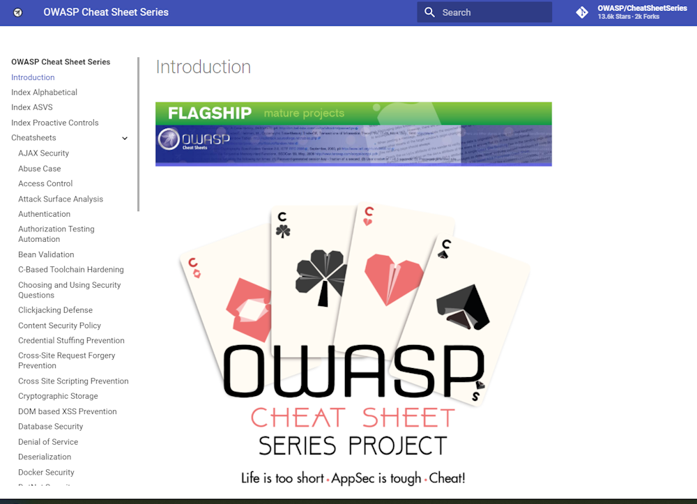
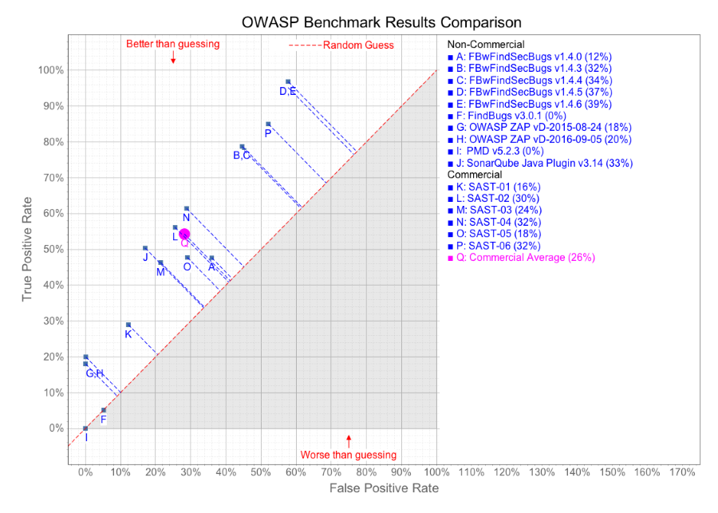
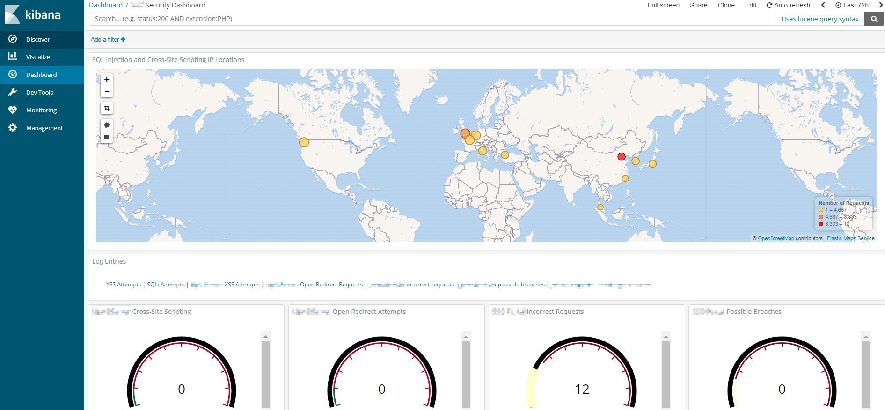
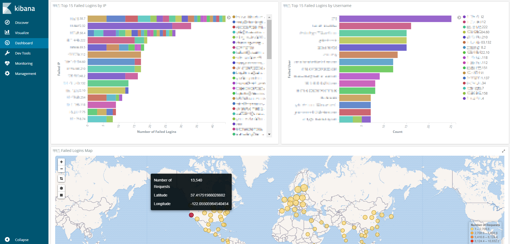
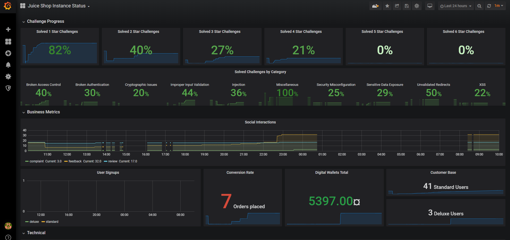
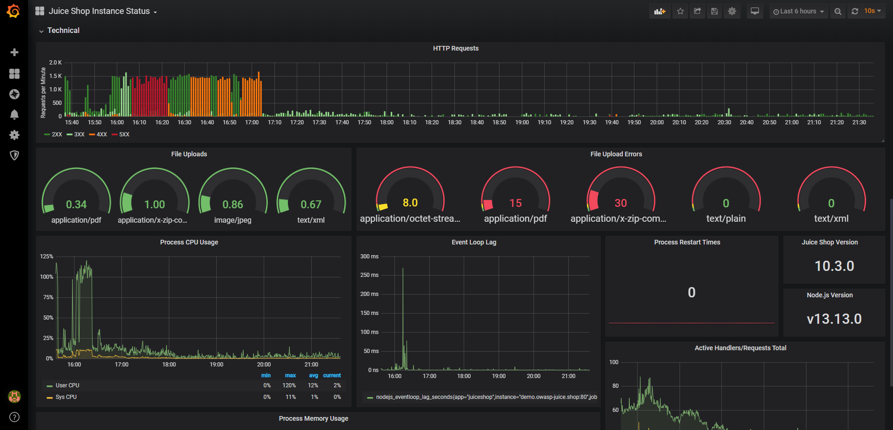
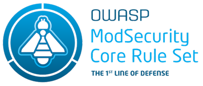
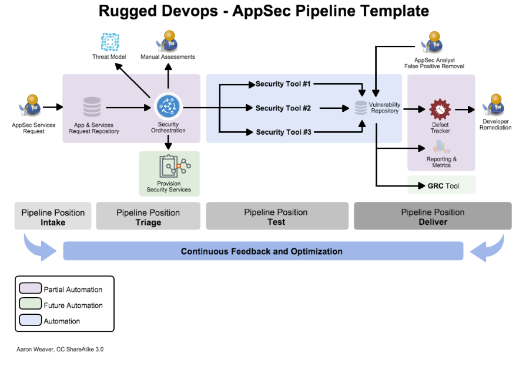

<!-- theme: default -->
<!-- paginate: true -->
<!-- footer: Copyright (c) by **Bjoern Kimminich** | Licensed under [CC-BY-SA 4.0](https://creativecommons.org/licenses/by-sa/4.0/) -->

# Secure Development Lifecycle

---

# Secure Development Lifecycle

:x: Identifying errors in late lifecycle phases makes them more
expensive to fix or mitigate. \[[^1]\]

:x: Having an unpublished or informal Secure Development Lifecycle will
not be successful. \[[^2]\]

:heavy_check_mark: Security must be embedded into all stages of the
Software Development Lifecycle to be effective. \[[^2]\]

:heavy_check_mark: A close connection with the right expert and
management drive from the beginning are both mandatory. \[[^3]\]

[^1]: https://www.nist.gov/sites/default/files/documents/director/planning/report02-3.pdf

[^2]: https://wiki.owasp.org/images/7/76/Jim_Manico_(Hamburg)_-_Securiing_the_SDLC.pdf

[^3]: https://www.youtube.com/watch?v=M7qMP3C5bkU

---

# Spaghetti Analogy

Sprinkling security on insecurely written software is equivalent to
sprinkling salt on spaghetti :spaghetti: after cooking them in unsalted
water :potable_water:.

---

<!-- _footer: NIST: The Economic Impacts of Inadequate Infrastructure for Software Testing, 2002 -->

#### [Estimates of Relative Cost Factors of Correcting Errors](https://www.nist.gov/sites/default/files/documents/director/planning/report02-3.pdf)

| Introduction of Error     | Requirements / Design | Coding / Unit Test | Integration / System Test | Early Access / Beta Test | Post-Release |
|:--------------------------|:----------------------|:-------------------|:--------------------------|:-------------------------|:-------------|
| Requirements / Design     | x1                    | x5                 | x10                       | x15                      | x30          |
| Coding / Unit Test        |                       | x1                 | x10                       | x20                      | x30          |
| Integration / System Test |                       |                    | x1                        | x10                      | x20          |

---

# Example: [Microsoft SDL](https://www.microsoft.com/en-us/sdl)

| Phase                                                                             | Practice                                                                                                      |
|:----------------------------------------------------------------------------------|:--------------------------------------------------------------------------------------------------------------|
| [Training](https://www.microsoft.com/en-us/SDL/process/training.aspx)             | Core Security Training                                                                                        |
| [Requirements](https://www.microsoft.com/en-us/SDL/process/requirements.aspx)     | Establish Security Requirements, Create Quality Gates/Bug Bars, Perform Security and Privacy Risk Assessments |
| [Design](https://www.microsoft.com/en-us/SDL/process/design.aspx)                 | Establish Design Requirements, Perform Attack Surface Analysis/Reduction, Use Threat Modelling                |
| [Implementation](https://www.microsoft.com/en-us/SDL/process/implementation.aspx) | Use Approved Tools, Deprecate Unsafe Functions, Perform Static Analysis                                       |

---

| Phase                                                                         | Practice                                                                                     |
|:------------------------------------------------------------------------------|:---------------------------------------------------------------------------------------------|
| [Verification](https://www.microsoft.com/en-us/SDL/process/verification.aspx) | Perform Dynamic Analysis, Perform Fuzz Testing, Conduct Attack Surface Review                |
| [Release](https://www.microsoft.com/en-us/SDL/process/release.aspx)           | Create an Incident Response Plan, Conduct Final Security Review, Certify Release and Archive |
| [Response](https://www.microsoft.com/en-us/SDL/process/response.aspx)         | Execute Incident Response Plan                                                               |

---

# Security Requirements

---

#### [Derive Security Requirements from Business Functionality](https://wiki.owasp.org/index.php/SAMM_-_Security_Requirements_-_1)

* Gather and review functional requirements
* For each functional requirement derive relevant security requirements
  * Lead stakeholders through explicitly noting security expectations
    * e.g. data security, access control, transaction integrity,
      criticality of business function, separation of duties, uptime
      etc.
  * Follow the same principles for writing good requirements in general
    * i.e. they should be specific, measurable, and reasonable

---

#### [Security and Compliance Guidance for Requirements](https://wiki.owasp.org/index.php/SAMM_-_Security_Requirements_-_1)

* Determine industry best-practices that project teams should treat as
  requirements
  * e.g. publicly available guidelines, internal or external
    guidelines/standards/policies, or established compliance
    requirements
* Do not attempt to bring in too many best-practice requirements into
  each development iteration
* Slowly add best-practices over successive development cycles

---

#### Protection Requirements ("Schutzbedarf" :de:) Calculator

* Provides an idea of the expected effort for security topics
* Serves as a starting point for detailed requirements analysis
* Formalizes the "gut-feeling" of business and IT stakeholders

<!-- -->

* Covers all **CIA** triad aspects in a high-level fashion
  * **C**onfidentiality: Information classification, Compliance
    requirements
  * **I**ntegrity: Authentication mechanism, Compliance requirements
  * **A**vailability: Business criticality, Exposure to threats

---

#### Requirements Score Table

| Aspect                                             | :red_circle: (=5)                         | :large_orange_diamond: (=2) | :yellow_heart: (=1)  | :green_heart: (=0)     |
|:---------------------------------------------------|:------------------------------------------|:----------------------------|:---------------------|:-----------------------|
| **Business criticality**                           | Mission Critical                          | Business Critical           | Business Operational | Administrative Service |
| <small>**Information&nbsp;classification**</small> | Secret                                    | Confidential                | Internal             | Public                 |
| <small>**Compliance&nbsp;requirements**</small>    | Legal                                     | Industry                    | Customer             | None                   |
| **Exposure to threats**                            | Internet-facing                           | Intranet                    | Dedicated Network    | Desktop                |
| <small>**Authentication mechanism**</small>        | :red_circle:/:large_blue_circle: (0) None | (-1) Proprietary            | (-2) Centralized     | (-3) Cent.+2FA         |

---

## Protection Requirements Rating Evaluation

$Total Score = Max(0, (Business Criticality$ $+ Information
Classification + Compliance Requirement)$ $+ Exposure To Threats +
Authentication Mechansim))$

| Total Score | PR Group                      |
|:------------|:------------------------------|
| 10 - 20     | :red_circle: High             |
| 5 - 9       | :large_orange_diamond: Medium |
| 0 - 4       | :green_heart: Low             |

---

### Exercise 9.1

1. Fill any gaps with reasonable assumptions for the fictive _Juice Shop
   Inc._
2. Calculate the Total Score and Rating for the applications
3. Repeat for at least one additional system from your own company

| Aspect / Application       | Website                   | VCS                | Webshop                    | B2B API                    |
|:---------------------------|:--------------------------|:-------------------|:---------------------------|:---------------------------|
| Business criticality       | :large_orange_diamond:(2) | :yellow_heart:(1)  | :red_circle:(5)            |                            |
| Information classification | :green_heart:(0)          |                    | :large_orange_diamond:(2)  | :large_orange_diamond:(2)  |
| Compliance requirements    | :green_heart:(0)          | :green_heart:(0)   | :large_orange_diamond:(2)  |                            |
| Exposure to threats        |                           |                    |                            |                            |
| Authentication mechanism   |                           | :yellow_heart:(-2) | :large_orange_diamond:(-1) | :large_orange_diamond:(-1) |

---

# Secure Design Principles

---

# [Secure Design Principles](https://wiki.owasp.org/index.php/Security_by_Design_Principles)

|                               |                               |
|:------------------------------|:------------------------------|
| Minimize Attack Surface Area  | Don't trust Services          |
| Establish Secure Defaults     | Separation of Duties          |
| Principle of Least Privilege  | Avoid Security by Obscurity   |
| Principle of Defense in Depth | Keep Security simple          |
| Fail securely                 | Fix Security Issues correctly |

---

## Minimize Attack Surface Area

* **Every feature** that is added to an application **adds a certain
  amount of risk** to the overall application
* The aim for secure development is to **reduce** the overall risk by
  reducing **the attack surface area**

---

## Establish Secure Defaults

* The **"out-of-box"** experience for the user **should be secure**
* It should be up to the user to reduce their security - if they are
  allowed

---

## Principle of Least Privilege

* Accounts have the **least amount of privilege required** to perform
  their business processes
* This encompasses user rights and resource permissions, e.g.
  * CPU limits
  * memory
  * network
  * file system

---

## Principle of Defense in Depth

* Where one control would be reasonable, **more controls that approach
  risks in different fashions** are better
* In-depth-controls can make severe vulnerabilities extraordinarily
  difficult to exploit

---

## Fail securely

* Whenever a transaction fails or code execution throws an exception it
  should **always "fail closed"** and never "fail open"

---

## Don't trust Services

* Third party partners more than likely have differing security policies
  and posture
* Implicit **trust of externally run systems is not warranted**
* All external systems should be treated in a similar fashion

---

## Separation of Duties

* Separation of duties is a key **fraud control**
* **Administrators should not also be users** of an application they are
  responsible for

---

## Avoid Security by Obscurity

* Security through obscurity is a weak security control, and nearly
  always fails when it is the only control
* The **security** of key systems **should not be reliant upon keeping
  details hidden**

---

## Keep Security simple

* **Attack surface and simplicity go hand in hand**
* Prefer straightforward and simple code over complex and
  over-engineered approaches
* Avoid the use of double negatives and complex architectures when a
  simpler approach would be faster and simpler

---

## Fix Security Issues correctly

* Once a security issue has been identified, it is important to develop
  a test for it, and to **understand the root cause** of the issue
* It is likely that the security issue is widespread amongst all code
  bases, so **developing the right fix without introducing regressions**
  is essential

---

# Secure Coding Guidelines

---

# :x: Secure Coding Guidelines

> * Overlooked by developers
> * "Static and not helpful"
> * 100+ pages that can be language specific
>
> * _Can_ be successful if collaborative/Wiki format and regularly
>   updated \[[^4]\]

_:information_source: Secure Coding Guidelines are often mandated by
contracts, compliance requirements or as a certification precondition._

[^4]: https://wiki.owasp.org/images/7/76/Jim_Manico_(Hamburg)_-_Securiing_the_SDLC.pdf

---

# :heavy_check_mark: Secure Coding Checklist

> Checklists are good. Big secure coding books are bad. In know this, I
> wrote one. Didn't help. \[_Jim Manico @ dotSecurity 2017_, [^5]\]
>
> * Simple 1-2 page document
> * All checklist items must be relevant
> * Brief document must be backed up with deeper resources and code
>   samples \[[^5]\]

[^5]: https://www.youtube.com/watch?v=M7qMP3C5bkU

---

# :heavy_check_mark: [OWASP Cheat Sheet Series](https://cheatsheetseries.owasp.org)

---

# Security Testing

---

## Static Application Security Testing (SAST)

> Static application security testing (SAST) is a set of technologies
> designed to analyze application source code, byte code and binaries
> for coding and design conditions that are indicative of security
> vulnerabilities. SAST solutions analyze an application from the
> "inside out" in a nonrunning state. \[[^6]\]

[^6]: https://www.gartner.com/it-glossary/static-application-security-testing-sast

---

# :muscle: [Strengths of SAST](https://owasp.org/www-community/Source_Code_Analysis_Tools)

* Scales well - can be run on lots of software, and can be run
  repeatedly (as with nightly builds or continuous integration)
* Useful for things that such tools can automatically find with high
  confidence, such as buffer overflows, SQL Injection Flaws, and so
  forth
* Output is good for developers - highlights the precise source files,
  line numbers, and even subsections of lines that are affected

---

# :-1: [Weaknesses of SAST](https://owasp.org/www-community/Source_Code_Analysis_Tools)

* Many types of security vulnerabilities are very difficult to find
  automatically (<small>e.g. authentication problems, access control
  issues, insecure use of cryptography, etc.</small>)
* Cover only a relatively small percentage of application security flaws
* High numbers of false positives
* Cannot find configuration issues not represented in the code
* Difficult to _prove_ that an identified security issue is an actual
  vulnerability

---

### [Open Source SAST Tools](https://owasp.org/www-community/Source_Code_Analysis_Tools) (Examples)

|                                                         | Tool                                                                                                                                      | Supported Language                                                   |
|:--------------------------------------------------------|:------------------------------------------------------------------------------------------------------------------------------------------|:---------------------------------------------------------------------|
|  | [SonarQube](https://github.com/SonarSource/sonarqube)                                                                                     | [20+ languages](https://www.sonarqube.org/features/multi-languages/) |
|    | <small>[FindSecBugs](https://github.com/find-sec-bugs/find-sec-bugs/) plugin for [SpotBugs](https://github.com/spotbugs/spotbugs)</small> | <small>Java, Android, Groovy, Scala</small>                          |
|        | [Bandit](https://github.com/PyCQA/bandit)                                                                                                 | Python                                                               |
|    | [Brakeman](https://github.com/presidentbeef/brakeman)                                                                                     | Ruby on Rails                                                        |

---

# Dynamic Application Security Testing (DAST)

> Dynamic application security testing (DAST) technologies are designed
> to detect conditions indicative of a security vulnerability in an
> application in its running state. Most DAST solutions test only the
> exposed HTTP and HTML interfaces of Web-enabled applications; however,
> some solutions are designed specifically for non-Web protocol and data
> malformation (for example, remote procedure call, Session Initiation
> Protocol \[SIP\] and so on). \[[^7]\]

[^7]: https://www.gartner.com/it-glossary/dynamic-application-security-testing-dast

---

# [Open Source DAST Tools](https://wiki.owasp.org/index.php/Category:Vulnerability_Scanning_Tools) (Examples)

|                                                   | Tool                                                    | Proxy              | Scanner            |
|:--------------------------------------------------|:--------------------------------------------------------|:-------------------|:-------------------|
|        | [Zed Attack Proxy](https://github.com/zaproxy/zaproxy/) | :heavy_check_mark: | :heavy_check_mark: |
|     | [w3af](https://github.com/andresriancho/w3af)           | :x:                | :heavy_check_mark: |
|  | [Wapiti](http://wapiti.sourceforge.net/)                | :x:                | :heavy_check_mark: |
|    | [Nikto](https://github.com/sullo/nikto)                 | :x:                | :heavy_check_mark: |

---

# [OWASP Benchmark](https://owasp.org/www-project-benchmark/)

> <small>The OWASP Benchmark for Security Automation (OWASP Benchmark)
> is a free and open test suite designed to evaluate the speed,
> coverage, and accuracy of automated software vulnerability detection
> tools and services (henceforth simply referred to as 'tools'). \[...\]
> There are four possible test outcomes in the Benchmark:</small>
>
> 1. Tool correctly identifies a real vulnerability (True Positive)
> 2. Tool fails to identify a real vulnerability (False Negative)
> 3. Tool correctly ignores a false alarm (True Negative)
> 4. Tool fails to ignore a false alarm (False Positive)

---

---

# Exercise 9.2

Assign the following statements to a corresponding section of the OWASP
Benchmark result diagram on the previous slide:

* _Ideal_ vulnerability detection
* Tool reports _everything_ is vulnerable
* Tool reports _nothing_ is vulnerable
* Tool reports vulnerabilities _randomly_
* _Worse_ than random

---

# Security Logging & Monitoring

---

# Insufficient Logging & Monitoring

* Exploitation of **insufficient logging and monitoring is the bedrock
  of nearly every major incident**
* **Attackers** rely on the lack of monitoring and timely response to
  **achieve their goals without being detected**
  * Most successful attacks start with vulnerability probing
  * Allowing such probes to continue can raise the likelihood of
    successful exploit to nearly 100%

---

# Examples of Insufficiencies

* <small>Auditable events, such as logins, failed logins, and high-value
  transactions are not logged</small>
* <small>Warnings and errors generate no, inadequate, or unclear log
  messages</small>
* <small>Logs of applications and APIs are not monitored for suspicious
  activity</small>
* <small>Logs are only stored locally</small>
* <small>Appropriate alerting thresholds and response escalation
  processes are not in place or effective</small>
* <small>Penetration testing and scans by automated tools do not trigger
  alerts</small>
* <small>The application is unable to detect, escalate, or alert for
  active attacks in real time or near real time</small>

---

# Risk Rating

## Insufficient Logging & Monitoring

| Exploitability                 | Prevalence              | Detecability                     | Impact                          | Risk                                                                                                                  |
|:-------------------------------|:------------------------|:---------------------------------|:--------------------------------|:----------------------------------------------------------------------------------------------------------------------|
| :large_orange_diamond: Average | :red_circle: Widespread | :small_orange_diamond: Difficult | :large_orange_diamond: Moderate | [A10](https://owasp.org/www-project-top-ten/OWASP_Top_Ten_2017/Top_10-2017_A10-Insufficient_Logging%252526Monitoring) |
| ( **2**                        | + **3**                 | + **1** ) / 3                    | * **2**                         | = **4.0**                                                                                                             |

---

# Prevention

* Ensure all login, access control failures, and server-side input
  validation **failures can be**
  * **logged with sufficient user context** to identify suspicious or
    malicious accounts
  * **held for sufficient time** to allow delayed forensic analysis
* Ensure that logs are generated in a format that can be easily consumed
  by a **centralized log management solution**
  * e.g. [Elastic Stack](https://www.elastic.co/products) (Kibana,
    Elasticsearch, Logstash & Beats)

---

* Ensure **high-value transactions have an audit trail** with integrity
  controls to prevent tampering or deletion
  * e.g. append-only database tables or similar
* Establish effective monitoring and alerting such that **suspicious
  activities are detected** and responded to **in a timely fashion**
* Establish or adopt an incident response and recovery plan

---

# Example Kibana Security Dashboard

---

---

# Exercise 9.3

1. Find the
   [Prometheus monitoring endpoint](https://github.com/prometheus/prometheus)
   offered by any running OWASP Juice Shop instance (:star:)
2. Locate and retrieve a
   [SIEM-signature file](https://github.com/Neo23x0/sigma) misplaced in
   the `/ftp` folder of the application (:star::star::star::star:)

---

# Grafana Dashboard for OWASP Juice Shop

---

---

# Web Application Firewall (WAF)

---

# Web Application Firewall

> A web application firewall (WAF) is an application firewall for HTTP
> applications. It applies a set of rules to an HTTP conversation.
> Generally, these rules cover common attacks such as cross-site
> scripting (XSS) and SQL injection.
>
> While proxies generally protect clients, WAFs protect servers. A WAF
> is deployed to protect a specific web application or set of web
> applications. A WAF can be considered a reverse proxy. WAFs may come
> in the form of an appliance, server plugin, or filter, and may be
> customized to an application. The effort to perform this customization
> can be significant and needs to be maintained as the application is
> modified. \[[^8]\]

[^8]: https://wiki.owasp.org/index.php/Web_Application_Firewall

---

<!-- _footer: Simple Web Application Firewall Architecture, 2018 M2farah, used under CC-BY-SA 4.0 -->

# WAF Deployment in the Network

<small>:bulb: _An application should be able to protect itself! Use a
WAF only as a secondary defense mechanism to achieve
[Defense in Depth](#principle-of-defense-in-depth)! For legacy systems
(with no feasible way to patch directly) a WAF can be the main
protection mechanism._</small>

---

## [Risk in the use of WAFs](https://wiki.owasp.org/index.php?title=Category:OWASP_Best_Practices:_Use_of_Web_Application_Firewalls)

* "Yet-another-proxy" (increased complexity of the IT infrastructure)
* Organisational tasks
* Training the WAF on each new release of the web application
* Testing
* False positives (which may have a significant business impact)
* More complex troubleshooting
* WAFs also have/generate errors
* Responsibility for system-wide error situations
* Cost-effectiveness

---

# WAF Modes

* **Blocking Mode**: Normal operational mode where the WAF blocks
  requests it identified as malicious.
* **Monitoring Mode**: The WAF logs alerts but does not block the
  corresponding requests.
* **Learning Mode**: The WAF learns from good traffic (e.g. by
  allow-listed IPs) what the normal use cases and input are.

:bulb: _Learning Mode might lead to false positives on new application
releases when the WAF did not learn any traffic for new functionality._

---

# [OWASP ModSecurity Core Rule Set](https://coreruleset.org/)

> The OWASP ModSecurity Core Rule Set (CRS) is a set of generic attack
> detection rules for use with ModSecurity or compatible web application
> firewalls. The CRS aims to protect web applications from a wide range
> of attacks, including the OWASP Top Ten, with a minimum of false
> alerts.

---

# Exercise 9.4 (:house:)

1. Find out if your university uses a Web Application Firewall
2. Find out which product/vendor is being used
3. Find out the number of web applications in your university
   * in total
   * accessible from public Internet (i.e. without VPN)
   * protected by a WAF
4. Repeat steps 1-3 for the company you work at (if applicable)

---

# AppSec Pipeline

---

# [AppSec Pipeline](https://owasp.org/www-project-appsec-pipeline/)

* Applies **principles of DevOps and Lean** to application security
* Designed for **iterative improvement** and has the ability to **grow
  in functionality organically** over time
* Provides a **consistent process** for the application security team
  and the constituency (devs, QA, product & senior managers)
* Throughout the process flow each activity has well-defined states
* **Relies heavily on automation** for repeatable tasks

<small>_:information_source: Start with the area of greatest pain and
work on a reusable path for all the AppSec activities that
follow._</small>

---

<!-- _footer: Rugged DevOps-AppSec Pipeline Template, 2015 Aaron Weaver, used under CC-BY-SA 3.0 -->

---

# [Security Champions](https://wiki.owasp.org/index.php/Security_Champions_Playbook)

> Security Champions are "active members of a team that may help to make
> decisions about when to engage the Security Team". They act as a core
> element of security assurance process within the product or service,
> and hold the role of the Single Point of Contact (SPOC) within the
> team.

### :crystal_ball: It's all a question of scalability...

Developers will outnumber Security staff in almost every organization.
There is _no way_ to scale this up without either heavy automation or
offloading security responsibility to the development teams!

---

---

# Exercise 9.5 (:house:)

1. Download the
   [SANS Secure DevOps Toolchain and SWAT Checklist](https://www.sans.org/security-resources/posters/appsec/secure-devops-toolchain-swat-checklist-60)
   poster
2. Compare your company's development & operations tools with the ones
   proposed on the _Secure DevOps Toolchain_ page:
   1. In which of the 5 phases do you have the most overlap?
   2. Where do you have the least?
3. For the last development project you worked on, which items from the
   _Securing Web Application Technologies (SWAT) Checklist_ did the team
   take into account?

