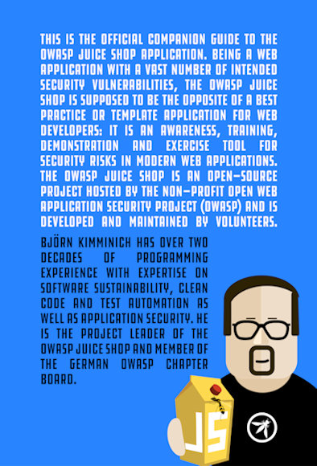

<!-- theme: default -->
<!-- paginate: true -->
<!-- footer: Copyright (c) by **Bjoern Kimminich** | Licensed under [CC-BY-SA 4.0](https://creativecommons.org/licenses/by-sa/4.0/) -->

# 

# OWASP

---

# OWASP

* [**O**pen **W**eb **A**pplication **S**ecurity **P**roject](https://owasp.org)
  * Free and open software security community
  * 501(c)(3) Nonprofit organization

* Core purpose
  * Be the thriving global community that drives visibility and
    evolution in the safety and security of the world's software

---

#  OWASP Top 10  

|    |                         |    |                                             |
|:---|:------------------------|:---|:--------------------------------------------|
| 1  | Injection               | 6  | Security Misconfiguration                   |
| 2  | Broken Authentication   | 7  | Cross-Site-Scripting (XSS)                  |
| 3  | Sensitive Data Exposure | 8  | Insecure Deserialization                    |
| 4  | XML External Entities   | 9  | Using Components with Known Vulnerabilities |
| 5  | Broken Access Control   | 10 | Insufficient Logging & Monitoring           |

---

## Risk Rating Table

_:information_source: Based on the
[OWASP Risk Rating Methodology](https://owasp.org/www-project-risk-assessment-framework/)_

---

#  [OWASP Juice Shop](https://owasp.org/www-project-juice-shop/)   

OWASP Juice Shop is probably the most modern and sophisticated insecure
web application! It can be used in security trainings, awareness demos,
CTFs and as a guinea pig for security tools! Juice Shop encompasses
vulnerabilities from the entire OWASP Top Ten along with many other
security flaws found in real-world applications!

---

## Main Selling Points

* **Free and Open source**: Licensed under the
  [MIT license](https://github.com/bkimminich/juice-shop/blob/master/LICENSE)
  with no hidden costs or caveats
* **Easy-to-install**: Choose between [node.js](http://nodejs.org),
  [Docker](https://www.docker.com) and
  [Vagrant](https://www.vagrantup.com/downloads.html) to run on
  Windows/Mac/Linux
* **Self-contained**: Additional dependencies are pre-packaged or will
  be resolved and downloaded automatically
* **Beginner-friendly**: Hacking Instructor tutorial scripts guide users
  through several of the easier challenges while explaining the
  underlying vulnerabilities
* **Gamification**: The application notifies you on solved challenges
  and keeps track of successfully exploited vulnerabilities on a Score
  Board

---

* **Self-healing**: The simple SQLite and MarsDB databases are wiped and
  repopulated from scratch on every server startup
* **Re-branding**: Fully customizable in business context and look &
  feel to your own corporate or customer requirements
* **CTF-support**: Challenge notifications optionally contain a flag
  code for your own
  [Capture-The-Flag events](https://github.com/bkimminich/juice-shop-ctf)

---

# Official Companion Guide

> [Pwning OWASP Juice Shop](https://leanpub.com/juice-shop) \[...\] will
> give you a complete overview of the vulnerabilities found in the
> application including hints how to spot and exploit them. In the
> appendix you will even find complete step-by-step solutions to every
> challenge. The ebook is continuously published under
> [CC BY-NC-ND 4.0](https://creativecommons.org/licenses/by-nc-nd/4.0/)
> and is
> [online-readable **for free**](https://pwning.owasp-juice.shop). The
> latest officially released edition is
> [available **for free** on LeanPub in PDF, Kindle and ePub format](https://leanpub.com/juice-shop).

---

&nbsp;&nbsp;&nbsp;&nbsp;&nbsp;&nbsp;&nbsp;&nbsp;&nbsp;&nbsp;&nbsp;&nbsp;

&nbsp;&nbsp;&nbsp;&nbsp;&nbsp;&nbsp;&nbsp;&nbsp;&nbsp;&nbsp;&nbsp;&nbsp;&nbsp;&nbsp;&nbsp;

---

# Exercise

## Happy path shopping tour

1. Register a user account at your local Juice Shop
2. Browse the inventory and purchase some products
3. Try out all other functionality you find in the application

---

# Exercise

## Score Board

1. (:mortar_board:) Find the hidden _Score Board_ in the Juice Shop (:star:)

