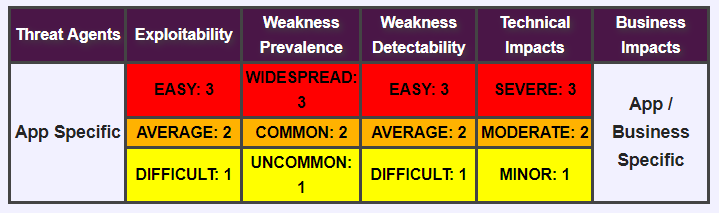
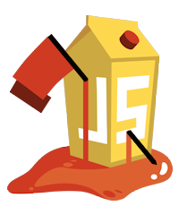
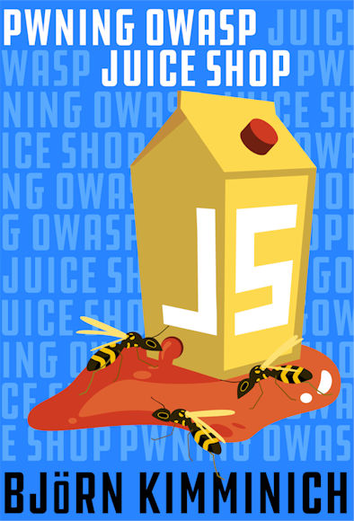

<!-- $size: 16:9 -->

<!-- page_number: true -->

<!-- footer: Copyright (c) by Bjoern Kimminich | Licensed under CC-BY-SA 4.0 -->

# 
# OWASP

---

# OWASP

* [**O**pen **W**eb **A**pplication **S**ecurity **P**roject](https://www.owasp.org)
  * Free and open software security community
  * 501(c)(3) Nonprofit organization

* Core purpose
  * Be the thriving global community that drives visibility and evolution in the safety and security of the world's software

---

# Principles

* Free & Open
* Governed by rough consensus & running code
* Abide by a [code of ethics](https://www.owasp.org/index.php/About_The_Open_Web_Application_Security_Project#Code_of_Ethics)
* Not-for-profit
* Not driven by commercial interests
* Risk based approach

---

# OWASP Top 10

---

#  OWASP Top 10  

|   |                         |    |                                             |
|:--|:------------------------|:---|:--------------------------------------------|
| 1 | Injection               | 6  | Security Misconfiguration                   |
| 2 | Broken Authentication   | 7  | Cross-Site-Scripting (XSS)                  |
| 3 | Sensitive Data Exposure | 8  | Insecure Deserialization                    |
| 4 | XML External Entities   | 9  | Using Components with Known Vulnerabilities |
| 5 | Broken Access Control   | 10 | Insufficient Logging & Monitoring           |

---

## Risk Rating Table

_:information_source: Based on the [OWASP Risk Rating Methodology](https://www.owasp.org/index.php/OWASP_Risk_Rating_Methodology)_

---

# 
# OWASP Juice Shop

---

#  [OWASP Juice Shop](https://www.owasp.org/index.php/OWASP_Juice_Shop_Project)   

OWASP Juice Shop is probably the most modern and sophisticated insecure web application! It can be used in security trainings, awareness demos, CTFs and as a guinea pig for security tools! Juice Shop encompasses vulnerabilities from the entire OWASP Top Ten along with many other security flaws found in real-world applications!

---

## Main Selling Points

* **Easy-to-install**: Choose between node.js, Docker and Vagrant to run on Windows/Mac/Linux
* **Self-contained**: Additional dependencies are pre-packaged or will be resolved and downloaded automatically
* **Self-healing**: The simple SQLite database is wiped and regenerated from scratch on every server startup
* **Gamification**: The application notifies you on solved challenges and keeps track of successfully exploited vulnerabilities on a Score Board

---

* **CTF-support**: Challenge notifications contain a customizable flag code for your own Capture-The-Flag events
* **Re-branding**: Fully customizable business context and look & feel
* **Free and Open source**: Licensed under the MIT license with no hidden costs or caveats

---

# Official Companion Guide

> [Pwning OWASP Juice Shop](https://leanpub.com/juice-shop) \[...\] will give you a complete overview of the vulnerabilities found in the application including hints how to spot and exploit them. In the appendix you will even find complete step-by-step solutions to every challenge. The ebook is published under [CC BY-NC-ND 4.0](https://creativecommons.org/licenses/by-nc-nd/4.0/) and is available **for free** as work-in-progress in [HTML, PDF, Kindle and ePub format on GitBook](https://www.gitbook.com/book/bkimminich/pwning-owasp-juice-shop). The latest officially released edition is [available **for free** on LeanPub in PDF, Kindle and ePub format](https://leanpub.com/juice-shop).

---

&nbsp;&nbsp;&nbsp;&nbsp;&nbsp;&nbsp;&nbsp;&nbsp;&nbsp;&nbsp;&nbsp;&nbsp;  &nbsp;&nbsp;&nbsp;&nbsp;&nbsp;&nbsp;&nbsp;&nbsp;&nbsp;&nbsp;&nbsp;&nbsp;&nbsp;&nbsp;&nbsp; 

---

# Exercise

## Happy path shopping tour

1. Register a user account at your local Juice Shop
2. Browse the inventory and purchase some products
3. Try out all other functionality you find in the application

---

# Exercise

## Score Board

1. Find the hidden Score Board in the Juice Shop (:star:)
